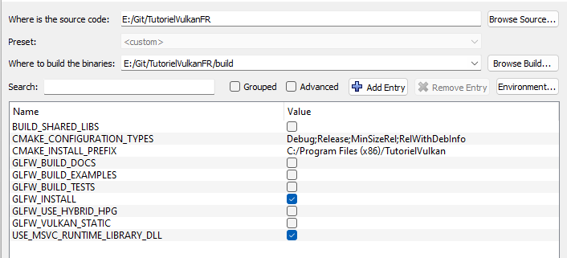
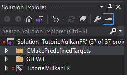

# Tutoriel pour bien débuter à Vulkan
# 0.3 - Environnement de développement

Il est possible de récupérer le projet de base depuis [**la branche ``debut`` sur GitHub**](https://github.com/ZaOniRinku/TutorielVulkanFR/tree/debut). Celui-ci contient déjà GLFW mais vous demande tout de même d'installer **un environnement de développement C++**, **CMake** et **VulkanSDK**.

## Environnement de développement C++
Dans le cas où vous utilisez du C++ pour suivre ce tutoriel et que vous n'avez pas encore d'environnement de développement, vous aurez besoin d'un compilateur C++.

Sur Windows, il est recommandé d'installer l'IDE [**Visual Studio Communauté**](https://visualstudio.microsoft.com/fr/downloads/). Le code de ce tutoriel est écrit sur **Visual Studio Communauté 2019** mais les versions ultérieures ne devraient pas poser de soucis.

Sur Linux, un compilateur comme **g++** ou **clang** permettra de compiler un programme en C++. Le choix de l'éditeur de code vous est personnel mais pour ceux qui ne savent pas quoi choisir, [**Visual Studio Code**](https://code.visualstudio.com/download) a une intégration C++ relativement correcte. Il existe aussi des IDE C++ sur Linux comme [**CLion**](https://www.jetbrains.com/fr-fr/clion/) mais celui-ci n'est pas gratuit.

## VulkanSDK
Afin de développer avec Vulkan, il est nécessaire d'installer le SDK (Software Development Kit) de Vulkan, sur [**le site de LunarG**](https://vulkan.lunarg.com/sdk/home). Prenez la dernière version disponible selon votre OS.

## GLFW
Bien que Vulkan puisse totalement faire du rendu sans fenêtre pour qu'on puisse récupérer le résultat dans un fichier, on va ici utiliser [**GLFW**](https://www.glfw.org/) qui est une librairie de fenêtrage cross-plateforme qui nous permettra de créer une fenêtre sans devoir utiliser directement la librairie fournie par Windows et les multiples librairies disponibles sur Linux. GLFW est choisi pour ce tutoriel car très simple à intégrer à un projet et très simple d'utilisation, il existe cependant d'autres alternatives comme [**Qt**](https://www.qt.io/download), mais qui ne seront pas traitées dans ce tutoriel.

## Glslang
Vulkan ne supporte pas nativement le GLSL comme langage de *shader* mais une représentation intermédiaire appelée **SPIR-V** (*Standard Portable Intermediate Representation*). Ce tutoriel va montrer deux méthodes pour compiler des *shaders* de GLSL vers SPIR-V, une en pré-compilation avec un exécutable fourni avec VulkanSDK et une pendant l'exécution du programme avec la librairies [**Glslang**](https://github.com/KhronosGroup/glslang), développée par **The Khronos Group**.

## CMake
Afin de créer ce qui vous permettra de compiler vos programmes, [**CMake**](https://cmake.org/download/) sera utilisé. CMake vous permettra de créer une solution Visual Studio ou un Makefile Linux en utilisant le même fichier CMake et le même code pour les deux OS.

## Mise en place
*Si vous avez récupéré le projet depuis GitHub, alors cette partie ne vous est qu'informative et n'a pas à être suivie et vous pouvez passer directement à la partie [Test de l'environnement](#test-de-l-environnement).*

Une fois que votre environnement de développement est prêt, donc lorsque vous avez installé VulkanSDK, un compilateur et CMake, créez un nouveau dossier, ici, il s'appellera ``TutorielVulkanFR``. Dans celui-ci, créez un nouveau dossier ``external``, dans lequel vous allez mettre le contenu du zip téléchargé sur le site de GLFW. Celui-ci devrait avoir comme nom ``glfw-*numero.de.version*`` mais renommez-le ``glfw``. Faites de même avec le contenu du zip téléchargé depuis la page GitHub de Glslang, le dossier devrait avoir comme nom ``glslang-*numero.de.version*`` mais renommez-le ``glslang``. Revenez maintenant à la racine de votre dossier et créez un fichier ``CMakeLists.txt``, ainsi qu'un dossier ``src`` qui contiendra le code, dans lequel vous allez mettre un fichier ``main.cpp``.

Vous devriez vous retrouver avec cette hiérarchie de fichiers et dossiers :

```
TutorielVulkanFR
 |- external
 |   |- glfw
 |   |   |- CMake
 |   |   |- deps
 |   |   |- docs
 |   |   |- (etc.)
 |   |- glslang
 |       |- .github
 |       |- build_overrides
 |       |- External
 |       |- (etc.)
 |- src
 |   |- main.cpp
 |- CMakeLists.txt (fichier)
```

Nous allons commencer par écrire le fichier ``CMakeLists.txt`` et par les informations principales, c'est à dire le nom du projet, la version de CMake minimale à utiliser et la version de C++ (ici C++17). Les # sont des commentaires et ne servent qu'à expliquer à quoi sert la ligne, vous pouvez les ignorer.

```CMake
cmake_minimum_required(VERSION 3.7 FATAL_ERROR) # Demande au moins la version 3.7 de CMake, puisque find_package(Vulkan) n'est disponible qu'à partir de la version 3.7 de CMake
set(NAME TutorielVulkanFR) # Crée une variable CMake s'appelant NAME contenant TutorielVulkanFR, le nom du projet
project(${NAME} VERSION 0.0.1 LANGUAGES C CXX) # Définit un nouveau projet utilisant le nom défini à la ligne précédente, en version 0.0.1 (ce n'est pas important) et qui utilisera du C et du C++

set(CMAKE_CXX_STANDARD 17) # Définit le standard de C++ utilisé comme étant C++17
set(CMAKE_CXX_STANDARD_REQUIRED ON) # Force l'utilisation de C++17
```

Ce moteur de rendu doit fonctionner sur Windows et Linux, nous devons donc avoir quelques constantes nous permettant de savoir s'il est actuellement compilé sur Windows ou sur Linux.

```CMake
set(TUTORIEL_VK_DEFINES "") # Définit une nouvelle variable appelée TUTORIEL_VK_DEFINES qui est vide pour le moment, elle servira à passer des constantes lors de la construction du projet

if(CMAKE_SYSTEM_NAME STREQUAL "Windows") # Si nous sommes sur Windows
	list(APPEND TUTORIEL_VK_DEFINES TUTORIEL_VK_OS_WINDOWS _CRT_SECURE_NO_WARNINGS NOMINMAX) # On ajoute à TUTORIEL_VK_DEFINES les constantes TUTORIEL_VK_OS_WINDOWS qu'on utilisera lorsqu'on souhaitera écrire du code spécifique à Windows ainsi que _CRT_SECURE_NO_WARNINGS qui retire les warnings liés à l'utilisation de certaines fonctions considérées unsafe par le compilateur MSVC (scanf, par exemple, même si nous n'allons pas les utiliser ici), ainsi que NOMINMAX qui permet de ne pas définir les fonctions min() et max() lorsque nous allons inclure windows.h
elseif(CMAKE_SYSTEM_NAME STREQUAL "Linux") # Si nous sommes sur Linux
	list(APPEND TUTORIEL_VK_DEFINES TUTORIEL_VK_OS_LINUX) # On ajoute à TUTORIEL_VK_DEFINES la constante TUTORIEL_VK_OS_LINUX qu'on utilisera lorsqu'on souhaitera écrire du code spécifique à Linux
endif()
```

GLFW et Glslang possèdent eux aussi un fichier CMakeLists.txt, il est donc possible d'utiliser ``add_subdirectory()`` pour les inclure à notre projet.

```CMake
add_subdirectory(external/glfw) # On appelle le fichier CMake de GLFW
add_subdirectory(external/glslang) # On appelle le fichier CMake de Glslang
```

On va ensuite chercher Vulkan, si VulkanSDK a été correctement installé, CMake devrait trouver Vulkan sans problème.

```CMake
find_package(Vulkan) # On demande à CMake de chercher Vulkan
if(NOT Vulkan_FOUND) # Si CMake n'a pas réussi à trouver Vulkan
	message(FATAL_ERROR "Impossible de trouver Vulkan.") # Arrête CMake et affiche un message d'erreur
else() # Si CMake a réussi à trouver Vulkan
	message(STATUS "Vulkan a été trouvé.") # Affiche un message de succès
endif()
```

On peut maintenant dire à CMake qu'on va créer un exécutable.

```CMake
add_executable(${PROJECT_NAME} src/main.cpp) # On va vouloir créer un exécutable du même nom que le projet et avec le fichier main.cpp
```

On va lier statiquement ls libraries Vulkan, GLFW, Glslang et SPIR-V (qui est inclut dans Glslang) à notre projet. Dans un projet de plus grande envergure, il est plutôt recommandé de ne pas lier Vulkan statiquement et de plutôt utiliser un meta-loader de fonctions Vulkan comme [**volk**](https://github.com/zeux/volk). Dans le cadre de ce tutoriel et pour rester au plus simple, Vulkan sera lié statiquement.

```CMake
target_link_libraries(${PROJECT_NAME} PRIVATE glfw glslang SPIRV Vulkan::Vulkan) # On lie GLFW, glslang, SPIRV (inclut dans Glslang) et Vulkan à notre projet
``` 

On peut enfin ajouter nos définitions de compilation créées plus haut, qui nous permettra notamment de savoir sur quel OS notre programme est en train d'être compilé.

```CMake
target_compile_definitions(${PROJECT_NAME} PRIVATE
	${TUTORIEL_VK_DEFINES}) # On ajoute toutes les définitions qu'on a créées plus haut
```

Le ``CMakeLists.txt`` est terminé pour le moment, on peut donc s'occuper du fichier ``main.cpp`` dans le dossier ``src``.

Pour tester, on va initialiser et ouvrir une fenêtre avec GLFW.

```CPP
#include "../external/glfw/include/GLFW/glfw3.h"
#include <iostream>

int main() {
	if (!glfwInit()) { // Initialisation de GLFW
		std::cout << "Une erreur a eu lieu lors de l'initialisation de GLFW." << std::endl; // Erreur lors de l'initialisation de GLFW
		return 1;
	}
	GLFWwindow* window = glfwCreateWindow(300, 300, "TutorielVulkanFR", nullptr, nullptr); // Création d'une fenêtre

	while (!glfwWindowShouldClose(window)) { // On boucle jusqu'à ce que la fenêtre soit fermée par l'utilisateur
		glfwPollEvents(); // Récupération des événements sur les fenêtres
	}

	return 0;
}
```

## <a name="test-de-l-environnement"></a>Test de l'environnement
Maintenant que tout est prêt, il est temps de tester.

### Windows
Sur Windows, lancez ``CMake (cmake-gui)`` puis pour ``Where is the source code:``, pointez vers le dossier où se trouve le fichier ``CMakeLists.txt`` et pour ``Where to build the binaries:``, pointez vers le même dossier que le précédent mais en ajoutant ``/build`` à la fin. Cliquez ensuite sur ``Configure``, CMake vous proposera de créer le dossier ``build``, acceptez, et vous demandera ensuite le générateur du projet, choisissez ``Visual Studio``, suivi du numéro de votre version de Visual Studio. Cliquez ensuite sur ``Generate`` pour créer la solution Visual Studio.



Dans le dossier ``build`` se trouve ``TutorielVulkanFR.sln``, où n'importe quel nom que vous avez donné à ``NAME`` dans le ``CMakeLists.txt``. Ouvrez-le, ce qui ouvrira la solution dans Visual Studio. À droite se trouve le contenu de la solution avec ``TutorielVulkanFR`` ou équivalent. Faites un clic droit dessus et cliquez sur l'option avec le rouage, ``Set as Startup Project``. Appuyez sur **F5** ou la flèche verte en haut pour lancer la compilation et l'exécution du programme.



Si tout s'est bien passé, vous devriez voir une petite fenêtre blanche.

### Linux
Sur Linux, ouvrez un terminal dans le dossier où se trouve le ``CMakeLists.txt``, puis entrez ces commandes :

```Bash
mkdir build
cd build
cmake ..
```

La première va créer un dossier ``build``, la deuxième va entrer dedans et la troisième va lancer CMake sur le dossier précédent, où se trouve le ``CMakeLists.txt``.

Faites ensuite :

```Bash
make -j
```

Pour compiler le programme.

Vous devriez maintenant avoir un fichier ``TutorielVulkanFR``, où n'importe quel nom que vous avez donné à ``NAME`` dans le ``CMakeLists.txt``. Lancez-le avec :

```Bash
./TutorielVulkanFR
```

Si tout s'est bien passé, vous devriez voir une petite fenêtre blanche.

### En cas d'échec
Si la compilation ne passe pas ou que le CMake ne se termine pas correctement, vérifiez bien que VulkanSDK soit installé, que GLFW se trouve bien dans le dossier ``external`` sous le nom ``glfw`` et que Glslang se trouve bien dans le dossier ``external`` sous le nom ``glslang``.

[**Chapitre précédent**](2.md) - [**Index**](../index.md) - [**Chapitre suivant**](../partie1/1.md)
