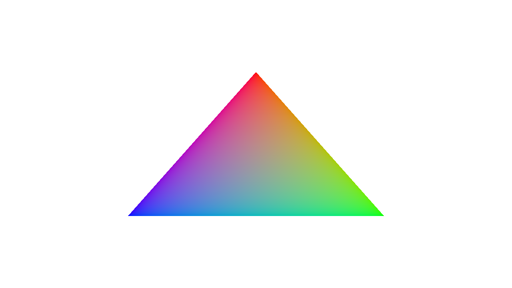
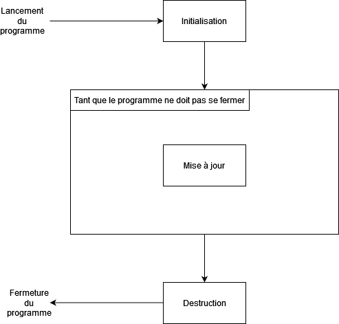

# Tutoriel Vulkan en français
## 1.1 - Structure du programme

Maintenant que nous savons que notre environnement de développement est prêt, il est temps de passer aux choses sérieuses. L'équivalent graphique du ``Hello World!`` en programmation est le ``Hello Triangle!`` où le but est de dessiner un triangle où chacun de ses points est une couleur de la trinité RGB (<span style="color:red">*Red*</span>, <span style="color:green">*Green*</span>, <span style="color:blue">*Blue*</span>).



Dans le dossier ``src``, créez les fichiers ``hellotriangle.h`` et ``hellotriangle.cpp``.

Le ``CMakeLists.txt`` doit être modifié en conséquence pour ajouter nos deux nouveaux fichiers. Pour cela, on va créer deux nouvelles variables CMake, ``SOURCES`` et ``HEADERS``, qui serviront à ajouter facilement les nouveaux fichiers qui arriveront au cours de ce tutoriel.

```CMake
set(SOURCES
	src/hellotriangle.cpp)
set(HEADERS
	src/hellotriangle.h)

add_executable(${PROJECT_NAME} src/main.cpp ${SOURCES} ${HEADERS}) # On va vouloir créer un exécutable du même nom que le projet et avec les fichiers du dossier src
```

On peut ensuite re-générer le projet avec CMake, comme cela avait été fait lors de la partie précédente.

Ouvrez le fichier ``hellotriangle.h`` pour y ajouter une classe ``HelloTriangle`` avec quatre méthodes publiques : ``init()``, qui ne sera exécutée qu'une seule fois au lancement du programme et qui servira à initialiser les ressources, ``update()``, qui sera exécuté à chaque tour de la boucle principale, ``destroy()``, qui sera exécutée à la fermeture du programme pour libérer les ressources utilisées, et enfin, ``shouldClose()`` qui permettra de déterminer s'il est temps de sortir de la boucle principale et de terminer le programme.

```CPP
class HelloTriangle {
public:
	void init();
	void update();
	void destroy();

	bool shouldClose();
};
```

Nous pouvons ensuite écrire le début de leur implémentation dans le fichier ``hellotriangle.cpp``, nous allons d'abord simplement y mettre des messages à afficher dans la console et dire que le programme ne doit pas se fermer :

```CPP
#include "hellotriangle.h"
#include <iostream>

void HelloTriangle::init() {
	std::cout << "Initialisation." << std::endl;
}

void HelloTriangle::update() {
	std::cout << "Mise a jour." << std::endl;
}

void HelloTriangle::destroy() {
	std::cout << "Destruction." << std::endl;
}

bool HelloTriangle::shouldClose() {
	return false;
}
```

Le fichier ``main.cpp`` servira à faire tourner la boucle principale.

La boucle principale dans un moteur de rendu ou dans un moteur de jeu consiste à initialiser les systèmes (ici, il n'y a qu'un moteur de rendu qui sera écrit dans ``HelloTriangle``), entrer dans une boucle qui vérifiera si sa condition de fin est remplie ou non, et enfin la libération des ressources utilisées par les systèmes.



Pour cela, nous allons utiliser une instance de la classe ``HelloTriangle``, l'initialiser, la mettre à jour dans une boucle qui, pour l'instant, ne sera finira pas, et la détruire.

```CPP
#include "hellotriangle.h"

int main() {
	HelloTriangle helloTriangle;
	helloTriangle.init();

	while (!helloTriangle.shouldClose()) {
		helloTriangle.update();
	}

	helloTriangle.destroy();

	return 0;
}
```

Si vous lancez le programme maintenant, vous devriez voir :

```
Initialisation.
Mise a jour.
Mise a jour.
Mise a jour.
Mise a jour.
Mise a jour.
Mise a jour.
```

Et celui-ci ne devrait pas se finir puisque la condition de boucle, représentée par ``!helloTriangle.shouldClose()``, est toujours vraie (puisque ``!false == true``). Pour le fermer, fermez la console sur Windows ou appuyez sur ``Ctrl-C`` sur Linux.

[**Partie précédente**](../partie0/2.md) - [**Index**](../index.md) - [**Partie suivante**](2.md)

[**Code de la partie**](https://github.com/ZaOniRinku/TutorielVulkanFR/tree/partie1-1)