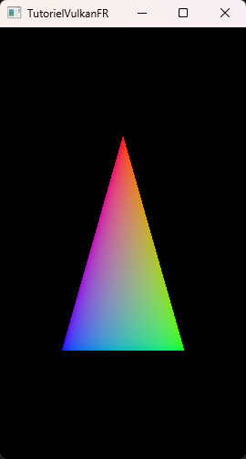

# [Tutoriel pour bien débuter à Vulkan](../index.md)
## 1.10 - Redimensionnement de la fenêtre et recréation de la swapchain

Si vous essayez maintenant de redimensionner ou de minimiser la fenêtre, le programme va se fermer sur l'appel à ``vkQueuePresentKHR`` :

```
Vulkan Error.
Error code: -1000001004
File: TutorielVulkanFR\src\hellotriangle.cpp
Function: vkQueuePresentKHR(m_graphicsQueue, &presentInfo)
Line: 750
```

Le code d'erreur peut être trouvé sur la page de la spécification de [**``VkResult``**](https://registry.khronos.org/vulkan/specs/1.3-extensions/man/html/VkResult.html). Un code d'erreur de ``-1000001004`` correspond à ``VK_ERROR_OUT_OF_DATE_KHR``.

L'erreur vient du fait que la surface a été mise à jour lors du redimensionnement, ce qui l'a rendue incompatible avec la *swapchain*. Et en effet, le redimensionnement change la taille de la fenêtre et donc de la surface. La *swapchain* n'est plus de la bonne taille et doit être recréée.

Nous allons créer une nouvelle méthode privée dans la classe ``HelloTriangle``, qui sera appelée lorsque la fenêtre est redimensionnée :

```CPP
void onResize();
```

Puis l'implémentation dans ``hellotriangle.cpp`` :

```CPP
void HelloTriangle::onResize() {
	// Attente que la swapchain soit libre
	TUTORIEL_VK_CHECK(vkQueueWaitIdle(m_graphicsQueue));

	int windowWidth;
	int windowHeight;
	glfwGetWindowSize(m_window, &windowWidth, &windowHeight);

	while (windowWidth == 0 || windowHeight == 0) {
		glfwPollEvents();
		glfwGetWindowSize(m_window, &windowWidth, &windowHeight);
	}

	// Destruction des vues des images de l'ancienne swapchain
	for (uint32_t i = 0; i < m_swapchainImageCount; i++) {
		vkDestroyImageView(m_device, m_swapchainImageViews[i], nullptr);
	}

	createSwapchain(m_swapchain);
}
```

Nous allons attendre que la fenêtre ne soit plus minimisée, ce qui est caractérisé par une hauteur et une largeur de 0.

On récupère les événements de la fenêtre à chaque tour de la boucle ``while`` pour mettre à jour la taille de la fenêtre, puis on la relit avec ``glfwGetWindowSize``, jusqu'à ce que la hauteur et la largeur ne soient plus égaux à 0.

Nous allons aussi détruire les vues des anciennes images de la *swapchain*.

Juste après, comme au début de la fonction ``destroy``, on s'assure que la *swapchain* puisse être détruite avant de la recréer, en appelant ``vkQueueWaitIdle`` :

```CPP
// Attente que la swapchain soit libre
TUTORIEL_VK_CHECK(vkQueueWaitIdle(m_graphicsQueue));
```

Nous allons maintenant recréer notre *swapchain* à deux endroits de la boucle de rendu :

```CPP
// Recuperation d'un indice d'une image libre de la swapchain
uint32_t imageIndex;
VkResult acquireNextImageResult = vkAcquireNextImageKHR(m_device, m_swapchain, std::numeric_limits<uint64_t>::max(), m_acquireCompletedSemaphores[m_currentFrameInFlight], VK_NULL_HANDLE, &imageIndex);
if (acquireNextImageResult == VK_ERROR_OUT_OF_DATE_KHR) {
	onResize();
}
else if (acquireNextImageResult != VK_SUCCESS && acquireNextImageResult != VK_SUBOPTIMAL_KHR) {
	std::cout << "Une erreur a eu lieu lors de l'acquisition de l'indice de la prochaine image de la swapchain." << std::endl;
	exit(1);
}
```

``vkAcquireNextImageKHR`` peut aussi renvoyer ``VK_ERROR_OUT_OF_DATE_KHR``. Si nous recevons ce résultat, alors nous recréons la *swapchain*, sinon, si le résultat n'est pas ``VK_SUCCESS`` ou ``VK_SUBOPTIMAL_KHR``, une autre erreur a eu lieu.

```CPP
presentInfo.pImageIndices = &imageIndex;
presentInfo.pResults = nullptr;
VkResult queuePresentResult = vkQueuePresentKHR(m_graphicsQueue, &presentInfo);
if (queuePresentResult == VK_ERROR_OUT_OF_DATE_KHR) {
	onResize();
}
else if (queuePresentResult != VK_SUCCESS) {
	std::cout << "Une erreur a eu lieu lors de la presentation de l'image de la swapchain." << std::endl;
	exit(1);
}
```

Nous allons évidemment aussi recréer la *swapchain* si l'erreur ``VK_ERROR_OUT_OF_DATE_KHR`` est renvoyé par ``vkQueuePresentKHR``.

Vous pouvez maintenant redimensionner et minimiser la fenêtre sans que le programme ne se ferme :



[**Chapitre précédent**](9.md) - [**Index**](../index.md) - [**Chapitre suivant**](../partie2/1.md)

[**Code de la partie**](https://github.com/ZaOniRinku/TutorielVulkanFR/tree/partie1)