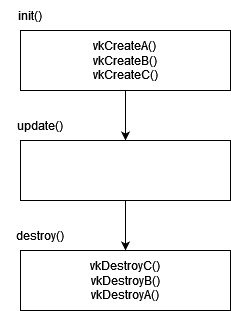

# [Tutoriel pour bien débuter à Vulkan](../index.md)
## 1.2 - Création d'une instance

Il est enfin temps de commencer à écrire du code avec Vulkan, et avec Vulkan, tout commence par la création d'une instance. Contrairement à OpenGL, Vulkan n'a pas d'état global donc toutes les informations sur l'application doivent être stockées quelque part : c'est le rôle de l'instance, qui est représentée par le type [**VkInstance**](https://registry.khronos.org/vulkan/specs/1.3-extensions/man/html/VkInstance.html).

L'instance va notamment nous permettre d'ajouter des extensions pour les surfaces de fenêtres, et malgré que GLFW nous permette de créer automatiquement une surface Vulkan sans que l'on ait à le faire soi-même, avec la fonction [**glfwCreateWindowSurface**](https://www.glfw.org/docs/3.3/group__vulkan.html#ga1a24536bec3f80b08ead18e28e6ae965), nous n'allons pas l'utiliser ici afin d'apprendre comment créer des surfaces avec des systèmes de fenêtrages différents, voire même directement avec l'API fournie par l'OS.

Tout d'abord, il faut inclure le header de Vulkan dans ``hellotriangle.h``. Mais avant cela, nous devons spécifier que nous voulons que le header Vulkan nous fournisse les fonctions nécessaires à la création de surfaces. C'est ici que vont servir les constantes d'OS définies dans le fichier CMake.

```cpp
#if defined(TUTORIEL_VK_OS_WINDOWS)
#define VK_USE_PLATFORM_WIN32_KHR
#elif defined(TUTORIEL_VK_OS_LINUX)
#define VK_USE_PLATFORM_XLIB_KHR
#endif
#include <vulkan/vulkan.h>
```

Il faut bien faire attention à définir ``VK_USE_PLATFORM_WIN32_KHR`` ou ``VK_USE_PLATFORM_XLIB_KHR`` avant d'inclure ``vulkan.h``. Aussi, pour Linux, ce tutoriel ne va couvrir que la création de surfaces pour ``Xlib`` mais il existe aussi ``VK_USE_PLATFORM_XCB_KHR`` pour ``xcb`` et ``VK_USE_PLATFORM_WAYLAND_KHR`` pour ``Wayland``.

Nous utilisons le *header* C de Vulkan, ``vulkan.h``, malgré qu'il existe un *header* C++ appelé ``vulkan.hpp`` qui est, au final, bien plus efficace quand on développe en C++, avec notamment l'utilisation des pointeurs uniques. Il y a cependant quelques raisons qui font que ce tutoriel utilise le *header* C, notamment un temps de compilation et de traitement par IntelliSense (Visual Studio) plus rapide et le fait que les fonctions aient les mêmes signatures que dans la [**spécification de Vulkan**](https://registry.khronos.org/vulkan/specs/1.3-extensions/html/vkspec.html), ce qui est important dans ce tutoriel, puisqu'il doit pouvoir être suivi avec n'importe quel langage.

Nous pouvons maintenant ajouter un attribut (variable de classe) privé pour l'instance Vulkan dans la classe ``HelloTriangle`` :

```cpp
private:
	VkInstance m_instance; // Le prefixe m_ sert a differencier les attributs des classes aux variables locales
```

Dans la fonction ``init``, dans ``hellotriangle.cpp``, nous pouvons créer l'instance Vulkan :

```cpp
	// Creation de l'instance
	VkApplicationInfo applicationInfo = {};
	applicationInfo.sType = VK_STRUCTURE_TYPE_APPLICATION_INFO;
	applicationInfo.pNext = nullptr;
	applicationInfo.pApplicationName = "Tutoriel Vulkan FR";
	applicationInfo.applicationVersion = VK_MAKE_VERSION(0, 0, 1);
	applicationInfo.pEngineName = "Tutoriel Vulkan FR";
	applicationInfo.engineVersion = VK_MAKE_VERSION(0, 0, 1);
	applicationInfo.apiVersion = VK_API_VERSION_1_1;

	VkInstanceCreateInfo instanceCreateInfo = {};
	instanceCreateInfo.sType = VK_STRUCTURE_TYPE_INSTANCE_CREATE_INFO;
	instanceCreateInfo.pNext = nullptr;
	instanceCreateInfo.flags = 0;
	instanceCreateInfo.pApplicationInfo = &applicationInfo;

	std::vector<const char*> explicitLayers;
	if (explicitLayerAvailable("VK_LAYER_KHRONOS_validation")) {
		explicitLayers.push_back("VK_LAYER_KHRONOS_validation");
	}
	else {
		std::cout << "Layer " << explicitLayers[0] << " is not available." << std::endl;
	}
	instanceCreateInfo.enabledLayerCount = static_cast<uint32_t>(explicitLayers.size());
	instanceCreateInfo.ppEnabledLayerNames = explicitLayers.data();

	std::vector<const char*> instanceExtensions;
	if (instanceExtensionAvailable("VK_EXT_debug_utils")) {
		instanceExtensions.push_back("VK_EXT_debug_utils");
	}
	if (instanceExtensionAvailable("VK_KHR_surface")) {
		instanceExtensions.push_back("VK_KHR_surface");
	}
#if defined(TUTORIEL_VK_OS_WINDOWS)
	if (instanceExtensionAvailable("VK_KHR_win32_surface")) {
		instanceExtensions.push_back("VK_KHR_win32_surface");
	}
#elif defined(TUTORIEL_VK_OS_LINUX)
	if (instanceExtensionAvailable("VK_KHR_xlib_surface")) {
		instanceExtensions.push_back("VK_KHR_xlib_surface");
	}
#endif
	instanceCreateInfo.enabledExtensionCount = static_cast<uint32_t>(instanceExtensions.size());
	instanceCreateInfo.ppEnabledExtensionNames = instanceExtensions.data();
	VK_CHECK(vkCreateInstance(&instanceCreateInfo, nullptr, &m_instance));
```

Chaque structure Vulkan comporte un ``sType``, un ``pNext``, et très souvent des ``flags``.
- ``sType`` n'a qu'une seule valeur valide, qui est une énumération [**VkStructureType**](https://registry.khronos.org/vulkan/specs/1.3-extensions/man/html/VkStructureType.html) représentant le type de la structure.
- ``pNext`` accepte un pointeur vers une autre structure Vulkan et sert à étendre la structure de base. Ce sera souvent ``nullptr`` mais nous allons voir plus tard des cas d'utilisations de ``pNext``. Ce pointeur est la raison pour laquelle les structures Vulkan ont besoin d'un ``sType`` puisque le pointeur n'étant pas typé (``void*``), Vulkan est incapable de retrouver le type de la structure de base sans le ``sType``.
- ``flags`` permet de spécifier des comportements spéciaux aux objets qui seront crées. Sa valeur sera souvent ``0`` qui signifie "aucun comportement spécial".

Nous avons ici aussi besoin d'un [**``VkApplicationInfo``**](https://registry.khronos.org/vulkan/specs/1.3-extensions/man/html/VkApplicationInfo.html) qui demande des informations générales sur l'application. La majorité de ces informations, comme le nom de l'application ou du moteur, ou encore les versions de ceux-ci, ne sont pas très importantes. Elles sont utilisées par les développeurs de *drivers* (pilotes) de cartes graphiques pour reconnaître certains moteurs ou certains jeux qui ont besoin de comportements spéciaux pour fonctionner correctement (un jeu peut, par exemple, fonctionner correctement sur GPU NVIDIA mais avoir des problèmes sur GPU AMD car les développeurs se sont focalisés, ou ont travaillé exclusivement, sur les GPU NVIDIA. Dans ce cas, AMD peut sortir une mise à jour de leurs *drivers* afin d'appliquer des changements précis seulement pour ce jeu-là).

Une information très importante figure néanmoins dans cette structure : ``apiVersion``, qui ici est à ``VK_API_VERSION_1_1``, qui signifie que nous allons utiliser la spécification de Vulkan 1.1.

Au jour où ce tutoriel est écrit, Vulkan en est à sa version 1.3, alors pourquoi utiliser la version 1.1 ? Tout est une question de compatibilité. Bien que n'importe quel GPU un tant soit peu moderne supporte tout à fait Vulkan 1.3 (par exemple, la carte graphique [***NVIDIA GTX 750* supporte Vulkan 1.3**](https://vulkan.gpuinfo.org/displayreport.php?id=17086)), les différences se trouvent dans les fonctionnalités qui sont disponibles directement dans le cœur de la spécification ou dans ses extensions. Puisque nous n'avons pas besoin de toutes les fonctionnalités qui ont rejoint le cœur de Vulkan 1.2 ou Vulkan 1.3, nous allons choisir celles qui nous sont utiles et les utiliser comme extensions.

Nous avons ensuite la mention de ***layers* explicites**. Les *layers* sont des programmes qui se situent entre l'appel Vulkan de votre programme et l'appel envoyé au *driver* de votre carte graphique. Il en existe de toutes sortes mais on les regroupe dans deux catégories : les *layers* explicites et les layers *implicites*. Cette seconde catégorie, les *layers* implicites, sont activés par défaut, et sont souvent récupérés lors de l'installation de certains logiciels comme [**Steam**](https://store.steampowered.com), [**GOG Galaxy**](https://www.gog.com/galaxy) ou encore [**OBS**](https://obsproject.com/fr). C'est avec les *layers* implicites que certains clients de jeux arrivent à afficher des overlays au-dessus des jeux. Certains *layers* implicites peuvent cependant avoir des soucis de compatibilité avec certaines versions de Vulkan et causer des bugs dont la cause est très difficile à repérer. Les *layers* explicites, eux, sont activés par le développeur du programme, comme ici, et peuvent avoir plusieurs utilités. Celui activé ici, [**``VK_LAYER_KHRONOS_validation``**](https://vulkan.lunarg.com/doc/view/1.2.162.1/windows/khronos_validation_layer.html), sera votre outil le plus important lorsque vous développerez avec Vulkan, puisqu'il permet de vérifier si les appels de fonctions que vous faites sont bien corrects et permet d'afficher un message dans la console en cas de soucis. Il en existe d'autres, comme [**``VK_LAYER_LUNARG_monitor``**](https://vulkan.lunarg.com/doc/view/1.3.211.0/linux/monitor_layer.html), que vous pouvez activer si vous le souhaitez, et qui permet d'afficher le nombre d'images par seconde (*frames per second*, ou FPS) dans le titre de la fenêtre.

La fonction ``explicitLayerAvailable`` est une méthode privée de la classe ``HelloTriangle`` qui permet de vérifier si un *layer* explicite est disponible :

Définition dans ``hellotriangle.h`` :

```cpp
bool explicitLayerAvailable(const char* layerName);
```

Implémentation dans ``hellotriangle.cpp`` :
```cpp
bool HelloTriangle::explicitLayerAvailable(const char* layerName) {
	uint32_t instanceLayerPropertyCount;
	VK_CHECK(vkEnumerateInstanceLayerProperties(&instanceLayerPropertyCount, nullptr));
	std::vector<VkLayerProperties> instanceLayerProperties(instanceLayerPropertyCount);
	VK_CHECK(vkEnumerateInstanceLayerProperties(&instanceLayerPropertyCount, instanceLayerProperties.data()));

	for (const VkLayerProperties& availableLayer : instanceLayerProperties) {
		if (strcmp(availableLayer.layerName, layerName) == 0) {
			return true;
		}
	}

	std::cout << "Layer " << layerName << " n'est pas disponible.";
	return false;
}
```

Les fonctions de type ``vkEnumerateX`` sont appelées deux fois : une fois pour récupérer le nombre d'éléments que nous souhaitons énumérer, et une fois avec un tableau de la taille du nombre d'éléments pour les recevoir. Ici, nous énumérons donc tous les *layers* explicites disponibles et vérifions si celui passé en paramètre en fait partie.

Nous devons ensuite activer des **extensions**. Elles existent sous deux formes, les extensions d'instance et les extensions de *device* (que nous verrons juste après). Ici, nous allons donc activer les extensions d'instance. Elles sont généralement en rapport avec les surfaces, comme [**``VK_KHR_surface``**](https://registry.khronos.org/vulkan/specs/1.3-extensions/man/html/VK_KHR_surface.html). Nous réutilisons les constantes définies dans le fichier CMake permettant de savoir sur quel OS le programme sera compilé afin d'activer les extensions correspondantes à notre système de fenêtrage. Pour Linux, ici aussi, seule [**``VK_KHR_xlib_surface``**](https://registry.khronos.org/vulkan/specs/1.3-extensions/man/html/VK_KHR_xlib_surface.html) pour ``Xlib`` sera traitée mais il existe aussi [**``VK_KHR_xcb_surface``**](https://registry.khronos.org/vulkan/specs/1.3-extensions/man/html/VK_KHR_xcb_surface.html) pour ``xcb`` et [**``VK_KHR_wayland_surface``**](https://registry.khronos.org/vulkan/specs/1.3-extensions/man/html/VK_KHR_wayland_surface.html) pour ``Wayland``.

Outre les extensions en rapport avec les surfaces, nous retrouvons ici aussi [**``VK_EXT_debug_utils``**](https://registry.khronos.org/vulkan/specs/1.3-extensions/man/html/VK_EXT_debug_utils.html), qui va permettre de contrôler les messages envoyés par le *layer* de validation, ``VK_LAYER_KHRONOS_validation``, mais qui permet aussi de nommer des objets Vulkan pour que les messages reçus dans la console comportent ces noms, ce qui est très utile pour s'y retrouver quand on commence à gérer des centaines d'objets Vulkan.

La fonction ``instanceExtensionAvailable`` est aussi une méthode privée de la classe ``HelloTriangle`` qui permet de vérifier si une extension d'instance est disponible :

Définition dans ``hellotriangle.h`` :

```cpp
bool instanceExtensionAvailable(const char* extensionName);
```

Implémentation dans ``hellotriangle.cpp`` :
```cpp
bool HelloTriangle::instanceExtensionAvailable(const char* extensionName) {
	uint32_t instanceExtensionPropertyCount;
	VK_CHECK(vkEnumerateInstanceExtensionProperties(nullptr, &instanceExtensionPropertyCount, nullptr));
	std::vector<VkExtensionProperties> instanceExtensionProperties(instanceExtensionPropertyCount);
	VK_CHECK(vkEnumerateInstanceExtensionProperties(nullptr, &instanceExtensionPropertyCount, instanceExtensionProperties.data()));

	for (const VkExtensionProperties& availableExtension : instanceExtensionProperties) {
		if (strcmp(availableExtension.extensionName, extensionName) == 0) {
			return true;
		}
	}

	std::cout << "Extension d'instance " << extensionName << " n'est pas disponible.";
	return false;
}
```

Après avoir rempli ces structures, nous pouvons enfin appeler [**``vkCreateInstance``**](https://registry.khronos.org/vulkan/specs/1.3-extensions/man/html/vkCreateInstance.html) pour créer notre instance.

À chaque fois qu'un objet Vulkan est créé, celui-ci doit être détruit lorsque nous n'en avons plus besoin. Nous pouvons donc détruire l'instance Vulkan dans la méthode ``destroy``, qui est appelée lors de la fermeture du programme :

```cpp
// Destruction de l'instance
vkDestroyInstance(m_instance, nullptr);
```

Nous pouvons remarquer que l'appel à [**``vkDestroyInstance``**](https://registry.khronos.org/vulkan/specs/1.3-extensions/man/html/vkDestroyInstance.html) n'est pas entouré par ``VK_CHECK()`` car les fonctions de destruction ne retournent pas de ``VkResult``.

Nous allons maintenant créer un messager de debug avec l'extension ``VK_EXT_debug_utils``, activée lors de la création de l'instance.

Nous allons tout d'abord ajouter un objet de type ``VkDebugUtilsMessengerEXT`` dans la classe ``HelloTriangle`` :

```cpp
VkDebugUtilsMessengerEXT m_debugMessenger;
```

Puis, à la suite de la création de l'instance :

```cpp
// Creation du messager de debug
VkDebugUtilsMessengerCreateInfoEXT debugMessengerCreateInfo = {};
debugMessengerCreateInfo.sType = VK_STRUCTURE_TYPE_DEBUG_UTILS_MESSENGER_CREATE_INFO_EXT;
debugMessengerCreateInfo.pNext = nullptr;
debugMessengerCreateInfo.flags = 0;
debugMessengerCreateInfo.messageSeverity = VK_DEBUG_UTILS_MESSAGE_SEVERITY_WARNING_BIT_EXT |
	VK_DEBUG_UTILS_MESSAGE_SEVERITY_ERROR_BIT_EXT;
debugMessengerCreateInfo.messageType = VK_DEBUG_UTILS_MESSAGE_TYPE_GENERAL_BIT_EXT |
	VK_DEBUG_UTILS_MESSAGE_TYPE_VALIDATION_BIT_EXT |
	VK_DEBUG_UTILS_MESSAGE_TYPE_PERFORMANCE_BIT_EXT;
debugMessengerCreateInfo.pfnUserCallback = debugCallback;
debugMessengerCreateInfo.pUserData = nullptr;

auto createDebugUtilsMessengerEXT = (PFN_vkCreateDebugUtilsMessengerEXT)vkGetInstanceProcAddr(m_instance, "vkCreateDebugUtilsMessengerEXT");
VK_CHECK(createDebugUtilsMessengerEXT(m_instance, &debugMessengerCreateInfo, nullptr, &m_debugMessenger));
```

``messageSeverity`` permet de filtrer la sévérité des messages, on les prend tous sauf ``VK_DEBUG_UTILS_MESSAGE_SEVERITY_VERBOSE_BIT_EXT`` et ``VK_DEBUG_UTILS_MESSAGE_SEVERITY_INFO_BIT_EXT`` qui affichent des informations peu importantes pour notre cas et qui rendront la lecture des messages de validation difficiles.

``messageType`` spécifie les événements qui passeront par le messager de debug. Nous allons l'utiliser pour les événements généraux, les messages de validation envoyés par ``VK_LAYER_KHRONOS_validation`` ainsi que les messages dits de "performance" qui nous préviendront si notre utilisation de Vulkan n'est pas optimale.

``pfnUserCallback`` est le *callback* qui sera appelé quand un message doit être envoyé. La fonction ``debugCallback`` est définie tout en haut de ``hellotriangle.cpp`` :

```cpp
VKAPI_ATTR VkBool32 VKAPI_CALL debugCallback(VkDebugUtilsMessageSeverityFlagBitsEXT messageSeverity, VkDebugUtilsMessageTypeFlagsEXT messageType, const VkDebugUtilsMessengerCallbackDataEXT* pCallbackData, void* pUserData) {
	std::cout << pCallbackData->pMessage << std::endl;

	return VK_FALSE;
}
```

Cette fonction se contente juste d'afficher le message dans la console. L'avantage de passer par un *callback* est qu'il est possible de customiser les messages, les trier, les écrire dans des fichiers de logs, et aussi de pouvoir mettre un *Breakpoint* (F9 sur Visual Studio) sur la ligne du ``std::cout`` pour que le programme se mette en pause au moment où un message est envoyé, permettant de remonter la pile des appels (*callstack*) pour retrouver 
l'appel Vulkan qui a provoqué l'utilisation du messager de debug.

Enfin, *pUserData* permet de passer des informations au *callback* mais nous n'en avons pas l'utilité ici.

L'appel de la fonction pour créer notre messager de debug peut vous sembler étrange. En réalité, dans [**le chapitre 2 de la partie 0**](../partie0/2.md) est indiqué : *il est plutôt recommandé de ne pas lier Vulkan statiquement et de plutôt utiliser un meta-loader de fonctions Vulkan comme [**volk**](https://github.com/zeux/volk)*. Lier statiquement Vulkan nous permet d'appeler directement les fonctions sans avoir à charger les pointeurs de fonctions Vulkan... sauf quand celles-ci sont ajoutées par des extensions (une grande partie d'entre elles, du moins), comme ici, avec [**``vkCreateDebugUtilsMessengerEXT``**](https://registry.khronos.org/vulkan/specs/1.3-extensions/man/html/vkCreateDebugUtilsMessengerEXT.html) qui est définie par l'extension ``VK_EXT_debug_utils`` et que nous devons donc charger à la main avec [**``vkGetInstanceProcAddr``**](https://registry.khronos.org/vulkan/specs/1.3-extensions/man/html/vkGetInstanceProcAddr.html).

Nous ne devons pas oublier de détruire le messager de debug à la fermeture du programme, dans la fonction ``destroy`` :

```cpp
// Destruction du messager de debug
auto destroyDebugUtilsMessengerEXT = (PFN_vkDestroyDebugUtilsMessengerEXT)vkGetInstanceProcAddr(m_instance, "vkDestroyDebugUtilsMessengerEXT");
destroyDebugUtilsMessengerEXT(m_instance, m_debugMessenger, nullptr);
```

Ici aussi, la fonction de destruction, [**``vkDestroyDebugUtilsMessengerEXT``**](https://registry.khronos.org/vulkan/specs/1.3-extensions/man/html/vkDestroyDebugUtilsMessengerEXT.html)  doit être chargée à la main.

Il est très important de détruire le messager de debug avant de détruire l'instance puisque l'instance est utilisée dans la destruction du messager de debug.

De manière générale, il est possible de s'assurer que les objets Vulkan soient détruits dans un ordre correct si ceux-ci sont détruits dans l'ordre inverse de leur création :



[**Chapitre précédent**](1.md) - [**Index**](../index.md) - [**Chapitre suivant**](3.md)

[**Code de la partie**](https://github.com/ZaOniRinku/TutorielVulkanFR/tree/partie1)