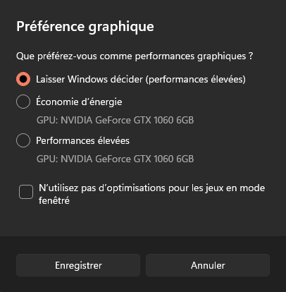
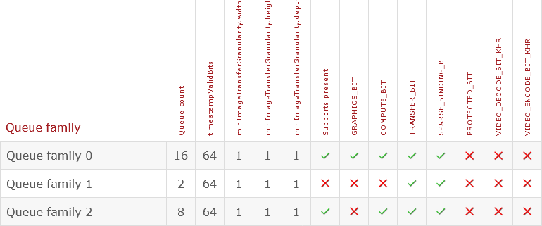

# Tutoriel pour bien débuter à Vulkan
## 1.4 - Choix d'un GPU et device logique

Vulkan étant une API graphique, elle requiert un GPU (carte graphique) supportant Vulkan dans ses drivers. Dans cette partie, nous allons sélectionner un GPU sur lequel exécuter nos commandes ainsi que créer un *device* logique.

Nous allons ajouter un VkPhysicalDevice dans la classe ``HelloTriangle``, cet objet va représenter notre GPU physique :

```CPP
VkPhysicalDevice m_physicalDevice;
```

Puis dans la fonction ``init()`` :

```CPP
// Sélection du GPU
uint32_t physicalDeviceCount;
vkEnumeratePhysicalDevices(m_instance, &physicalDeviceCount, nullptr);
if (physicalDeviceCount == 0) {
	std::cout << "Aucun GPU supportant Vulkan n'a ete trouve." << std::endl;
	exit(1);
}
std::vector<VkPhysicalDevice> physicalDevices(physicalDeviceCount);
vkEnumeratePhysicalDevices(m_instance, &physicalDeviceCount, physicalDevices.data());

m_physicalDevice = physicalDevices[0];
```

[**``vkEnumeratePhysicalDevices()``**](https://registry.khronos.org/vulkan/specs/1.3-extensions/man/html/vkEnumeratePhysicalDevices.html) va tout d'abord nous donner le nombre de GPU supportant Vulkan. Si aucun GPU ne supporte Vulkan, alors nous pouvons quitter le programme. Il existe néanmoins des alternatives consistant à utiliser le CPU comme un GPU, comme avec [**SwiftShader**](https://github.com/google/swiftshader).

Lors du second appel à ``vkEnumeratePhysicalDevices``, nous mettons tous les GPU disponibles, représentés par des ``VkPhysicalDevice``s, dans un ``std::vector`` puis nous récupérons le premier. Il est possible de trier les GPU selon s'ils sont intégrés, comme les *chipsets* graphiques, ou discrets, comme les cartes graphiques. Il est même possible de calculer un score pour chaque GPU selon sa mémoire disponible, la version de son *driver*, etc. puis de choisir le meilleur, mais en réalité, il est généralement préférable de récupérer le premier dans la liste, ordre étant décidé par l'OS et permettant à l'utilisateur de choisir lui-même le GPU à utiliser pour le programme dans les paramètres de son OS.



On peut maintenant, optionnellement, afficher dans la console des informations sur le GPU :

```CPP
#include <string> // A mettre avec les autres includes en haut du fichier

	// Afficher quelques informations sur le GPU choisi
	VkPhysicalDeviceProperties2 physicalDeviceProperties2 = {};
	physicalDeviceProperties2.sType = VK_STRUCTURE_TYPE_PHYSICAL_DEVICE_PROPERTIES_2;
	physicalDeviceProperties2.pNext = nullptr;
	vkGetPhysicalDeviceProperties2(m_physicalDevice, &physicalDeviceProperties2);

	std::string physicalDeviceType;
	switch (physicalDeviceProperties2.properties.deviceType) {
	case VK_PHYSICAL_DEVICE_TYPE_OTHER:
		physicalDeviceType = "Autre";
		break;
	case VK_PHYSICAL_DEVICE_TYPE_INTEGRATED_GPU:
		physicalDeviceType = "Integre";
		break;
	case VK_PHYSICAL_DEVICE_TYPE_DISCRETE_GPU:
		physicalDeviceType = "Discret";
		break;
	case VK_PHYSICAL_DEVICE_TYPE_VIRTUAL_GPU:
		physicalDeviceType = "Virtuel";
		break;
	case VK_PHYSICAL_DEVICE_TYPE_CPU:
		physicalDeviceType = "CPU";
		break;
	}

	std::string driverVersion = std::to_string(VK_API_VERSION_MAJOR(physicalDeviceProperties2.properties.driverVersion)) + "."
		+ std::to_string(VK_API_VERSION_MINOR(physicalDeviceProperties2.properties.driverVersion)) + "."
		+ std::to_string(VK_API_VERSION_PATCH(physicalDeviceProperties2.properties.driverVersion));
	if (physicalDeviceProperties2.properties.vendorID == 4318) { // NVIDIA
		uint32_t major = (physicalDeviceProperties2.properties.driverVersion >> 22) & 0x3ff;
		uint32_t minor = (physicalDeviceProperties2.properties.driverVersion >> 14) & 0x0ff;
		uint32_t patch = (physicalDeviceProperties2.properties.driverVersion >> 6) & 0x0ff;
		driverVersion = std::to_string(major) + "." + std::to_string(minor) + "." + std::to_string(patch);
	}
#if defined(NTSH_OS_WINDOWS)
	else if (physicalDeviceProperties2.properties.vendorID == 0x8086) { // Intel
		uint32_t major = (physicalDeviceProperties2.properties.driverVersion >> 14);
		uint32_t minor = (physicalDeviceProperties2.properties.driverVersion) & 0x3fff;
		driverVersion = std::to_string(major) + "." + std::to_string(minor);
	}
#endif

	std::cout << "Nom du GPU : " << physicalDeviceProperties2.properties.deviceName << std::endl;
	std::cout << "Type du GPU : " << physicalDeviceType << std::endl;
	std::cout << "Version du driver : " << driverVersion << std::endl;
```

[**``VkPhysicalDeviceProperties2``**](https://registry.khronos.org/vulkan/specs/1.3-extensions/man/html/VkPhysicalDeviceProperties2.html) est l'exemple d'une fonctionnalité qui était disponible via une extension ([**``VK_KHR_get_physical_device_properties2``**](https://registry.khronos.org/vulkan/specs/1.3-extensions/man/html/VK_KHR_get_physical_device_properties2.html)) mais qui est fait partie du cœur de Vulkan 1.1. Elle a le chiffre ``2`` à la fin de son nom car il existe [**``VkPhysicalDeviceProperties``**](https://registry.khronos.org/vulkan/specs/1.3-extensions/man/html/VkPhysicalDeviceProperties.html). La deuxième version ajoute un ``pNext`` permettant de l'étendre afin de récupérer des informations additionnelles.

La version du *driver* du GPU n'est pas triviale à récupérer car elle est sous le format d'un entier 32 bits non-signé et chaque vendeur de GPU choisit la manière dont elle est encodée.

Si vous lancez le programme, vous devriez voir le nom de votre GPU s'afficher, son type et sa version de *driver*.

```
Nom du GPU : NVIDIA GeForce GTX 1060 6GB
Type du GPU : Discret
Version du driver : 527.56.0
```

Si le nom affiché n'est pas celui que vous espériez, rendez-vous dans les paramètres de votre OS pour changer le GPU par défaut pour votre programme.

Nous devons maintenant créer un *device* logique qui servira de moyen de communication avec le *device* physique (le GPU).

On peut donc créer un VkDevice dans la classe ``HelloTriangle`` :

```CPP
VkDevice m_device;
```

Le GPU a plusieurs familles de queues sur lesquelles exécuter des commandes. Ces familles de queues supportent différents types d'opérations. Nous devons donc en trouver une qui nous permette de faire du rendu et de présenter des images à l'écran.



Ce tableau est tiré de [**GPUinfo**](https://vulkan.gpuinfo.org/listdevices.php), qui permet de consulter et soumettre des rapports concernant les GPU et leur support de Vulkan. On peut voir ici que la famille de queues 0 a 16 queues, supporte, entre autres, la présentation à l'écran, les opérations graphiques, de calculs et de transferts.

On peut donc ajouter un entier 32 bits non signé à la calsse ``HelloTriangle`` pour y mettre le numéro de la famille de queues supportant les opérations graphiques et le rendu à l'écran :

```CPP
uint32_t m_graphicsQueueFamilyIndex;
```

Et dans la fonction ``init()`` :

```CPP
// Trouver une famille de queues supportant les operations graphiques
uint32_t queueFamilyPropertyCount;
vkGetPhysicalDeviceQueueFamilyProperties(m_physicalDevice, &queueFamilyPropertyCount, nullptr);
std::vector<VkQueueFamilyProperties> queueFamilyProperties(queueFamilyPropertyCount);
vkGetPhysicalDeviceQueueFamilyProperties(m_physicalDevice, &queueFamilyPropertyCount, queueFamilyProperties.data());

m_graphicsQueueFamilyIndex = 0;
for (const VkQueueFamilyProperties& queueFamilyProperty : queueFamilyProperties) {
	if (queueFamilyProperty.queueCount > 0 && queueFamilyProperty.queueFlags & VK_QUEUE_GRAPHICS_BIT) {
		VkBool32 presentSupport;
		vkGetPhysicalDeviceSurfaceSupportKHR(m_physicalDevice, m_graphicsQueueFamilyIndex, m_surface, &presentSupport);
		if (presentSupport) {
			break;
		}
	}
	m_graphicsQueueFamilyIndex++;
}
```

[**``vkGetPhysicalDeviceQueueFamilyProperties``**](https://registry.khronos.org/vulkan/specs/1.3-extensions/man/html/vkGetPhysicalDeviceQueueFamilyProperties.html) nous permet de récupérer les propriétés de toutes les familles de queues disponibles sur le GPU. On itère ensuite sur toutes les familles de queues pour en trouver une qui :
- A au moins une queue (``queueFamilyProperty.queueCount > 0``),
- Supporte les opérations graphiques (``queueFamilyProperty.queueFlags & VK_QUEUE_GRAPHICS_BIT``),
- Supporte la présentation à l'écran (``vkGetPhysicalDeviceSurfaceSupportKHR(m_physicalDevice, m_graphicsQueueFamilyIndex, m_surface, &presentSupport)`` avec ``presentSupport == VK_TRUE``).

Une fois qu'une famille de queues répond à toutes ces conditions, on a son indice dans ``m_graphicsQueueFamilyIndex`` et on arrête de chercher.

On peut maintenant créer le *device* logique :

```CPP
// Creation du device logique
float queuePriority = 1.0f;
VkDeviceQueueCreateInfo deviceQueueCreateInfo = {};
deviceQueueCreateInfo.sType = VK_STRUCTURE_TYPE_DEVICE_QUEUE_CREATE_INFO;
deviceQueueCreateInfo.pNext = nullptr;
deviceQueueCreateInfo.flags = 0;
deviceQueueCreateInfo.queueFamilyIndex = m_graphicsQueueFamilyIndex;
deviceQueueCreateInfo.queueCount = 1;
deviceQueueCreateInfo.pQueuePriorities = &queuePriority;

VkDeviceCreateInfo deviceCreateInfo = {};
deviceCreateInfo.sType = VK_STRUCTURE_TYPE_DEVICE_CREATE_INFO;
deviceCreateInfo.pNext = nullptr;
deviceCreateInfo.queueCreateInfoCount = 1;
deviceCreateInfo.pQueueCreateInfos = &deviceQueueCreateInfo;
deviceCreateInfo.enabledLayerCount = 0;
deviceCreateInfo.ppEnabledLayerNames = nullptr;

std::vector<const char*> deviceExtensions;
if (deviceExtensionAvailable("VK_KHR_swapchain")) {
	deviceExtensions.push_back("VK_KHR_swapchain");
}
deviceCreateInfo.enabledExtensionCount = static_cast<uint32_t>(deviceExtensions.size());
deviceCreateInfo.ppEnabledExtensionNames = deviceExtensions.data();

deviceCreateInfo.pEnabledFeatures = nullptr;
TUTORIEL_VK_CHECK(vkCreateDevice(m_physicalDevice, &deviceCreateInfo, nullptr, &m_device));
```

La structure [**``VkDeviceCreateInfo``**](https://registry.khronos.org/vulkan/specs/1.3-extensions/man/html/VkDeviceCreateInfo.html) demande le nombre de queues que l'on souhaite créer, représentées par la structure [**``VkDeviceQueueCreateInfo``**](https://registry.khronos.org/vulkan/specs/1.3-extensions/man/html/VkDeviceQueueCreateInfo.html), qui demande l'indice de la famille de queues, que l'on a récupéré juste avant, le nombre de queues que l'on souhaite créer, une seule ici, et la priorité des queues, dans le cas où on souhaite en créer plusieurs. La priorité permet de partager le travail entre les différentes queues et la somme des priorités de chaque queue doit donner 1. Étant donné que nous n'allons créer qu'une seule queue, sa priorité sera 1.

La création du *device* logique mentionne ``enabledLayerCount`` et ``ppEnabledLayerNames``, comme lors de la création de l'instance Vulkan. En réalité, l'activation de *layers* explicites depuis la création du *device* logique est dépréciée et ses valeurs sont ignorées.

On a aussi la mention d'extensions de *device*, avec ``enabledExtensionCount`` et ``ppEnabledExtensionNames``. Nous allons ici aussi vérifier qu'une extension, ``VK_KHR_swapchain``, existe, avant de l'activer, avec la méthode de classe privée ``deviceExtensionAvailable``.

Dans la classe ``HelloTriangle`` :

```CPP
bool deviceExtensionAvailable(const char* extensionName);
```

Et dans ``hellotriangle.cpp`` :

```CPP
bool HelloTriangle::deviceExtensionAvailable(const char* extensionName) {
	uint32_t deviceExtensionPropertyCount;
	TUTORIEL_VK_CHECK(vkEnumerateDeviceExtensionProperties(m_physicalDevice, nullptr, &deviceExtensionPropertyCount, nullptr));
	std::vector<VkExtensionProperties> deviceExtensionProperties(deviceExtensionPropertyCount);
	TUTORIEL_VK_CHECK(vkEnumerateDeviceExtensionProperties(m_physicalDevice, nullptr, &deviceExtensionPropertyCount, deviceExtensionProperties.data()));

	for (const VkExtensionProperties& availableExtension : deviceExtensionProperties) {
		if (strcmp(availableExtension.extensionName, extensionName) == 0) {
			return true;
		}
	}

	std::cout << "Extension de device " << extensionName << " n'est pas disponible.";
	return false;
}
```

Cette fonction suit le même principe que ``instanceExtensionAvailable`` qui vérifiait qu'une extension d'instance était disponible.

L'extension ``VK_KHR_swapchain`` va nous servir à créer une *swapchain* au chapitre suivant.

``pFeatures`` sont des fonctionnalités que l'on peut activer depuis un [**``VkPhysicalDeviceFeatures``**](https://registry.khronos.org/vulkan/specs/1.3-extensions/man/html/VkPhysicalDeviceFeatures.html). Il est par exemple possible d'activer la possibilité d'utiliser des entiers ou des flottants 64 bits dans les *shaders* avec ``shaderInt64`` ou ``shaderFloat64`` ou encore d'effectuer plusieurs dessins en un seul appel de fonctions de [**dessin indirect**](https://registry.khronos.org/vulkan/specs/1.3-extensions/man/html/vkCmdDrawIndirect.html) avec ``multiDrawIndirect``.

Chaque objet Vulkan crée doit être détruit :

```CPP
// Destruction du device logique
vkDestroyDevice(m_device, nullptr);
```

On peut ensuite récupérer la queue avec un nouvel attribut de classe :

```CPP
VkQueue m_graphicsQueue;
```

Et à la suite de la création du *device* logique :

```CPP
// Recuperation de la queue creee
vkGetDeviceQueue(m_device, m_graphicsQueueFamilyIndex, 0, &m_graphicsQueue);
```

Nous avons donc maintenant sélectionné un GPU et crée un *device* logique pour communiquer avec.

[**Chapitre précédent**](3.md) - [**Index**](../index.md) - [**Chapitre suivant**](5.md)

[**Code de la partie**](https://github.com/ZaOniRinku/TutorielVulkanFR/tree/partie1/4)