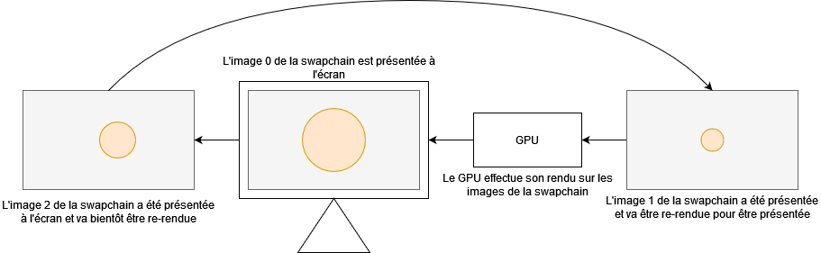
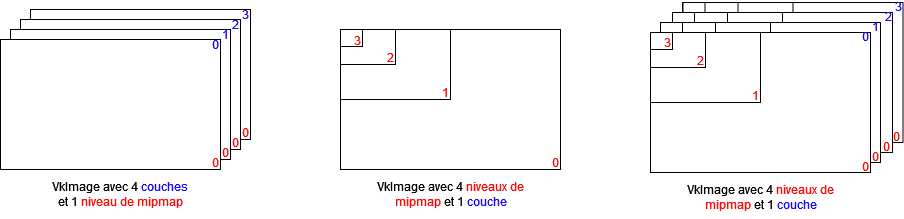
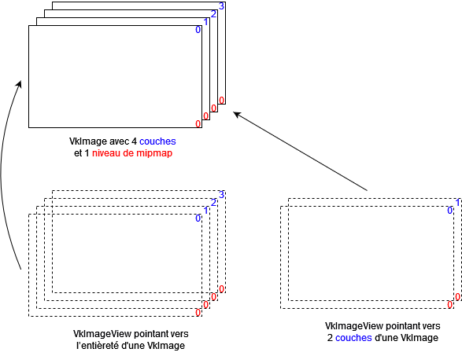

# Tutoriel Vulkan en français
## 1.5 - La swapchain

Dessiner une image sur l'écran requiert l'utilisation d'images spéciales sur lesquelles effectuer le rendu : les images de la *swapchain*.

La *swapchain* représente les images qui seront présentées à l'écran, et, logiquement, les images sur lesquelles finiront les images rendues.



Sur ce diagramme, l'image 0 de la *swapchain* est en train d'être présentée à l'écran à la suite de l'image 2 tandis que l'image 1 a été présentée encore avant l'image 2 et va être re-rendue par le GPU. Si l'ordre vous paraît étrange, c'est normal, on ne peut pas savoir à l'avance quelle image de la swapchain sera la suivante à être rendue et présentée.

Nous allons avoir besoin d'un objet ``VkSwapchainKHR``, d'un entier 32 bits non signé pour le nombre d'images dans la *swapchain*, d'un ``std::vector`` de ``VkImage`` pour y mettre les images de la *swapchain* et d'un ``std::vector`` de ``VkImageView`` dans la classe ``HelloTriangle`` :

```CPP
#include <vector> // A mettre avec les autres includes en haut du fichier

VkSwapchainKHR m_swapchain;
uint32_t m_swapchainImageCount;
std::vector<VkImage> m_swapchainImages;
std::vector<VkImageView> m_swapchainImageViews;
```



Une ``VkImage`` représente une image dans la mémoire. Elle a une taille (largeur et hauteur) ainsi qu'un certain nombres de couches et de niveaux de mipmaps. Les différentes couches d'une image ont toutes la même taille et peuvent servir, par exemple, à représenter les 6 faces d'une *cubemap* pour faire une *skybox*. Les niveaux de mipmaps sont tous deux fois plus petits que le niveau précédent, le niveau 0 ayant la taille native de l'image.



Une ``VkImageView`` pointe vers une ``VkImage``, soit entièrement, en couvrant toutes ses couches et tous ses niveaux de mipmaps, soit partiellement, en ne couvrant qu'une partie de ses couches et/ou de ses niveaux de mipmaps. De ce fait, plusieurs ``VkImageView``s peuvent pointer vers la même ``VkImage``. Ce sont les ``VkImageView`` qui seront les cibles de rendu quand il faudra enregistrer les commandes pour le GPU.

On peut maintenant passer à la création de la *swapchain* :

```CPP
// Creation de la swapchain
VkSurfaceCapabilitiesKHR surfaceCapabilities;
vkGetPhysicalDeviceSurfaceCapabilitiesKHR(m_physicalDevice, m_surface, &surfaceCapabilities);
uint32_t minImageCount = surfaceCapabilities.minImageCount + 1;
if (surfaceCapabilities.maxImageCount > 0 && minImageCount > surfaceCapabilities.maxImageCount) {
	minImageCount = surfaceCapabilities.maxImageCount;
}

uint32_t surfaceFormatCount;
vkGetPhysicalDeviceSurfaceFormatsKHR(m_physicalDevice, m_surface, &surfaceFormatCount, nullptr);
std::vector<VkSurfaceFormatKHR> surfaceFormats(surfaceFormatCount);
vkGetPhysicalDeviceSurfaceFormatsKHR(m_physicalDevice, m_surface, &surfaceFormatCount, surfaceFormats.data());
VkFormat swapchainFormat = surfaceFormats[0].format;
VkColorSpaceKHR swapchainColorSpace = surfaceFormats[0].colorSpace;
for (const VkSurfaceFormatKHR& surfaceFormat : surfaceFormats) {
	if (surfaceFormat.format == VK_FORMAT_R8G8B8A8_SRGB && surfaceFormat.colorSpace == VK_COLORSPACE_SRGB_NONLINEAR_KHR) {
		swapchainFormat = surfaceFormat.format;
		swapchainColorSpace = surfaceFormat.colorSpace;
		break;
	}
}

uint32_t presentModeCount;
vkGetPhysicalDeviceSurfacePresentModesKHR(m_physicalDevice, m_surface, &presentModeCount, nullptr);
std::vector<VkPresentModeKHR> presentModes(presentModeCount);
vkGetPhysicalDeviceSurfacePresentModesKHR(m_physicalDevice, m_surface, &presentModeCount, presentModes.data());
VkPresentModeKHR swapchainPresentMode = VK_PRESENT_MODE_FIFO_KHR;
for (const VkPresentModeKHR& presentMode : presentModes) {
	if (presentMode == VK_PRESENT_MODE_MAILBOX_KHR) {
		swapchainPresentMode = presentMode;
		break;
	}
	else if (presentMode == VK_PRESENT_MODE_IMMEDIATE_KHR) {
		swapchainPresentMode = presentMode;
	}
}

VkSwapchainCreateInfoKHR swapchainCreateInfo = {};
swapchainCreateInfo.sType = VK_STRUCTURE_TYPE_SWAPCHAIN_CREATE_INFO_KHR;
swapchainCreateInfo.pNext = nullptr;
swapchainCreateInfo.flags = 0;
swapchainCreateInfo.surface = m_surface;
swapchainCreateInfo.minImageCount = minImageCount;
swapchainCreateInfo.imageFormat = swapchainFormat;
swapchainCreateInfo.imageColorSpace = swapchainColorSpace;
swapchainCreateInfo.imageExtent = surfaceCapabilities.currentExtent;
swapchainCreateInfo.imageArrayLayers = 1;
swapchainCreateInfo.imageUsage = VK_IMAGE_USAGE_COLOR_ATTACHMENT_BIT;
swapchainCreateInfo.imageSharingMode = VK_SHARING_MODE_EXCLUSIVE;
swapchainCreateInfo.queueFamilyIndexCount = 0;
swapchainCreateInfo.pQueueFamilyIndices = nullptr;
swapchainCreateInfo.preTransform = surfaceCapabilities.currentTransform;
swapchainCreateInfo.compositeAlpha = VK_COMPOSITE_ALPHA_OPAQUE_BIT_KHR;
swapchainCreateInfo.presentMode = swapchainPresentMode;
swapchainCreateInfo.clipped = VK_TRUE;
swapchainCreateInfo.oldSwapchain = VK_NULL_HANDLE;
TUTORIEL_VK_CHECK(vkCreateSwapchainKHR(m_device, &swapchainCreateInfo, nullptr, &m_swapchain));
```

Comme on peut le voir, il y a un certain nombres d'informations à récupérer pour pouvoir remplir [**``VkSwapchainCreateInfoKHR``**](https://registry.khronos.org/vulkan/specs/1.3-extensions/man/html/VkSwapchainCreateInfoKHR.html).

``minImageCount`` est le nombre d'images minimales dont le programme a besoin. Le nombre d'images crée réellement est géré par le *driver* du GPU.

``imageFormat`` est le format que les images de la *swapchain* auront. Il existe de nombreux formats différents ([**``VkFormat``**](https://registry.khronos.org/vulkan/specs/1.3-extensions/man/html/VkFormat.html)) mais la *swapchain* n'en supporte que très peu. Ici, on va viser ``VK_FORMAT_R8G8B8A8_SRGB`` et non pas ``VK_FORMAT_R8G8B8A8_UNORM`` car les couleurs doivent être traitées avec l'espace de couleur SRGB. Pour le [**``VkColorSpaceKHR``**](https://registry.khronos.org/vulkan/specs/1.3-extensions/man/html/VkColorSpaceKHR.html), ce sera ``VK_COLOR_SPACE_SRGB_NONLINEAR_KHR``, qui est le seul supporté sans extension supplémentaire.

``imageExtent`` est tout simplement la taille de la surface, qui est donc aussi la taille de la fenêtre.

``imageUsage`` est un ``VkImageUsageFlags`` où nous devons spécifier ce à quoi serviront les images de la *swapchain*. Nous comptons dessiner dessus comme des images de couleur, nous utilisons donc l'usage ``VK_IMAGE_USAGE_COLOR_ATTACHMENT_BIT``.

``imageSharingMode`` sert à spécifier sur les images de la *swapchain* seront utilisées par une seule (``VK_SHARING_MODE_EXCLUSIVE``) ou plusieurs (``VK_SHARING_MODE_CONCURRENT``) familles de queues. ``queueFamilyIndexCount`` et ``pQueueFamilyIndices`` ne sont utilisés que si ``imageSharingMode`` est ``VK_SHARING_MODE_CONCURRENT``, ce qui n'est pas le cas ici car nous n'utilisons qu'une seule famille de queues.

``preTransform`` sert à effectuer des rotations ou des effets miroirs dans le but d'afficher correctement l'image sur l'écran. On utilise celui de la surface.

``compositeAlpha`` permet de garder ou non, la composante alpha de l'image de la *swapchain* affichée à l'écran. Ici, on va remplacer l'alpha par 1, donc une opacité complète.

``presentMode`` est un [**``VkPresentModeKHR``**](https://registry.khronos.org/vulkan/specs/1.3-extensions/man/html/VkPresentModeKHR.html) permet de donner des indications sur comment présenter l'image. ``VK_PRESENT_MODE_IMMEDIATE_KHR`` n'attend pas que l'image précédente ait fini sa présentation pour présenter l'image suivante (pas de Vsync), et peut faire apparaitre des effets de *tearing* quand une image n'a pas fini d'être présentée alors que la suivante commence sa présentation. ``VK_PRESENT_MODE_MAILBOX_KHR`` et ``VK_PRESENT_MODE_FIFO_KHR`` attendent que l'image précédente ait finit sa présentation pour présenter l'image suivante (Vsync), la différence entre ces deux modes se situent dans le fait que ``VK_PRESENT_MODE_FIFO_KHR`` va garder les images qui ne sont pas encore présentées en mémoire pour les présenter dans l'autre dans lesquelles elles sont rendues tandis que ``VK_PRESENT_MODE_MAILBOX_KHR`` va présenter la dernière image mise à disposition lorsque l'image précédente aura fini d'être présentée, ce mode de présentation peut donc sauter des images. On spécifie par défaut que le mode de présentation est ``VK_PRESENT_MODE_FIFO_KHR`` car il est seul qui est garanti d'être supporté. Ici, on va essayer d'utiliser ``VK_PRESENT_MODE_MAILBOX_KHR``, s'il n'est pas disponible, ``VK_PRESENT_MODE_IMMEDIATE_KHR`` et si celui-ci n'est aussi pas disponible, ``VK_PRESENT_MODE_FIFO_KHR``.

``clipped`` permet de dire si le *driver* a le droit de ne pas rendre certaines parties de l'image si elles sont cachées. Par exemple, si on a une autre fenêtre complétement ou partiellement par-dessus la fenêtre de notre programme, le *driver* peut ne pas rendre la partie cachée par l'autre fenêtre.

``oldSwapchain`` permet de passer l'ancienne *swapchain*, et nous n'en avons pas ici puisque c'est la première que l'on crée, dans le but de laisser le *driver* réutiliser les ressources de l'ancienne *swapchain*.

Une fois la *swapchain* créée, il faut la détruire à la fermeture du programme, dans la fonction ``destroy()`` :

```CPP
// Destruction de la swapchain
vkDestroySwapchainKHR(m_device, m_swapchain, nullptr);
```

On peut maintenant récupérer les images de la *swapchain* :

```CPP
TUTORIEL_VK_CHECK(vkGetSwapchainImagesKHR(m_device, m_swapchain, &m_swapchainImageCount, nullptr));
m_swapchainImages.resize(m_swapchainImageCount);
TUTORIEL_VK_CHECK(vkGetSwapchainImagesKHR(m_device, m_swapchain, &m_swapchainImageCount, m_swapchainImages.data()));
```


[**Chapitre précédent**](4.md) - [**Index**](../index.md) - [**Chapitre suivant**](6.md)

[**Code de la partie**](https://github.com/ZaOniRinku/TutorielVulkanFR/tree/partie1/5)