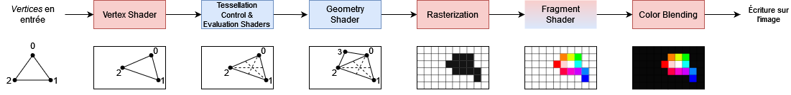
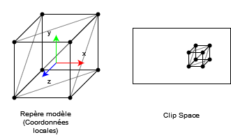

# Tutoriel pour bien débuter à Vulkan
## 1.6 - Le pipeline graphique

Le pipeline graphique est l'élément central à tout rendu. Il est composé de plusieurs étapes qui permettent de passer de modèles 3D et textures à une image.



Les étapes en rouge seront forcément présentes dans un pipeline graphique tandis que celles en bleu sont optionnelles. Le *fragment shader* est en rouge et en bleu car il n'est pas obligé d'en spécifier un mais il y en aura tout de même un par défaut.

- Vertices en entrée : Ils représentent les points des maillages en entrée. Ils peuvent contenir des informations s'ils sont dans un *Vertex Buffer*, telles que leur position, leur normale, leurs coordonnées de textures, leur tangente, etc. Le pipeline graphique définit la primitive associée à ces *vertices*, qui sont généralement des triangles (3 *vertices*), mais peuvent aussi être des lignes (2 *vertices*) ou simplement des points (1 *vertex*).

- **Vertex shader** : Prend en entrée des *vertices* (points d'un maillage) dans le repère de leur modèle, qui sont des coordonnées locales, et sort des *vertices* dans le *Clip Space*.



- *Tessellation control shader* et *Tessellation evaluation shader* : Permet de subdiviser le maillage sorti par le *Vertex shader* dans le but de lui donner plus de détails.

- *Geometry shader* : Prend en entrée la primitive de choix du pipeline graphique (triangle, ligne ou point) et, soit en supprime, soit en ajoute. Les *Geometry shaders* ne sont plus vraiment utilisés aujourd'hui et il est même recommandé de ne plus s'en servir.

- **Rastérisation** (Rasterization) : Prend les primitives retournées par l'étape précédente et les discrétise pour sortir des fragments. Ce processus consiste à prendre une grille qui représente l'image et, pour chaque cellule de cette grille, chercher toutes les primitives qui couvrent le centre de celles-ci afin de créer des fragments contenant des informations sur la primitive.

- **Fragment shader** : Prend en entrée des fragments sortis lors de la rastérisation et sort une couleur et une profondeur.

- **Mélange de couleurs** (*Color Blending*) : Prend en entrée la couleur sortie du *Fragment shader* et l'ajoute à l'image finale selon des opérations définies lors de la création de la pipeline graphique. Le mélange de couleurs permet par exemple d'avoir des objets transparents.

Les pipelines de tout genre (car il en existe d'autres types, comme les pipelines de calcul) sont représentés par des ``VkPipeline``s. Nous allons donc en ajouter un ainsi qu'un ``VkPipelineLayout`` à notre classe ``HelloTriangle`` :

```CPP
VkPipeline m_graphicsPipeline;
VkPipelineLayout m_graphicsPipelineLayout;
```

Nous allons aussi ajouter une méthode privée dans laquelle nous allons créer notre pipeline graphique :

```CPP
void createGraphicsPipeline();
```

Que nous allons appeler à la suite de la fonction ``init()`` :

```CPP
// Creation du pipeline graphique
createGraphicsPipeline();
```

Puis implémenter dans ``hellotriangle.cpp`` :

```CPP
void HelloTriangle::createGraphicsPipeline() {

}
```

Toute la création du pipeline graphique s'effectuera dans cette fonction.

[**Chapitre précédent**](5.md) - [**Index**](../index.md) - [**Chapitre suivant**](6/1.md)

[**Code de la partie**](https://github.com/ZaOniRinku/TutorielVulkanFR/tree/partie1)