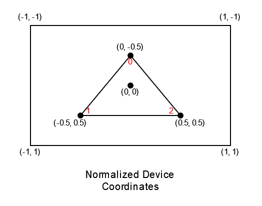
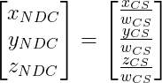

# [Tutoriel pour bien débuter à Vulkan](../../index.md)
## 1.6.1 - Le pipeline graphique - Écriture et compilation des shaders

Le pipeline graphique a plusieurs étapes où des *shaders* sont utilisés, le *Vertex shader*, le *Tessellation Control shader*, le *Tessellation Evaluation shader*, le *Geometry shader* et le *Fragment shader*.

Le *Tessellation Control shader*, le *Tessellation Evaluation shader* et le *Geometry shader* sont optionnels et il est possible de créer un pipeline graphique sans spécifier de *Fragment shader* mais dans ce cas, seule l'information de la profondeur du fragment sera sortie. Dans la très grande majorité des cas, un pipeline graphique ne comportera que deux *shaders* : le *Vertex shader* et le *Fragment shader*.

Contrairement à OpenGL, Vulkan ne supporte pas le GLSL mais supporte une représentation intermédiaire appelée [**SPIR-V**](https://www.khronos.org/spir/). L'avantage est le fait qu'il soit techniquement possible d'écrire ses *shaders* en n'importe quel langage, tant qu'il existe un compilateur vers SPIR-V. Heureusement, VulkanSDK nous fournit de quoi compiler du GLSL vers SPIR-V.

Dans ce chapitre, nous allons voir deux façons de compiler des *shaders* depuis du GLSL vers du SPIR-V. La première méthode consistera à pré-compiler les *shaders* avant de lire le SPIR-V dans le programme et la seconde méthode consistera à compiler les *shaders* pendant que le programme est en cours.

Avant de les compiler, nous devons écrire les *shaders*. Tout d'abord nous allons créer un dossier ``shaders`` à la racine du dossier du projet (à côté de ``CMakeLists.txt``). Dans ce dossier ``shaders``, nous allons créer deux fichiers, ``triangle.vert``, le *Vertex shader*, et ``triangle.frag``, le *Fragment shader*. Ce seront les *shaders* qui nous serviront à dessiner notre triangle.

Tout d'abord, ``triangle.vert``, le *Vertex shader* :

```glsl
#version 460

const vec2 positions[3] = {
	vec2(0.0, -0.5),
	vec2(-0.5, 0.5),
	vec2(0.5, 0.5)
};

const vec3 colors[3] = {
	vec3(1.0, 0.0, 0.0),
	vec3(0.0, 0.0, 1.0),
	vec3(0.0, 1.0, 0.0)
};

layout(location = 0) out vec3 color;

void main() {
	color = colors[gl_VertexIndex];
	gl_Position = vec4(positions[gl_VertexIndex], 0.0, 1.0);
}
```

``#version 460`` signifie que nous allons utiliser [**GLSL 4.60**](https://registry.khronos.org/OpenGL/specs/gl/GLSLangSpec.4.60.pdf).

Pour dessiner un triangle, nous n'avons besoin que de 3 points, nous n'avons donc pas besoin de ``Vertex buffer`` pour contenir les positions et couleurs de nos ``vertices``, puisque le volume de données à utiliser est faible.

À la place, nous allons les indiquer directement dans le *shader* avec le tableau de 3 ``vec2`` (``vec2 positions[3]``) pour les positions, et le tableau de 3 ``vec3`` (``vec3 colors[3]``) pour les couleurs. Le *Vertex shader* est appelé une fois par *vertex*, et pour savoir sur lequel notre *shader* s'exécute, nous pouvons utiliser la constante prédéfinie dans le GLSL Vulkan ``gl_VertexIndex`` (en GLSL OpenGL, cette constante prédéfinie s'appelle ``gl_VertexID``), qui va, ici, être égale à 0 pour le premier *vertex*, à 1 pour le deuxième *vertex* et à 2 pour le troisième *vertex*.

Les positions sont sur les *Normalized Device Coordinates* (*NDC*), qui vont de -1 à 1 sur *x* et *y*, avec l'origine placée au centre. Nous n'avons pas de 3ème composante *z* puisque notre triangle est aligné avec l'écran.



Sur ce graphique, les chiffres en rouge sont les valeurs de ``gl_VertexIndex`` selon le *vertex* traité.

``gl_Position`` est une valeur pré-existante de GLSL qui sert à donner les coordonnées dans le *Clip Space*. Pourtant, il est indiqué juste au-dessus que les positions des *vertices* sont dans le *NDC*... Le *Vertex shader* sort des coordonnées dans le *Clip Space* qui sont des coordonnées homogènes, en 4 dimensions. La 4ème composante, appelée *w*, divise toutes les autres composantes pour donner les *NDC* lors de l'étape de rastérisation, donnant donc :



Ici, *w* est égal à 1, donc les positions des *vertices* à l'entrée seront les mêmes qu'à la sortie.

Les couleurs sont au format RGB (<span style="color:red">*Red*</span>, <span style="color:green">*Green*</span>, <span style="color:blue">*Blue*</span>).

``layout(location = 0) out vec3 color`` signifie que nous allons passer la variable ``color`` au *Fragment shader*, où les fragments récupéreront une valeur interpolée selon leur distance avec les *vertices*. Si on ne souhaite pas interpoler les valeurs sur les fragments, nous pouvons ajouter le qualifiant ``flat`` de cette manière :

``layout(location = 0) flat out vec3 color``

``color`` est simplement égal à la valeur du tableau ``colors`` indexé avec la valeur de la constante prédéfinie ``gl_VertexIndex``.

Ensuite, ``triangle.frag``, le *Fragment shader* :

```glsl
#version 460

layout(location = 0) in vec3 inColor;

layout(location = 0) out vec4 outColor;

void main() {
	outColor = vec4(inColor, 1.0);
}
```

Le *Fragment shader* s'exécute une fois par fragment. Celui-ci est simple, ``layout(location = 0) in vec3 inColor`` récupère la valeur ``layout(location = 0) out vec3 color`` du *Vertex shader*, les noms des variables peuvent être totalement différentes tant que la ``location`` est la même. Si on ne souhaite pas d'interpolation, il faut, ici aussi, ajouter le qualifieur ``flat`` :

``layout(location = 0) flat in vec3 inColor``

``layout(location = 0) out vec4 outColor`` signifie que ``outColor`` sera notre variable contenant la valeur finale pour l'image à la ``location`` 0, qui sera notre *swapchain*. Nous pouvons donc rendre sur plusieurs images en même temps, *Multiple Render Targets* (MRT), si on spécifie plusieurs valeurs de retour, comme ceci :

```cpp
layout(location = 0) out vec4 outColor0;
layout(location = 1) out vec4 outColor1;
layout(location = 2) out vec4 outColor2;
```

Mais ici, nous n'allons rendre que sur une seule image.

Maintenant que les *shaders* sont écrits, nous pouvons les compiler.

### Pré-compilation
Pré-compiler les *shaders* permet de ne pas perdre de temps à compiler les *shaders* en temps-réel (pendant que le programme est en cours). Le désavantage principal est qu'il n'est donc pas possible de mettre à jour ses *shaders* en temps-réel.

Pour pré-compiler les shaders, nous allons nous servir de ``glslangValidator`` qui est fourni avec ``VulkanSDK``. Dans le dossier où est installé ``VulkanSDK`` : ``VulkanSDK/*numero.de.version*/Bin`` devrait figurer ``glslangValidator.exe`` sur Windows ou ``glslangValidator`` sur Linux. Copiez-le et mettez-le dans le dossier ``shaders`` du projet. Ouvrez un terminal dans ce dossier et utilisez ces commandes :

Windows :
```bash
glslangValidator.exe -V triangle.vert
glslangValidator.exe -V triangle.frag
```

Linux :
```bash
./glslangValidator -V triangle.vert
./glslangValidator -V triangle.frag
```

``-V`` est l'option permettant de spécifier que le fichier en entrée est écrit avec du **GLSL Vulkan**, qui a [**quelques différences**](https://github.com/KhronosGroup/GLSL/blob/master/extensions/khr/GL_KHR_vulkan_glsl.txt) avec le GLSL original fait pour OpenGL. Si vous voulez connaître les options disponibles pour glslangValidator, entrez la commande ``glslangValidator.exe --help`` sur Windows ou ``./glslangValidator --help`` sur Linux. S'il y a des erreurs lors de la compilation, elles s'afficheront dans le terminal.

Une fois ces commandes exécutées, vous vous retrouvez avec deux nouveaux fichiers : ``vert.spv``, qui est ``triangle.vert`` compilé en SPIR-V, et ``frag.spv``, qui est ``triangle.frag`` compilé en SPIR-V. Si vous essayez de les ouvrir, vous n'arriverez pas à les lire car le SPIR-V est un langage binaire.

Nous allons maintenant lire ce fichier dans notre programme. Dans la classe ``HelloTriangle``, on ajoute une méthode privée qui va servir à lire le *shader* en binaire :

```cpp
#include <string> // A mettre avec les autres includes en haut du fichier

std::string readBinaryFile(const std::string& filePath);
```

Puis l'implémentation dans ``hellotriangle.cpp`` :

```cpp
#include <fstream> // A mettre avec les autres includes en haut du fichier

std::string HelloTriangle::readBinaryFile(const std::string& filePath) {
	std::ifstream file(filePath, std::ios::in | std::ios::binary);
	if (!file.is_open()) {
		std::cout << "Le fichier binaire \"" << filePath << "\" n'a pas pu etre ouvert." << std::endl;
		exit(1);
	}
	std::string fileContent((std::istreambuf_iterator<char>(file)), std::istreambuf_iterator<char>());
	return fileContent;
}
```

On ouvre le fichier en lecture seulement (``std::ios::in``) et en tant que contenu binaire (``std::ios::binary``). Si le fichier ne s'ouvre pas, soit parce qu'il n'existe pas, soit parce que l'utilisateur n'a pas les droits de lecture sur le fichier, on quitte le programme. Sinon, on lit le fichier dans un ``std::string`` qu'on retourne.

### Compilation temps-réel
La seconde méthode consiste à compiler les *shaders* pendant le programme est en cours, c'est celle qui sera utilisée pour la suite de ce tutoriel. Pour cela, nous allons nous servir de la librarie Glslang, qui est d'ailleurs utilisée dans ``glslangValidator``.

Nous allons tout d'abord devoir lire les fichiers GLSL des *shaders* avec une nouvelle méthode privée dans la classe ``HelloTriangle`` :

```cpp
std::string readAsciiFile(const std::string& filePath);
```

Puis l'implémentation dans ``hellotriangle.cpp`` :

```cpp
std::string HelloTriangle::readAsciiFile(const std::string& filePath) {
	std::ifstream file(filePath, std::ios::in);
	if (!file.is_open()) {
		std::cout << "Le fichier ASCII \"" << filePath << "\" n'a pas pu etre ouvert." << std::endl;
		exit(1);
	}
	std::string fileContent((std::istreambuf_iterator<char>(file)), std::istreambuf_iterator<char>());
	return fileContent;
}
```

La seule différence avec la fonction ``readBinaryFile`` utilisée pour lire les fichiers SPIR-V pré-compilés est que le fichier en entrée est ASCII et non pas binaire, nous devons donc retirer ``std::ios::binary`` lors de l'ouverture du fichier.

Maintenant que celui-ci est en mémoire, nous pouvons commencer la compilation du ``shader``.

Au-dessus de la classe ``HelloTriangle``, dans ``hellotriangle.h``, nous allons ajouter un ``enum`` comportant les différents types de *shaders* du pipeline graphique :

```cpp
enum struct ShaderType {
	Vertex,
	TessellationControl,
	TessellationEvaluation,
	Geometry,
	Fragment
};
```

Une nouvelle méthode privée ``compileShaderFile``, qui prend en paramètre le code GLSL du shader et son type, est ajoutée dans la classe ``HelloTriangle``, ainsi qu'un attribut privé permettant de vérifier si Glslang a déjà été initialisé ou non :

```cpp
std::vector<uint32_t> compileShaderFile(const std::string& shaderCode, ShaderType shaderType);
```

```cpp
bool m_glslangInitialized = false;
```

Cette fonction est ensuite implémentée dans ``hellotriangle.cpp`` :

```cpp
std::vector<uint32_t> HelloTriangle::compileShaderFile(const std::string& shaderCode, ShaderType shaderType) {
	if (!m_glslangInitialized) {
		glslang::InitializeProcess();
		m_glslangInitialized = true;
	}

	std::vector<uint32_t> spvCode;

	const char* shaderCodeCharPtr = shaderCode.c_str();

	EShLanguage eshType;
	switch (shaderType) {
	case ShaderType::Vertex:
		eshType = EShLangVertex;
		break;

	case ShaderType::TessellationControl:
		eshType = EShLangTessControl;
		break;

	case ShaderType::TessellationEvaluation:
		eshType = EShLangTessEvaluation;
		break;

	case ShaderType::Geometry:
		eshType = EShLangGeometry;
		break;

	case ShaderType::Fragment:
		eshType = EShLangFragment;
		break;
	}

	glslang::TShader shader(eshType);
	shader.setStrings(&shaderCodeCharPtr, 1);
	int clientInputSemanticsVersion = 110;
	glslang::EshTargetClientVersion vulkanClientVersion = glslang::EShTargetVulkan_1_1;
	glslang::EShTargetLanguageVersion spvLanguageVersion = glslang::EShTargetSpv_1_2;
	shader.setEnvInput(glslang::EShSourceGlsl, eshType, glslang::EShClientVulkan, clientInputSemanticsVersion);
	shader.setEnvClient(glslang::EShClientVulkan, vulkanClientVersion);
	shader.setEnvTarget(glslang::EshTargetSpv, spvLanguageVersion);
	EShMessages messages = (EShMessages)(EShMsgSpvRules | EShMsgVulkanRules);
	int defaultVersion = 460;

	// Preprocess
	const TBuiltInResource defaultTBuiltInResource = {
		/* .MaxLights = */ 32,
		/* .MaxClipPlanes = */ 6,
		/* .MaxTextureUnits = */ 32,
		/* .MaxTextureCoords = */ 32,
		/* .MaxVertexAttribs = */ 64,
		/* .MaxVertexUniformComponents = */ 4096,
		/* .MaxVaryingFloats = */ 64,
		/* .MaxVertexTextureImageUnits = */ 32,
		/* .MaxCombinedTextureImageUnits = */ 80,
		/* .MaxTextureImageUnits = */ 32,
		/* .MaxFragmentUniformComponents = */ 4096,
		/* .MaxDrawBuffers = */ 32,
		/* .MaxVertexUniformVectors = */ 128,
		/* .MaxVaryingVectors = */ 8,
		/* .MaxFragmentUniformVectors = */ 16,
		/* .MaxVertexOutputVectors = */ 16,
		/* .MaxFragmentInputVectors = */ 15,
		/* .MinProgramTexelOffset = */ -8,
		/* .MaxProgramTexelOffset = */ 7,
		/* .MaxClipDistances = */ 8,
		/* .MaxComputeWorkGroupCountX = */ 65535,
		/* .MaxComputeWorkGroupCountY = */ 65535,
		/* .MaxComputeWorkGroupCountZ = */ 65535,
		/* .MaxComputeWorkGroupSizeX = */ 1024,
		/* .MaxComputeWorkGroupSizeY = */ 1024,
		/* .MaxComputeWorkGroupSizeZ = */ 64,
		/* .MaxComputeUniformComponents = */ 1024,
		/* .MaxComputeTextureImageUnits = */ 16,
		/* .MaxComputeImageUniforms = */ 8,
		/* .MaxComputeAtomicCounters = */ 8,
		/* .MaxComputeAtomicCounterBuffers = */ 1,
		/* .MaxVaryingComponents = */ 60,
		/* .MaxVertexOutputComponents = */ 64,
		/* .MaxGeometryInputComponents = */ 64,
		/* .MaxGeometryOutputComponents = */ 128,
		/* .MaxFragmentInputComponents = */ 128,
		/* .MaxImageUnits = */ 8,
		/* .MaxCombinedImageUnitsAndFragmentOutputs = */ 8,
		/* .MaxCombinedShaderOutputResources = */ 8,
		/* .MaxImageSamples = */ 0,
		/* .MaxVertexImageUniforms = */ 0,
		/* .MaxTessControlImageUniforms = */ 0,
		/* .MaxTessEvaluationImageUniforms = */ 0,
		/* .MaxGeometryImageUniforms = */ 0,
		/* .MaxFragmentImageUniforms = */ 8,
		/* .MaxCombinedImageUniforms = */ 8,
		/* .MaxGeometryTextureImageUnits = */ 16,
		/* .MaxGeometryOutputVertices = */ 256,
		/* .MaxGeometryTotalOutputComponents = */ 1024,
		/* .MaxGeometryUniformComponents = */ 1024,
		/* .MaxGeometryVaryingComponents = */ 64,
		/* .MaxTessControlInputComponents = */ 128,
		/* .MaxTessControlOutputComponents = */ 128,
		/* .MaxTessControlTextureImageUnits = */ 16,
		/* .MaxTessControlUniformComponents = */ 1024,
		/* .MaxTessControlTotalOutputComponents = */ 4096,
		/* .MaxTessEvaluationInputComponents = */ 128,
		/* .MaxTessEvaluationOutputComponents = */ 128,
		/* .MaxTessEvaluationTextureImageUnits = */ 16,
		/* .MaxTessEvaluationUniformComponents = */ 1024,
		/* .MaxTessPatchComponents = */ 120,
		/* .MaxPatchVertices = */ 32,
		/* .MaxTessGenLevel = */ 64,
		/* .MaxViewports = */ 16,
		/* .MaxVertexAtomicCounters = */ 0,
		/* .MaxTessControlAtomicCounters = */ 0,
		/* .MaxTessEvaluationAtomicCounters = */ 0,
		/* .MaxGeometryAtomicCounters = */ 0,
		/* .MaxFragmentAtomicCounters = */ 8,
		/* .MaxCombinedAtomicCounters = */ 8,
		/* .MaxAtomicCounterBindings = */ 1,
		/* .MaxVertexAtomicCounterBuffers = */ 0,
		/* .MaxTessControlAtomicCounterBuffers = */ 0,
		/* .MaxTessEvaluationAtomicCounterBuffers = */ 0,
		/* .MaxGeometryAtomicCounterBuffers = */ 0,
		/* .MaxFragmentAtomicCounterBuffers = */ 1,
		/* .MaxCombinedAtomicCounterBuffers = */ 1,
		/* .MaxAtomicCounterBufferSize = */ 16384,
		/* .MaxTransformFeedbackBuffers = */ 4,
		/* .MaxTransformFeedbackInterleavedComponents = */ 64,
		/* .MaxCullDistances = */ 8,
		/* .MaxCombinedClipAndCullDistances = */ 8,
		/* .MaxSamples = */ 4,
		/* .maxMeshOutputVerticesNV = */ 256,
		/* .maxMeshOutputPrimitivesNV = */ 512,
		/* .maxMeshWorkGroupSizeX_NV = */ 32,
		/* .maxMeshWorkGroupSizeY_NV = */ 1,
		/* .maxMeshWorkGroupSizeZ_NV = */ 1,
		/* .maxTaskWorkGroupSizeX_NV = */ 32,
		/* .maxTaskWorkGroupSizeY_NV = */ 1,
		/* .maxTaskWorkGroupSizeZ_NV = */ 1,
		/* .maxMeshViewCountNV = */ 4,
		/* .maxMeshOutputVerticesEXT = */ 256,
		/* .maxMeshOutputPrimitivesEXT = */ 256,
		/* .maxMeshWorkGroupSizeX_EXT = */ 128,
		/* .maxMeshWorkGroupSizeY_EXT = */ 128,
		/* .maxMeshWorkGroupSizeZ_EXT = */ 128,
		/* .maxTaskWorkGroupSizeX_EXT = */ 128,
		/* .maxTaskWorkGroupSizeY_EXT = */ 128,
		/* .maxTaskWorkGroupSizeZ_EXT = */ 128,
		/* .maxMeshViewCountEXT = */ 4,
		/* .maxDualSourceDrawBuffersEXT = */ 1,

		/* .limits = */ {
			/* .nonInductiveForLoops = */ 1,
			/* .whileLoops = */ 1,
			/* .doWhileLoops = */ 1,
			/* .generalUniformIndexing = */ 1,
			/* .generalAttributeMatrixVectorIndexing = */ 1,
			/* .generalVaryingIndexing = */ 1,
			/* .generalSamplerIndexing = */ 1,
			/* .generalVariableIndexing = */ 1,
			/* .generalConstantMatrixVectorIndexing = */ 1,
		} };
	DirStackFileIncluder includer;
	includer.pushExternalLocalDirectory("../shaders/");
	std::string preprocess;
	if (!shader.preprocess(&defaultTBuiltInResource, defaultVersion, ENoProfile, false, false, messages, &preprocess, includer)) {
		std::cout << "Le preprocessing du shader a echoue.\n" << std::string(shader.getInfoLog()) << std::endl;
	}

	// Parse
	const char* preprocessCharPtr = preprocess.c_str();
	shader.setStrings(&preprocessCharPtr, 1);
	if (!shader.parse(&defaultTBuiltInResource, defaultVersion, false, messages)) {
		std::cout << "Le parsing du shader a echoue.\n" << std::string(shader.getInfoLog()) << std::endl;
	}

	// Link
	glslang::TProgram program;
	program.addShader(&shader);
	if (!program.link(messages)) {
		std::cout << "Le linking du shader a echoue.\n" << std::string(shader.getInfoLog()) << std::endl;
	}

	// Compile
	spv::SpvBuildLogger buildLogger;
	glslang::SpvOptions spvOptions;
	glslang::GlslangToSpv(*program.getIntermediate(eshType), spvCode, &buildLogger, &spvOptions);

	return spvCode;
}
```

Au début de la fonction, on initialise Glslang. Pour être sûr que Glslang n'est initialisé qu'une seule fois, on utilise ``m_glslangInitialized`` qu'on met à *true* une fois que Glslang a été initialisé.

Ensuite, on définit la version de Vulkan ciblée, pour nous, ce sera Vulkan 1.1, tel que défini lors de la création de l'instance Vulkan. Puis, c'est au tour de la version de SPIR-V, qui est ici SPIR-V 1.2.

Le ``TBuiltInResource`` est une très longue structure qui contient les limites des *shaders*. Celle-ci est simplement copiée du  [**code source de glslangValidator**](https://github.com/KhronosGroup/glslang/blob/master/StandAlone/ResourceLimits.cpp).

Vient ensuite le *preprocessing*, qui s'occupe par exemple de remplacer les macros par leurs valeurs, le *parsing*, qui identifie les *tokens* GLSL, et le *linking*, qui s'occupe de lier les entrées et les sorties de différents *shaders* si on les compile ensemble. Toutes ces étapes permettent de créer le langage intermédiaire à Glslang.

La compilation se termine ensuite avec l'appelle à ``glslang::GlslangToSpv`` qui convertit le langage intermédiaire crée aux étapes précédentes en SPIR-V, que l'on récupère dans un ``std::vector<uint32_t>`` car les *opcodes* du SPIR-V font 32 bits chacun.

Le ``DirStackFileIncluder`` est utilisé dans le cas où on utilise l'extension ``GL_GOOGLE_include_directive`` qui permet d'inclure des fichiers dans les *shaders* GLSL de cette manière (ici, le fichier sera cherché à partir de ``../shaders/`` qui est le dossier où se trouvent nos *shaders*) :

```glsl
#extension GL_GOOGLE_include_directive : enable

#include "chemin/vers/le/fichier/a/inclure"
```

Nos *shaders* étant maintenant compilés, nous pouvons nous en servir lors de la création du pipeline graphique.

Dans la fonction ``createGraphicsPipeline`` :

```cpp
// Compilation des shaders
std::string vertexShader = readAsciiFile("../shaders/triangle.vert");
std::vector<uint32_t> vertexShaderSpv = compileShaderFile(vertexShader, ShaderType::Vertex);

std::string fragmentShader = readAsciiFile("../shaders/triangle.frag");
std::vector<uint32_t> fragmentShaderSpv = compileShaderFile(fragmentShader, ShaderType::Fragment);
```

On lit les *shaders* GLSL puis on les compile avec la fonction ``compileShaderFile`` pour récupérer le SPIR-V dans des ``std::vector<uint32_t>``.

```cpp
// Creation des modules de shaders
VkShaderModule vertexShaderModule;
VkShaderModuleCreateInfo vertexShaderModuleCreateInfo = {};
vertexShaderModuleCreateInfo.sType = VK_STRUCTURE_TYPE_SHADER_MODULE_CREATE_INFO;
vertexShaderModuleCreateInfo.pNext = nullptr;
vertexShaderModuleCreateInfo.flags = 0;
vertexShaderModuleCreateInfo.codeSize = vertexShaderSpv.size() * sizeof(uint32_t);
vertexShaderModuleCreateInfo.pCode = vertexShaderSpv.data();
VK_CHECK(vkCreateShaderModule(m_device, &vertexShaderModuleCreateInfo, nullptr, &vertexShaderModule));

VkPipelineShaderStageCreateInfo vertexShaderStageCreateInfo = {};
vertexShaderStageCreateInfo.sType = VK_STRUCTURE_TYPE_PIPELINE_SHADER_STAGE_CREATE_INFO;
vertexShaderStageCreateInfo.pNext = nullptr;
vertexShaderStageCreateInfo.flags = 0;
vertexShaderStageCreateInfo.stage = VK_SHADER_STAGE_VERTEX_BIT;
vertexShaderStageCreateInfo.module = vertexShaderModule;
vertexShaderStageCreateInfo.pName = "main";
vertexShaderStageCreateInfo.pSpecializationInfo = nullptr;

VkShaderModule fragmentShaderModule;
VkShaderModuleCreateInfo fragmentShaderModuleCreateInfo = {};
fragmentShaderModuleCreateInfo.sType = VK_STRUCTURE_TYPE_SHADER_MODULE_CREATE_INFO;
fragmentShaderModuleCreateInfo.pNext = nullptr;
fragmentShaderModuleCreateInfo.flags = 0;
fragmentShaderModuleCreateInfo.codeSize = fragmentShaderSpv.size() * sizeof(uint32_t);
fragmentShaderModuleCreateInfo.pCode = fragmentShaderSpv.data();
VK_CHECK(vkCreateShaderModule(m_device, &fragmentShaderModuleCreateInfo, nullptr, &fragmentShaderModule));

VkPipelineShaderStageCreateInfo fragmentShaderStageCreateInfo = {};
fragmentShaderStageCreateInfo.sType = VK_STRUCTURE_TYPE_PIPELINE_SHADER_STAGE_CREATE_INFO;
fragmentShaderStageCreateInfo.pNext = nullptr;
fragmentShaderStageCreateInfo.flags = 0;
fragmentShaderStageCreateInfo.stage = VK_SHADER_STAGE_FRAGMENT_BIT;
fragmentShaderStageCreateInfo.module = fragmentShaderModule;
fragmentShaderStageCreateInfo.pName = "main";
fragmentShaderStageCreateInfo.pSpecializationInfo = nullptr;
```

Pour un pipeline graphique, le SPIR-V des *shaders* doit être dans un [**``VkShaderModule``**](https://registry.khronos.org/vulkan/specs/1.3-extensions/man/html/VkShaderModule.html), crée avec une structure [**``VkShaderModuleCreateInfo``**](https://registry.khronos.org/vulkan/specs/1.3-extensions/man/html/VkShaderModuleCreateInfo.html), dans lequel sera mis le SPIR-V du *shader* ainsi que sa taille. ``vertexShaderSpv.size()`` retourne le nombre d'éléments du ``std::vector<uint32_t>`` donc si nous voulons la taille réelle des données, nous devons multiplier par la taille d'un ``uint32_t``. Dans le cas où vous lisez un *shader* pré-compilé avec la fonction ``readBinaryFile``, qui renvoie un ``std::string`` :

```cpp
vertexShaderModuleCreateInfo.codeSize = vertexShaderSpv.size();
vertexShaderModuleCreateInfo.pCode = reinterpret_cast<const uint32_t*>(vertexShaderSpv.data());
```

``codeSize`` est simplement égal à ``vertexShaderSpv.size()`` puisqu'un ``std::string`` est un tableau de ``char`` qui font 1 octet chacun, 4 ``char``s sont donc égaux en taille à un ``uint32_t``, de plus, ``pCode`` demande un pointeur vers un ``uint32_t`` donc un ``reinterpret_cast<const uint32_t*>`` est nécessaire.

Ces ``VkShaderModule``s doivent ensuite être créés avec [**``vkCreateShaderModule``**](https://registry.khronos.org/vulkan/specs/1.3-extensions/man/html/vkCreateShaderModule.html) (et seront détruits une fois qu'ils ne seront plus nécessaires).

Le pipeline graphique demande un tableau de [**``VkPipelineShaderStageCreateInfo``**](https://registry.khronos.org/vulkan/specs/1.3-extensions/man/html/VkPipelineShaderStageCreateInfo.html)s pour donner les différents stages de *shaders*. Ces structures contiennent le type du *shader*, ici nous avons donc un *Vertex shader*, ``VK_SHADER_STAGE_VERTEX_BIT``, et un *Fragment shader*, ``VK_SHADER_STAGE_FRAGMENT_BIT``, le module de *shader* crée juste avant, et un ``pName`` qui correspond au nom de la fonction principale, le point d'entrée du *shader*, que nous avons appelé ``main`` dans nos *shaders*. Il est tout à fait possible d'avoir un seul ``VkShaderModule``, donc un seul *shader* pour couvrir différents stages, en utilisant des points d'entrée différents. ``pSpecializationInfo`` permet d'utiliser les constantes spécialisées, qui sont des constantes dont la valeur est indiquée lors de la création du pipeline graphique, et non pas à la compilation du *shader*, mais nous n'en utilisons pas ici.

Maintenant que nous avons nos deux [**``VkPipelineShaderStageCreateInfo``**](https://registry.khronos.org/vulkan/specs/1.3-extensions/man/html/VkPipelineShaderStageCreateInfo.html)s, nous pouvons les regrouper dans un ``std::array`` :

```cpp
std::array<VkPipelineShaderStageCreateInfo, 2> shaderStageCreateInfos = { vertexShaderStageCreateInfo, fragmentShaderStageCreateInfo };
```

[**Chapitre précédent**](../6.md) - [**Index**](../../index.md) - [**Chapitre suivant**](2.md)

[**Code de la partie**](https://github.com/ZaOniRinku/TutorielVulkanFR/tree/partie1)