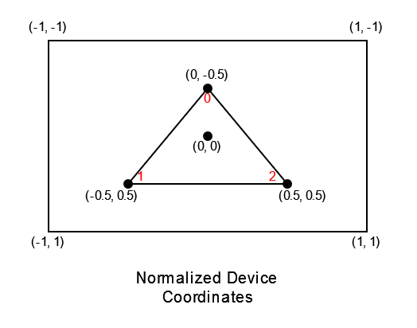
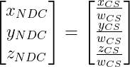

# Tutoriel Vulkan en français
## 1.6 - La pipeline graphique - Compilation des shaders

La pipeline graphique a plusieurs étapes où des *shaders* sont utilisés, le *Vertex shader*, le *Tessellation Control shader*, le *Tesselation Evaluation shader*, le *Geometry shader* et le *Fragment shader*.

Le *Tessellation Control shader*, le *Tesselation Evaluation shader* et le *Geometry shader* sont optionnels et il est possible de créer une pipeline graphique sans spécifier de *Fragment shader* mais dans ce cas, seule l'information de la profondeur du fragment sera sortie. Dans la très grande majorité des cas, une pipeline graphique ne comportera que deux *shaders* : le *Vertex shader* et le *Fragment shader*.

Contrairement à OpenGL, Vulkan ne supporte pas le GLSL mais supporte une représentation intermédiaire appelée [**SPIR-V**](https://www.khronos.org/spir/). L'avantage est le fait qu'il soit techniquement possible d'écrire ses *shaders* en n'importe quel langage, tant qu'il existe un compilateur vers SPIR-V. Heureusement, VulkanSDK nous fournit de quoi compiler du GLSL vers SPIR-V.

Dans ce chapitre, nous allons voir deux façons de compiler des *shaders* depuis du GLSL vers du SPIR-V. La première méthode consistera à pré-compiler les *shaders* avant de lire le SPIR-V dans le programme et la seconde méthode consistera à compiler les *shaders* pendant que le programme est en cours.

Avant de les compiler, nous devons écrire les *shaders*. Tout d'abord nous allons créer un dossier ``shaders`` à la racine du dossier du projet (à côté de ``CMakeLists.txt``). Dans ce dossier ``shaders``, nous allons créer deux fichiers, ``triangle.vert``, le *Vertex shader*, et ``triangle.frag``, le *Fragment shader*. Ce seront les *shaders* qui nous serviront à dessiner notre triangle.

Tout d'abord, ``triangle.vert``, le *Vertex shader* :

```GLSL
#version 460

const vec2 positions[3] = {
	vec2(0.0, -0.5),
	vec2(-0.5, 0.5),
	vec2(0.5, 0.5)
};

const vec3 colors[3] = {
	vec3(1.0, 0.0, 0.0),
	vec3(0.0, 0.0, 1.0),
	vec3(0.0, 0.0, 1.0)
};

layout(location = 0) out vec3 color;

void main() {
	color = colors[gl_VertexIndex];
	gl_Position = vec4(positions[gl_VertexIndex], 0.0, 1.0);
}
```

Pour dessiner un triangle, nous n'avons besoin que de 3 points, nous n'avons donc pas besoin de ``Vertex buffer`` pour contenir les positions et couleurs de nos ``vertices``, puisque le volume de données à utiliser est faible.

À la place, nous allons les indiquer directement dans le *shader* avec le tableau de 3 ``vec2`` (``vec2 positions[3]``) pour les positions, et le tableau de 3 ``vec3`` (``vec3 colors[3]``) pour les couleurs. Le *Vertex shader* est appelé une fois par *vertex*, et pour savoir sur lequel notre *shader* s'exécute, nous pouvons utiliser la constante pré-définie dans le GLSL Vulkan ``gl_VertexIndex`` (en GLSL OpenGL, cette constante pré-définie s'appelle ``gl_VertexID``), qui va, ici, être égale à 0 pour le premier *vertex*, à 1 pour le deuxième *vertex* et à 2 pour le troisième *vertex*.

Les positions sont sur les *Normalized Device Coordinates* (*NDC*), qui vont de -1 à 1 sur *x* et *y*, avec l'origine placée au centre. Nous n'avons pas de 3ème composante *z* puisque notre triangle est aligné avec l'écran.



Sur ce graphique, les chiffres en rouge sont les valeurs de ``gl_VertexIndex`` selon le *vertex* traité.

``gl_Position`` est une valeur pré-existante de GLSL qui sert à donner les coordonnées dans le *Clip Space*. Pourtant, il est indiqué juste au-dessus que les positions des *vertices* sont dans le *NDC*... Le *Vertex shader* sort des coordonnées dans le *Clip Space* qui sont des coordonnées homogènes, en 4 dimensions. La 4ème composante, appelée *w*, divise toutes les autres composantes pour donner les *NDC* lors de l'étape de rastérisation, donnant donc :



Ici, *w* est égal à 1, donc les positions des *vertices* à l'entrée seront les mêmes qu'à la sortie.

Les couleurs sont au format RGB (<span style="color:red">*Red*</span>, <span style="color:green">*Green*</span>, <span style="color:blue">*Blue*</span>).

``layout(location = 0) out vec3 color`` signifie que nous allons passer la variable ``color`` au *Fragment shader*, où les fragments récupéreront une valeur interpolée selon leur distance avec les *vertices*. Si on ne souhaite pas interpoler les valeurs sur les fragments, nous pouvons ajouter le qualifiant ``flat`` de cette manière :

``layout(location = 0) flat out vec3 color``

``color`` est simplement égal à la valeur du tableau ``colors`` indexée avec la valeur de la constante pré-définie ``gl_VertexIndex``.

Ensuite, ``triangle.frag``, le *Fragment shader* :

```GLSL
#version 460

layout(location = 0) in vec3 inColor;

layout(location = 0) out vec4 outColor;

void main() {
	outColor = vec4(inColor, 1.0);
}
```

[**Chapitre précédent**](../6.md) - [**Index**](../../index.md) - [**Chapitre suivant**](2.md)

[**Code de la partie**](https://github.com/ZaOniRinku/TutorielVulkanFR/tree/partie1/6)