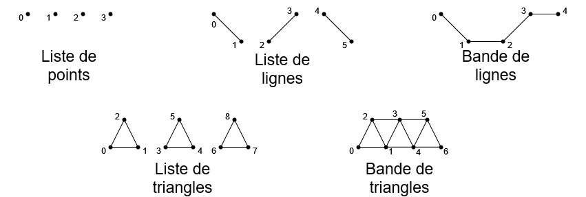

# Tutoriel pour bien débuter à Vulkan
## 1.6.2 - Le pipeline graphique - Vertices en entrée

Nous allons maintenant nous occuper des *vertices* en entrée et des primitives.

Nous pouvons donc ajouter :

```CPP
// Vertices en entree
VkPipelineVertexInputStateCreateInfo vertexInputStateCreateInfo = {};
vertexInputStateCreateInfo.sType = VK_STRUCTURE_TYPE_PIPELINE_VERTEX_INPUT_STATE_CREATE_INFO;
vertexInputStateCreateInfo.pNext = nullptr;
vertexInputStateCreateInfo.flags = 0;
vertexInputStateCreateInfo.vertexBindingDescriptionCount = 0;
vertexInputStateCreateInfo.pVertexBindingDescriptions = nullptr;
vertexInputStateCreateInfo.vertexAttributeDescriptionCount = 0;
vertexInputStateCreateInfo.pVertexAttributeDescriptions = nullptr;
```

La structure [**``VkPipelineVertexInputStateCreateInfo``**](https://registry.khronos.org/vulkan/specs/1.3-extensions/man/html/VkPipelineVertexInputStateCreateInfo.html) permet de spécifier la structure qu'auront les *vertices* dans un *Vertex Buffer*. On peut par exemple avoir cette structure de *vertex* :

```
Position : Vector3
Normal : Vector3
UV : Vector2
Color : Vector3
Tangent : Vector3
```

Qui dans un *Vertex shader* se traduira en :

```GLSL
layout(location = 0) in vec3 position;
layout(location = 1) in vec3 normal;
layout(location = 2) in vec2 uv;
layout(location = 3) in vec3 color;
layout(location = 4) in vec4 tangent;
```

[**``vertexBindingDescriptionCount``**](https://registry.khronos.org/vulkan/specs/1.3-extensions/man/html/VkVertexInputBindingDescription.html) permet de donner la taille d'un *vertex* en octets, afin de savoir quand on passe d'un *vertex* à un autre dans un *Vertex Buffer*.


Ici, un *vertex* fait 56 octets (``position``, ``normal``, ``color`` et ``tangent`` sont des ``vec3``, ``vec3`` étant un vecteur de 3 nombres flottants (``float``), ``uv`` est un ``vec2``, donc un vecteur de 2 nombres flottants et sachant qu'un nombre flottants fait 4 octets, nous avons donc ``(4 * (3 * 4)) + (2 * 4) = 56 octets``) donc l'écart entre deux *vertices* est égal à la taille d'un *vertex*, donc, ici, 56 octets. On peut par ailleurs spécifier plusieurs écarts car il est possible de séparer les différentes composantes d'un *vertex* dans plusieurs *Vertex Buffers* différents, en ayant par exemple la position, la normal et les coordonnées de textures dans un *Vertex Buffer* et la couleur et la tangente dans un autre.

Dans notre cas, nous n'utilisons pas de *Vertex Buffer* donc nous ne spécifions pas de ``pVertexBindingDescriptions``.

[**``VkVertexInputAttributeDescription``**](https://registry.khronos.org/vulkan/specs/1.3-extensions/man/html/VkVertexInputAttributeDescription.html) permet de donner la ``location`` et la taille individuelle de chaque composante d'un *vertex*. Donc dans l'exemple plus haut, ``position`` aurait la ``location`` 0, ``binding`` est l'indice du *Vertex Buffer* dans lequel se trouve cette information, ``format`` serait ``VK_FORMAT_R32G32B32_SFLOAT`` car c'est un ``vec3``, donc un vecteur de 3 nombres flottants, et les nombres flottants font 4 octets donc 32 bits, enfin, ``offset`` serait 0 car ``position`` est le premier attribut de la structure de *vertex* alors que ``normal`` aurait un ``offset`` de 32 car il faut passer 32 octets, la taille de ``position``, pour atteindre ``normal``.

Dans notre cas, nous n'utilisons pas de *Vertex Buffer* donc nous ne spécifions pas de ``pVertexAttributeDescriptions``.

Nous avons ensuite la manière dont nos *vertices* sont assemblés pour devenir des primitives :

```CPP
// Assemblement des vertices en primitives
VkPipelineInputAssemblyStateCreateInfo inputAssemblyStateCreateInfo = {};
inputAssemblyStateCreateInfo.sType = VK_STRUCTURE_TYPE_PIPELINE_INPUT_ASSEMBLY_STATE_CREATE_INFO;
inputAssemblyStateCreateInfo.pNext = nullptr;
inputAssemblyStateCreateInfo.flags = 0;
inputAssemblyStateCreateInfo.topology = VK_PRIMITIVE_TOPOLOGY_TRIANGLE_LIST;
inputAssemblyStateCreateInfo.primitiveRestartEnable = VK_FALSE;
```

Les primitives sont des compositions de *vertices*, on en retrouve 3 types principaux : le point, la ligne et le triangle. On peut aussi ajouter le quadrilatère, mais ils sont surtout présents dans les logiciels de modélisation 3D.

Les primitives peuvent être construites avec des topologies différentes :



Les topologies de primitives (représentées par [**``VkPrimitiveTopology``**](https://registry.khronos.org/vulkan/specs/1.3-extensions/man/html/VkPrimitiveTopology.html)) principales sont :
- Liste de points (``VK_PRIMITIVE_TOPOLOGY_POINT_LIST``) : chaque *vertex* est un point.
- Liste de lignes (``VK_PRIMITIVE_TOPOLOGY_LINE_LIST``) : deux *vertices* serviront à former une ligne.
- Bande de lignes (``VK_PRIMITIVE_TOPOLOGY_LINE_STRIP``) : deux *vertices* consécutifs serviront à former une ligne, ce qui signifie que chaque *vertex* suivant forme une ligne avec le *vertex* précédent.
- Liste de triangles (``VK_PRIMITIVE_TOPOLOGY_TRIANGLE_LIST``) : trois *vertices* serviront à former un triangle.
- Bande de triangles (``VK_PRIMITIVE_TOPOLOGY_TRIANGLE_STRIP``) : trois *vertices* consécutifs serviront à former un triangle, ce qui signifie que chaque *vertex* suivant forme un triangle avec les deux *vertices* précédents.

La topologie la plus répandue, et celle que l'on retrouve généralement dans les modèles 3D, est la liste de triangles, et c'est d'ailleurs celle-ci qui est utilisée dans ce tutoriel.

``primitiveRestartEnable`` est utilisé avec les topologies de type "bande" (``VK_PRIMITIVE_TOPOLOGY_LINE_STRIP`` et ``VK_PRIMITIVE_TOPOLOGY_TRIANGLE_STRIP``) pour permettre de redémarrer une nouvelle bande en donnant un indice de *vertex* spécial (0xFFFFFFFF) dans l'*Index Buffer*.


[**Chapitre précédent**](1.md) - [**Index**](../../index.md) - [**Chapitre suivant**](3.md)

[**Code de la partie**](https://github.com/ZaOniRinku/TutorielVulkanFR/tree/partie1)