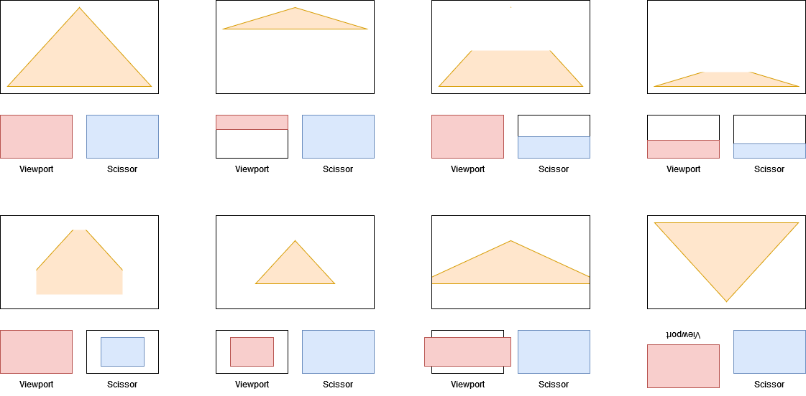

# Tutoriel Vulkan en français
## 1.6.3 - La pipeline graphique - Viewport et scissor

Le *viewport* et le *scissor* déterminent la zone d'action de la pipeline graphique sur l'image.



Le *viewport* détermine une région de l'image où le rendu aura lieu.

Le *scissor* détermine une région de l'image qui sera gardée. Tout fragment se trouvant en dehors de cette région sera supprimé.

Nous avons besoin de deux nouveaux attributs privés, [**``VkViewport``**](https://registry.khronos.org/vulkan/specs/1.3-extensions/man/html/VkViewport.html) et [**``VkRect2D``**](https://registry.khronos.org/vulkan/specs/1.3-extensions/man/html/VkRect2D.html), dans la classe ``HelloTriangle`` :

```CPP
VkViewport m_viewport;
VkRect2D m_scissor;
```

Nous pouvons ensuite remplir leurs structures, mais nous allons faire ça juste avant de créer la *swapchain* pour une raison que nous verrons un peu plus tard dans ce tutoriel :

```CPP
// Viewport et scissor
int windowWidth;
int windowHeight;
glfwGetWindowSize(m_window, &windowWidth, &windowHeight);

m_viewport.x = 0.0f;
m_viewport.y = 0.0f;
m_viewport.width = static_cast<float>(windowWidth);
m_viewport.height = static_cast<float>(windowHeight);
m_viewport.minDepth = 0.0f;
m_viewport.maxDepth = 1.0f;

m_scissor.offset.x = 0;
m_scissor.offset.y = 0;
m_scissor.extent.width = static_cast<uint32_t>(windowWidth);
m_scissor.extent.height = static_cast<uint32_t>(windowHeight);
```

On souhaite que le *viewport* et le *scissor* prennent la taille entière de la fenêtre.

``x`` et ``y`` placent l'origine du *viewport*, placée en haut à gauche, ``width`` et ``height`` sont la largeur et la hauteur du *viewport*. ``minDepth`` et ``maxDepth`` permettent de prendre en compte la profondeur des fragments. La profondeur de Vulkan allant de 0 à 1, nous utilisons ces valeurs.

Utiliser une hauteur ``height`` négative permet de retourner verticalement le *viewport*, ``y`` doit dans ce cas être en bas et non pas en haut. À noter que ceci ne fonctionne pas avec la largeur ``width``.

``offset.x`` et ``offset.y`` placent l'origine du ``scissor``, placée en haut à gauche, ``extent.width`` et ``extent.height`` sont la largeur et la hauteur du ``scissor``.

Nous pouvons ensuite retourner à la suite de ``init()`` lors de la création de la pipeline graphique :

```CPP
VkPipelineViewportStateCreateInfo viewportStateCreateInfo = {};
viewportStateCreateInfo.sType = VK_STRUCTURE_TYPE_PIPELINE_VIEWPORT_STATE_CREATE_INFO;
viewportStateCreateInfo.pNext = nullptr;
viewportStateCreateInfo.flags = 0;
viewportStateCreateInfo.viewportCount = 1;
viewportStateCreateInfo.pViewports = nullptr;
viewportStateCreateInfo.scissorCount = 1;
viewportStateCreateInfo.pScissors = nullptr;
```

Le *viewport* et le *scissor* sont utilisés dans la structure [**``VkPipelineViewportStateCreateInfo``**](https://registry.khronos.org/vulkan/specs/1.3-extensions/man/html/VkPipelineViewportStateCreateInfo.html).

``viewportCount`` et ``scissorCount`` sont le nombre de *viewports* et *scissors* utilisés par la pipeline graphique. Nous n'en utilisons qu'un seul de chaque ici.

Malgré que ``viewportCount`` et ``scissorCount`` ne soient pas égaux à 0, nous ne spécifions pas de *viewport* ni de *scissor* dans ``pViewports`` et ``pScissors`` car nous allons les utiliser comme des états dynamiques.

[**Chapitre précédent**](2.md) - [**Index**](../../index.md) - [**Chapitre suivant**](4.md)

[**Code de la partie**](https://github.com/ZaOniRinku/TutorielVulkanFR/tree/partie1/6-3)