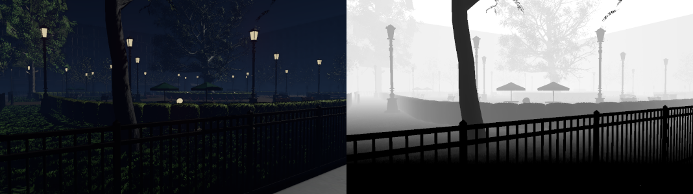

# [Tutoriel pour bien débuter à Vulkan](../../index.md)
## 1.6.4 - Le pipeline graphique - La rastérisation

La rastérisation est le processus de discrétisation des primitives afin de créer des fragments qui seront traités par le *Fragment Shader* pour devenir des pixels sur l'image.


Une grille qui représente l'image est échantillonnée au centre de chaque cellule pour chercher si une ou plusieurs primitives le couvre. Malgré leurs similitudes avec les pixels, les fragments n'en sont pas encore puisqu'il peut y avoir plusieurs fragments à la position d'un pixel et que ceux-ci seront peut-être supprimés avant de faire partie de l'image finale.

Dans le pipeline graphique, la rastérisation est représentée par la structure [**``VkPipelineRasterizationStateCreateInfo``**](https://registry.khronos.org/vulkan/specs/1.3-extensions/man/html/VkPipelineRasterizationStateCreateInfo.html) :

```cpp
// Rasterisation
VkPipelineRasterizationStateCreateInfo rasterizationStateCreateInfo = {};
rasterizationStateCreateInfo.sType = VK_STRUCTURE_TYPE_PIPELINE_RASTERIZATION_STATE_CREATE_INFO;
rasterizationStateCreateInfo.pNext = nullptr;
rasterizationStateCreateInfo.flags = 0;
rasterizationStateCreateInfo.depthClampEnable = VK_FALSE;
rasterizationStateCreateInfo.rasterizerDiscardEnable = VK_FALSE;
rasterizationStateCreateInfo.polygonMode = VK_POLYGON_MODE_FILL;
rasterizationStateCreateInfo.cullMode = VK_CULL_MODE_BACK_BIT;
rasterizationStateCreateInfo.frontFace = VK_FRONT_FACE_COUNTER_CLOCKWISE;
rasterizationStateCreateInfo.depthBiasEnable = VK_FALSE;
rasterizationStateCreateInfo.depthBiasConstantFactor = 0.0f;
rasterizationStateCreateInfo.depthBiasClamp = 0.0f;
rasterizationStateCreateInfo.depthBiasSlopeFactor = 0.0f;
rasterizationStateCreateInfo.lineWidth = 1.0f;
```

``depthClampEnable`` sert à garder les valeurs de profondeur des fragments entre les limites fixées par ``minDepth`` et ``maxDepth`` du *viewport*. Cette option est particulièrement utile si ``minDepth`` est différent de 0 et ``maxDepth`` est différent de 1, ou si ``minDepth`` est différent de 1 et ``maxDepth`` différent de 0.

Si ``rasterizerDiscardEnable`` est égal à ``VK_TRUE``, toutes les primitives seront supprimées avant la rastérisation et aucun fragment ne sera créé. C'est utile, par exemple, pour tester si le *bottleneck* (goulot d'étranglement, l'élément qui limite les performances d'un logiciel) du programme est le *Vertex Shader*, puisque le *Fragment Shader* ne sera pas exécuté.

``polygonMode`` est le mode de rendu des primitives.


On y retrouve trois options :
- plein (``VK_POLYGON_MODE_FILL``) : les primitives sont rendues telles quelles.
- ligne (``VK_POLYGON_MODE_LINE``) : les arêtes des primitives sont rendues, c'est le mode qu'on appelle *Wireframe*.
- point (``VK_POLYGON_MODE_POINT``) : les *vertices* des primitives sont rendus.

``frontFace`` et ``cullMode`` servent à spécifier quel côté de la primitive sera considéré comme l'avant et quel côté ne doit pas être rendu. Le côté d'une primitive est déterminé par son *winding order*, selon si la primitive suit les *vertices* dans le sens des aiguilles d'une montre ou dans le sens inverse des aiguilles d'une montre. Et une primitive vue avec les *vertices* dans le sens des aiguilles d'une montre, sera donc vue avec les *vertices* dans le sens inverse des aiguilles d'une montre de l'autre côté.

Dans notre *Fragment Shader*, les points sont positionnés de manière à ce que le triangle soit monté dans le sens inverse des aiguilles d'une montre :


Le sens inverse des aiguilles d'une montre a été choisi car c'est celui que l'on retrouve généralement dans les modèles 3D.

Notre ``frontFace`` est donc ``VK_FRONT_FACE_COUNTER_CLOCKWISE``, ce qui signifie que la face avant est celle où les *vertices* sont dans le sens inverse des aiguilles d'une montre. Un ``cullMode`` égal à ``VK_CULL_MODE_BACK_BIT`` signifie donc que nous allons supprimer les primitives dans le sens des aiguilles d'une montre, donc, ici, l'autre côté de notre triangle. Il y a plusieurs raisons de supprimer les faces arrière, la principale étant une question de performance car il est inutile de faire passer le *Fragment Shader* sur des fragments que nous n'allons de toute façon pas voir. De plus, la plupart des modèles 3D sont pensés avec la suppression des faces arrière et les afficher pourrait ne pas donner le résultat attendu par le modeleur 3D. Il existe cependant des cas où les faces arrière ont besoin d'être rendues donc il est intéressant de comprendre ce concept de face avant et face arrière.

``depthBiasEnable``, ``depthBiasConstantFactor``, ``depthBiasClamp`` et ``depthBiasSlopeFactor`` permettent de choisir si on souhaite appliquer un biais à la profondeur du fragment et la valeur de celui-ci. Nous n'utilisons pas la profondeur ici donc nous n'activons pas le biais sur la profondeur.

``lineWidth`` permet de spécifier la largeur des lignes, dans le cas où nous rendons des lignes. Une valeur différente de 1 demande d'activer la fonctionnalité ``wideLines`` lors de la création du *device* logique.

Un peu plus haut est expliqué que la rastérisation consiste à échantillonner au centre des cellules d'une grille, mais il est possible d'avoir encore plus d'échantillons par cellule : c'est le multi-échantillonnage ou *multisampling*, spécifié dans [**``VkPipelineMultisampleStateCreateInfo``**](https://registry.khronos.org/vulkan/specs/1.3-extensions/man/html/VkPipelineMultisampleStateCreateInfo.html) :

```cpp
// Multisampling
VkPipelineMultisampleStateCreateInfo multisampleStateCreateInfo = {};
multisampleStateCreateInfo.sType = VK_STRUCTURE_TYPE_PIPELINE_MULTISAMPLE_STATE_CREATE_INFO;
multisampleStateCreateInfo.pNext = nullptr;
multisampleStateCreateInfo.flags = 0;
multisampleStateCreateInfo.rasterizationSamples = VK_SAMPLE_COUNT_1_BIT;
multisampleStateCreateInfo.sampleShadingEnable = VK_FALSE;
multisampleStateCreateInfo.minSampleShading = 0.0f;
multisampleStateCreateInfo.pSampleMask = nullptr;
multisampleStateCreateInfo.alphaToCoverageEnable = VK_FALSE;
multisampleStateCreateInfo.alphaToOneEnable = VK_FALSE;
```

Le *multisampling*, ou *Multisampling Anti-Aliasing* (MSAA) est une méthode d'anti-aliasing consistant à échantillonner à plusieurs endroits d'une cellule lors de la rastérisation pour avoir plusieurs fragments pour une même cellule et pondérer la couleur finale selon le nombre d'échantillons couverts.


Dans cet exemple, nous avons 4 échantillons par pixel (``VK_SAMPLE_COUNT_4_BIT``). Les zones les moins couvertes sont beaucoup plus claires que celles totalement couvertes car elles sont pondérées avec la couleur blanche du fond.

``rasterizationSamples`` contrôle ce nombre d'échantillons par pixel. À savoir qu'il faut rendre sur une image (``VkImage``) supportant ce nombre d'échantillons par pixel. La *swapchain* ne supportant pas le multi-échantillonnage, on reste à ``VK_SAMPLE_COUNT_1_BIT``.

``sampleShadingEnable``, ``minSampleShading`` et ``pSampleMask`` permettent d'utiliser le *Fragment Shader* sur chacun des échantillons, ce qui peut donner un meilleur résultat visuel.

``alphaToCoverageEnable`` et ``alphaToOneEnable`` permettent de modifier la valeur de couverture de l'échantillon et l'opacité du fragment selon un facteur de couverture.

Les couleurs ne sont pas le seul élément d'un fragment, il y a aussi la profondeur. Allant de 0 à 1 dans Vulkan, elle est spécifiée avec la structure [**``VkPipelineDepthStencilStateCreateInfo``**](https://registry.khronos.org/vulkan/specs/1.3-extensions/man/html/VkPipelineDepthStencilStateCreateInfo.html) :

```cpp
// Profondeur et stencil
VkPipelineDepthStencilStateCreateInfo depthStencilStateCreateInfo = {};
depthStencilStateCreateInfo.sType = VK_STRUCTURE_TYPE_PIPELINE_DEPTH_STENCIL_STATE_CREATE_INFO;
depthStencilStateCreateInfo.pNext = nullptr;
depthStencilStateCreateInfo.flags = 0;
depthStencilStateCreateInfo.depthTestEnable = VK_FALSE;
depthStencilStateCreateInfo.depthWriteEnable = VK_FALSE;
depthStencilStateCreateInfo.depthCompareOp = VK_COMPARE_OP_NEVER;
depthStencilStateCreateInfo.depthBoundsTestEnable = VK_FALSE;
depthStencilStateCreateInfo.stencilTestEnable = VK_FALSE;
depthStencilStateCreateInfo.front = {};
depthStencilStateCreateInfo.back = {};
depthStencilStateCreateInfo.minDepthBounds = 0.0f;
depthStencilStateCreateInfo.maxDepthBounds = 1.0f;
```

Les images de couleur ne sont pas le seul type d'image existant, on y retrouve aussi les images de profondeur et les images de profondeur-*stencil*.



À gauche est l'image de couleur et à droite l'image de profondeur de la scène [**NVIDIA Emerald Square City**](https://developer.nvidia.com/orca/nvidia-emerald-square) pour un même plan. Sur l'image de profondeur, les éléments proches de la caméra ont une valeur inférieure (minimum 0) aux éléments éloignés de la caméra (maximum 1).

``depthTestEnable`` permet de spécifier si on souhaite effectuer un test de profondeur entre le fragment rastérisé et l'image de profondeur liée à la passe de rendu. ``depthCompareOp`` permet de choisir l'opérateur utilisé lors de la comparaison, ici, nous avons ``VK_COMPARE_OP_NEVER`` puisque nous ne faisons pas de test de profondeur, mais on y retrouve généralement la valeur ``VK_COMPARE_OP_LESS``, qui signifie que le fragment n'est gardé que si sa profondeur est inférieure à celle de l'image de profondeur à la même position. En temps normal, la profondeur minimale est 0, au plus proche, et la profondeur maximale est 1, au plus loin. Si le fragment a une profondeur inférieure à celle de l'image de profondeur à la même position, alors le fragment est plus proche de la caméra. Dans le cas où nous avons des objets transparents, nous ne voulons peut-être pas supprimer les fragments derrière eux car ils sont supposés apparaître à travers.

``depthWriteEnable`` permet d'écrire sur l'image de profondeur attachée à la passe de rendu, si le test de profondeur passe. Ce qui signifie que si ``depthWriteEnable`` est égal à ``VK_TRUE``, qu'un nouveau fragment arrive, que le test de profondeur est activé (``depthTestEnable = VK_TRUE``) et que sa profondeur est inférieure à celle de l'image de profondeur au même endroit (depthCompareOp = ``VK_COMPARE_OP_LESS``), la profondeur de ce nouveau fragment sera écrit sur l'image de profondeur et remplacera le précédent.

``depthBoundsTestEnable`` permet de vérifier si la valeur de profondeur d'un fragment se situe entre ``minDepthBounds`` et ``maxDepthBounds``. Si ce n'est pas le cas, le fragment est supprimé.

``stencilTestEnable`` utilise une image de *stencil*, qui fait généralement partie de l'image de profondeur-*stencil*. La différence entre les images de profondeur et les images de profondeur-*stencil* est que les images de profondeur ne contiennent que l'information de profondeur tandis que les images de profondeur-*stencil* contiennent l'information de profondeur et de *stencil*.


L'image de *stencil*, ou *Stencil Buffer*, est généralement une image où chaque pixel fait 1 octet, ou 8 bits, avec des valeurs allant de 0 à 255. Le test de *stencil* permet de supprimer les fragments dont la valeur de *stencil* est inférieure (ou supérieure, selon l'opérateur choisi) à la valeur indiquée sur l'image de *stencil* à la même position.

``stencilTestEnable`` permet d'activer ou non le test de *stencil*, dans le cas de notre triangle, nous n'avons pas d'image de *stencil* non plus donc nous n'allons pas l'activer.

``front`` et ``back`` permettent de donner l'opérateur de comparaison ainsi que la valeur de seuil du test de *stencil* pour les fragments créés respectivement à partir de la face avant et de la face arrière de la primitive.

[**Chapitre précédent**](3.md) - [**Index**](../../index.md) - [**Chapitre suivant**](5.md)

[**Code de la partie**](https://github.com/ZaOniRinku/TutorielVulkanFR/tree/partie1)