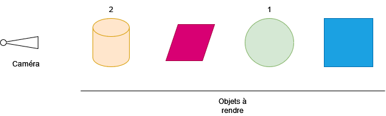
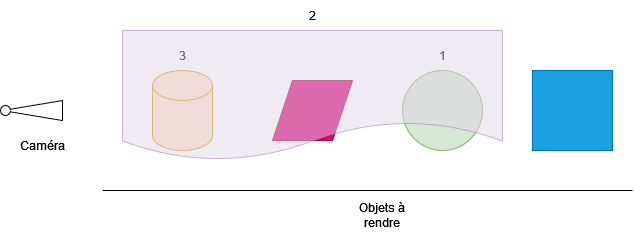

# Tutoriel pour bien débuter à Vulkan
## 1.6.5 - La pipeline graphique - Mélange de couleurs

Lorsque plusieurs objets sont rendus sur la même image, la pipeline graphique a besoin de savoir comment les nouveaux fragments, et surtout leurs couleurs, doivent s'ajouter à la couleur déjà présente sur l'image. C'est le principe de la structure [**``VkPipelineColorBlendStateCreateInfo``**](https://registry.khronos.org/vulkan/specs/1.3-extensions/man/html/VkPipelineColorBlendStateCreateInfo.html).

```CPP
// Melange de couleurs
VkPipelineColorBlendAttachmentState colorBlendAttachmentState = {};
colorBlendAttachmentState.blendEnable = VK_FALSE;
colorBlendAttachmentState.srcColorBlendFactor = VK_BLEND_FACTOR_ONE;
colorBlendAttachmentState.dstColorBlendFactor = VK_BLEND_FACTOR_ZERO;
colorBlendAttachmentState.colorBlendOp = VK_BLEND_OP_ADD;
colorBlendAttachmentState.srcAlphaBlendFactor = VK_BLEND_FACTOR_ONE;
colorBlendAttachmentState.dstAlphaBlendFactor = VK_BLEND_FACTOR_ZERO;
colorBlendAttachmentState.alphaBlendOp = VK_BLEND_OP_ADD;
colorBlendAttachmentState.colorWriteMask = { VK_COLOR_COMPONENT_R_BIT |
	VK_COLOR_COMPONENT_G_BIT |
	VK_COLOR_COMPONENT_B_BIT |
	VK_COLOR_COMPONENT_A_BIT };

VkPipelineColorBlendStateCreateInfo colorBlendStateCreateInfo = {};
colorBlendStateCreateInfo.sType = VK_STRUCTURE_TYPE_PIPELINE_COLOR_BLEND_STATE_CREATE_INFO;
colorBlendStateCreateInfo.pNext = nullptr;
colorBlendStateCreateInfo.flags = 0;
colorBlendStateCreateInfo.logicOpEnable = VK_FALSE;
colorBlendStateCreateInfo.logicOp = VK_LOGIC_OP_COPY;
colorBlendStateCreateInfo.attachmentCount = 1;
colorBlendStateCreateInfo.pAttachments = &colorBlendAttachmentState;
```

``logicOpEnable`` et ``logicOp`` permettent d'appliquer un opérateur logique entre le fragment entrant et la couleur sur l'image, tel que défini par [**``VkLogicOp``**](https://registry.khronos.org/vulkan/specs/1.3-extensions/man/html/VkLogicOp.html). L'utiliser demande d'activer la fonctionnalité ``logicOp`` lors de la création du *device* logique et empêche les opérations de mélange d'avoir lieu.

``attachmentCount`` et ``pAttachments`` spécifient les opérations de mélange qui auront lieu pour chaque attachement (il est possible d'avoir plusieurs attachements, notamment dans le cas du *Multiple Render Target* (MRT), mais ici, nous allons n'en avoir qu'un seul : l'image de la *swapchain*). ``pAttachments`` est une liste de [**``VkPipelineColorBlendAttachmentState``**](https://registry.khronos.org/vulkan/specs/1.3-extensions/man/html/VkPipelineColorBlendAttachmentState.html).

``blendEnable`` permet d'activer le mélange de couleurs.

``src`` signifie ``Source`` et est la valeur du fragment après le *Fragment shader*. Dans le nôtre, la valeur de sortie est ``outColor``, qui est un ``vec4``, qui a donc une couleur ``outColor.rgb`` et une opacité ``outColor.a``. ``srcColor`` est donc la couleur de sortie (notre ``outColor.rgb``) et ``srcAlpha`` est l'alpha, l'opacité de sortie (notre ``outColor.a``).

``dst`` signifie ``Destination`` et est la valeur du pixel écrite sur l'image, qui a aussi une couleur et une opacité.

La couleur de sortie qui sera écrite sur l'image sera donc :

```
Orgb = srgb * Srgb (OPrgb) drgb * Drgb
Oa = sa * Sa (OPa) da * Da
```

Avec :
- ``O`` la valeur de sortie écrite sur l'image (``Orgb`` est la couleur et ``Oa`` est l'opacité),
- ``S`` la valeur du fragment après le *Fragment shader* (``Srgb`` est la couleur et ``Sa`` est l'opacité),
- ``D`` la valeur du pixel sur l'image (``Drgb`` est la couleur et ``Da`` est l'opacité),
- ``s`` le facteur de mélange pour ``S`` (``srgb`` est ``srcColorBlendFactor`` et ``sa`` est ``srcAlphaBlendFactor``),
- ``d`` le facteur de mélange pour ``D`` (``drgb`` est ``dstColorBlendFactor`` et ``da`` est ``dstAlphaBlendFactor``),
- ``(OP)`` l'opérateur de mélange défini par [**``VkBlendOp``**](https://registry.khronos.org/vulkan/specs/1.3-extensions/man/html/VkBlendOp.html) (``OPrgb`` est ``colorBlendOp`` et ``OPa`` est ``alphaBlendOp``).

Nous n'avons qu'un seul triangle et celui-ci est opaque donc nous n'allons pas appliquer de mélange de couleurs ici, mais si ``blendEnable`` était égal à ``VK_TRUE``, notre couleur de sortie serait égale à :

```
Orgb = 1 * Srgb + 0 * Drgb = Srgb
Oa = 1 * Sa + 0 * Da = Sa
```

Ce qui correspond à juste copier la couleur du fragment.

La couleur finale dépendra donc de l'ordre dans lequel nos objets sont rendus. Dans le cas où tous nos objets sont opaques, l'ordre n'a pas d'importance tant qu'on a une image de profondeur qui permet de les trier, mais le mélange de couleurs montre son intérêt lorsqu'il y a des objets transparents.

Dans le cas où nous avons des objets transparents, la méthode la plus naïve pour les rendre est l'*Order Dependant Transparency* (Transparence dépendante de l'ordre), qui nécessite de prendre en compte l'ordre dans lequel sont rendus les objets, en rendant d'abord tous les objets opaques, suivis des objets transparents du plus éloigné au plus proche de la caméra :



Avec cette méthode, les objets transparents doivent être rendus avec une autre pipeline graphique avec un mélange de couleurs différent, appelé *Alpha Blending* :

```
colorBlendAttachmentState.blendEnable = VK_TRUE;
colorBlendAttachmentState.srcColorBlendFactor = VK_BLEND_FACTOR_SRC_ALPHA;
colorBlendAttachmentState.dstColorBlendFactor = VK_BLEND_FACTOR_ONE_MINUS_SRC_ALPHA;
colorBlendAttachmentState.colorBlendOp = VK_BLEND_OP_ADD;
colorBlendAttachmentState.srcAlphaBlendFactor = VK_BLEND_FACTOR_ONE;
colorBlendAttachmentState.dstAlphaBlendFactor = VK_BLEND_FACTOR_ZERO;
colorBlendAttachmentState.alphaBlendOp = VK_BLEND_OP_ADD;
```

Ce qui donne :

```
Orgb = Sa * Srgb + (1 - Sa) * Drgb
Oa = 1 * Sa + 0 * Da
```

Où on multiplie la couleur du fragment par son opacité et on l'additionne à la couleur du pixel multipliée par 1 moins l'opacité du fragment.

Cette méthode n'est pas sans défaut et ne fonctionne plus dès lors que des objets transparents se placent devant et derrière d'autres objets transparents :



Il existe des méthodes de *Order Independent Transparency* (OIT) qui permet de pallier ce défaut en ne prenant plus en compte l'ordre dans lequel les objets sont rendus.

``colorWriteMask`` spécifient quelles valeurs (rouge, vert, bleu, alpha) seront écrites sur l'image finale. Ici, nous les voulons toutes.

[**Chapitre précédent**](4.md) - [**Index**](../../index.md) - [**Chapitre suivant**](6.md)

[**Code de la partie**](https://github.com/ZaOniRinku/TutorielVulkanFR/tree/partie1/6)