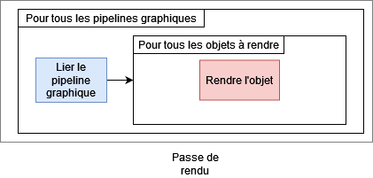

# Tutoriel pour bien débuter à Vulkan
## 1.6.6 - Le pipeline graphique - Passe de rendu

Les passes de rendu ne sont pas réellement liées au pipeline graphique puisque ce sont les séquences dans lesquelles les pipelines graphiques seront utilisés.



Cette image illustre une passe de rendu très simple. Dans celle-ci, nous lions un pipeline graphique et nous rendons tous les objets qui utilisent ce pipeline graphique. Il est possible d'utiliser plusieurs pipelines graphiques dans une seule passe de rendu.

Le pipeline graphique, dans Vulkan, a besoin de connaître la passe de rendu, qui est un objet [**``VkRenderPass``**](https://registry.khronos.org/vulkan/specs/1.3-extensions/man/html/VkRenderPass.html) à construire préalablement, pour connaître les images qui y sont attachées. Mais comme vous l'avez sûrement remarqué, nous ne l'avons pas fait.

Vulkan est une API multi-plateforme et les ``VkRenderPass`` ont été pensés avec cette spécificité en tête. Le rendu sur mobile est assez différent du rendu sur ordinateur, car ceux-ci utilisent du *Tile-Based Rendering* (TBR) qui permet de séparer l'écran en plusieurs cellules contenant plusieurs pixels, et en accédant qu'à cette zone de mémoire dans les sous-passes, dans le but d'économiser de la batterie. Les ``VkRenderPass`` ont été pensés avec le TBR en tête et leur construction est très contraignante lorsque nous faisons du développement pour ordinateur.

Heureusement, une extension appelée [**``VK_KHR_dynamic_rendering``**](https://registry.khronos.org/vulkan/specs/1.3-extensions/man/html/VK_KHR_dynamic_rendering.html), faisant maintenant partie du cœur de Vulkan depuis Vulkan 1.3, a fait son apparition et permet de ne plus utiliser de ``VkRenderPass`` et leurs sous-passes, et de ne plus en fournir lors de la création du pipeline graphique.

Nous devons donc activer cette extension et toutes les extensions dont elle dépend, [**``VK_KHR_create_renderpass2``**](https://registry.khronos.org/vulkan/specs/1.3-extensions/man/html/VK_KHR_create_renderpass2.html) et [**``VK_KHR_depth_stencil_resolve``**](https://registry.khronos.org/vulkan/specs/1.3-extensions/man/html/VK_KHR_depth_stencil_resolve.html), lors de la création du *device* logique pour nous en servir :

```CPP
// Lors de la creation du device logique
std::vector<const char*> deviceExtensions;
if (deviceExtensionAvailable("VK_KHR_swapchain")) {
	deviceExtensions.push_back("VK_KHR_swapchain");
}
if (deviceExtensionAvailable("VK_KHR_create_renderpass2")) {
	deviceExtensions.push_back("VK_KHR_create_renderpass2"); // On ajoute cette extension car VK_KHR_depth_stencil_resolve en depend
}
if (deviceExtensionAvailable("VK_KHR_depth_stencil_resolve")) {
	deviceExtensions.push_back("VK_KHR_depth_stencil_resolve"); // On ajoute cette extension car VK_KHR_dynamic_rendering en depend
}
if (deviceExtensionAvailable("VK_KHR_dynamic_rendering")) {
	deviceExtensions.push_back("VK_KHR_dynamic_rendering"); // On ajoute cette extension
}
deviceCreateInfo.enabledExtensionCount = static_cast<uint32_t>(deviceExtensions.size());
deviceCreateInfo.ppEnabledExtensionNames = deviceExtensions.data();
```

Nous devons aussi activer la fonctionnalité :

```CPP
VkPhysicalDeviceDynamicRenderingFeatures physicalDeviceDynamicRenderingFeatures = {};
physicalDeviceDynamicRenderingFeatures.sType = VK_STRUCTURE_TYPE_PHYSICAL_DEVICE_DYNAMIC_RENDERING_FEATURES;
physicalDeviceDynamicRenderingFeatures.pNext = nullptr;
physicalDeviceDynamicRenderingFeatures.dynamicRendering = VK_TRUE;

VkDeviceCreateInfo deviceCreateInfo = {};
deviceCreateInfo.sType = VK_STRUCTURE_TYPE_DEVICE_CREATE_INFO;
deviceCreateInfo.pNext = &physicalDeviceDynamicRenderingFeatures; // Le pNext de la creation du device logique est maintenant utilise
```

On peut maintenant utiliser une structure [**``VkPipelineRenderingCreateInfo``**](https://registry.khronos.org/vulkan/specs/1.3-extensions/man/html/VkPipelineRenderingCreateInfo.html) pour pallier l'absence de ``VkRenderPass`` à la suite de la fonction ``init()`` :

```CPP
// Rendu dynamique
VkPipelineRenderingCreateInfo pipelineRenderingCreateInfo = {};
pipelineRenderingCreateInfo.sType = VK_STRUCTURE_TYPE_PIPELINE_RENDERING_CREATE_INFO;
pipelineRenderingCreateInfo.pNext = nullptr;
pipelineRenderingCreateInfo.viewMask = 0;
pipelineRenderingCreateInfo.colorAttachmentCount = 1;
pipelineRenderingCreateInfo.pColorAttachmentFormats = &swapchainFormat;
pipelineRenderingCreateInfo.depthAttachmentFormat = VK_FORMAT_UNDEFINED;
pipelineRenderingCreateInfo.stencilAttachmentFormat = VK_FORMAT_UNDEFINED;
```

Cette structure permet de remplacer un ``VkRenderPass`` lors de la création d'un pipeline graphique en spécifiant ici les attachements qui seront utilisés.

``viewMask`` est utilisé lorsque le *Multiview* est utilisé, qui permet de rendre plusieurs images différentes efficacement si la seule différence est la vue de la caméra. Le *Multiview* est surtout utilisé en Réalité Virtuelle (VR) où la différence de rendu entre les deux yeux est la vue de la caméra.

``colorAttachmentCount`` et ``pColorAttachmentFormats`` permet de spécifier les formats des images de couleur. Nous n'allons rendre sur une seule image à la fois ici, qui est une image de la *swapchain*, donc le format que l'on va donner est le format des images de la *swapchain*. Spécifier plusieurs formats signifie attacher plusieurs images, ce qui est du *Multiple Render Targets*.

``depthAttachmentFormat`` et ``stencilAttachmentFormat`` sont les formats de profondeur et de *stencil*. Malgré qu'il soit possible d'attacher plusieurs images de couleur, il n'est possible d'attacher qu'une seule image de profondeur et de *stencil*.

[**Chapitre précédent**](5.md) - [**Index**](../../index.md) - [**Chapitre suivant**](7.md)

[**Code de la partie**](https://github.com/ZaOniRinku/TutorielVulkanFR/tree/partie1/6)