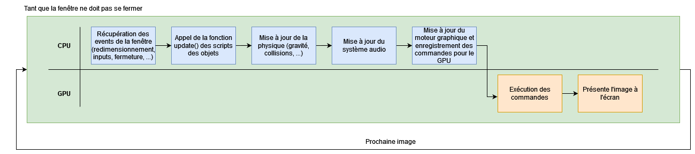
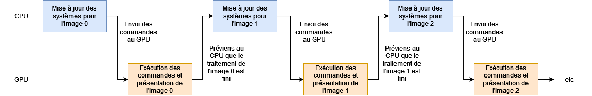
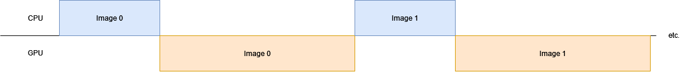
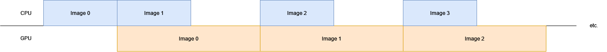

# Tutoriel Vulkan en français
## 1.7 - Double buffering et Command Buffer

Pour que le GPU rende et présente une image à l'écran, il a besoin de commandes créées par le CPU. Si on se place dans le cadre d'un moteur de jeu :



Le CPU va effectuer de nombreuses actions, telles que récupérer les événements de la fenêtre, dont les entrées clavier, souris et/ou manette, mettre à jour les scripts des objets, mettre à jour le moteur physique ainsi que le moteur audio, puis mettre à jour le moteur graphique pour y enregistrer les commandes pour le GPU. Il va ensuite envoyer ces commandes au GPU pour qu'elles soient exécutées, que l'image soit rendue pour être au final rendue à l'écran.

Nous pouvons représenter plusieurs tours de la boucle de jeu de cette manière :



On peut aussi le représenter sous forme d'occupation théorique du CPU et du GPU :



La longueur de la barre représente le temps pris pour effectuer l'action.

On peut remarquer que quelque chose cloche : le CPU ne travaille pas quand le GPU travaille. Dans cette configuration, le CPU doit attendre que le GPU termine et libère les ressources au CPU pour que celui-ci puisse de nouveau les modifier et y mettre les nouvelles informations récupérées depuis les mises à jour des systèmes. Il ne faudrait surtout pas modifier des données que le GPU est en train d'utiliser actuellement sous peine de s'exposer à de gros bugs visuels et des gros soucis de performance.

C'est ici qu'entre en scène le concept de *Double Buffering*, qui consiste à doubler le nombre de ressources modifiées par le CPU et utilisées par le GPU pendant l'exécution des commandes. De ce fait, avec deux ensembles de ressources que nous allons appeler *a* et *b*, le CPU peut travailler sur les ressources *a*, envoyer les commandes au GPU qui va les utiliser, et, pendant ce temps, le CPU peut travailler sur les ressources *b* et envoyer les commandes au GPU. Si le CPU effectue ses actions plus rapidement que le GPU, il pourra traiter la mise à jour des systèmes de plusieurs images pendant que le GPU exécute les commandes d'une seule image, et le GPU n'aura plus à attendre que le CPU lui envoie les commandes puisque celui-ci les aura déjà envoyées, permettant de gagner beaucoup de performance sur le programme, au coût du double de la mémoire concernée, celle qui est modifiée par le CPU et utilisée par le GPU.

Nous pouvons représenter cette configuration sous forme d'occupation théorique du CPU et du GPU :



Nous pouvons nous dire que le *Double Buffering* est effectivement très efficace, mais pourquoi ne pas monter au *Triple Buffering*, voire même au *Quadruple Buffering* ?

Certains jeux proposent effectivement la possibilité d'utiliser du *Triple Buffering* mais pour que le gain de performance soit visible, il faut que le CPU puisse créer une image de plus pendant que le GPU exécute les commandes, ce qui est rarement le cas. De plus, hors le coût en mémoire qui augmente, le *Triple Buffering* a un autre défaut : il introduit de la latence. Si le CPU récupère les entrées clavier, souris et/ou manette mais que le GPU ne rend et présente l'image que plus tard, il y aura un décalage visible entre le moment où le joueur appuie sur un bouton et le moment où cette action est visible à l'écran.

Aussi, cette méthode de *Buffering* est limitée par le nombre d'images dans la *swapchain*. Si aucune image n'est actuellement disponible, le CPU restera bloqué à attendre que le GPU lui dise qu'une image est disponible, il faut donc que le nombre de *frames-in-flight* (qui est le nombre d'images traitables par le CPU avant d'être bloqué par le GPU, donc 2 pour le *Double Buffering* et 3 pour le *Triple Buffering*, soit inférieur ou égal au nombre d'images dans la *swapchain*.

Nous allons ajouter un nouvel attribut privé dans la classe ``HelloTriangle`` afin d'y mettre le nombre de *frames-in-flight* ainsi qu'un moyen de savoir sur quelle *frame-in-flight* nous travaillons actuellement :

```CPP
uint32_t m_framesInFlight = 2;
uint32_t m_currentFrameInFlight = 0;
```

Nous allons viser du *Double Buffering* et s'assurer que le nombre d'images de la *swapchain* est suffisant, juste après avoir récupérées les images de celle-ci :

```CPP
TUTORIEL_VK_CHECK(vkGetSwapchainImagesKHR(m_device, m_swapchain, &m_swapchainImageCount, nullptr));
m_swapchainImages.resize(m_swapchainImageCount);
TUTORIEL_VK_CHECK(vkGetSwapchainImagesKHR(m_device, m_swapchain, &m_swapchainImageCount, m_swapchainImages.data()));

// Le nombre de frames-in-flight ne doit pas etre superieur au nombre d'images dans la swapchain
if (m_framesInFlight > m_swapchainImageCount) {
	m_framesInFlight = m_swapchainImageCount;
}
```

Pour enregistrer nos commandes de rendus, nous allons besoin de [**``VkCommandPool``**](https://registry.khronos.org/vulkan/specs/1.3-extensions/man/html/VkCommandPool.html) pour allouer des [**``VkCommandBuffer``**](https://registry.khronos.org/vulkan/specs/1.3-extensions/man/html/VkCommandBuffer.html) qui serviront à enregistrer nos commandes GPU, nous allons donc en ajouter à notre classe ``HelloTriangle`` :

```CPP
std::vector<VkCommandPool> m_renderingCommandPools;
std::vector<VkCommandBuffer> m_renderingCommandBuffers;
```

À la suite de la fonction ``init()`` :

```CPP
// Creation des command pools et allocation des command buffers
m_renderingCommandPools.resize(m_framesInFlight);
m_renderingCommandBuffers.resize(m_framesInFlight);

VkCommandPoolCreateInfo commandPoolCreateInfo = {};
commandPoolCreateInfo.sType = VK_STRUCTURE_TYPE_COMMAND_POOL_CREATE_INFO;
commandPoolCreateInfo.pNext = nullptr;
commandPoolCreateInfo.flags = 0;
commandPoolCreateInfo.queueFamilyIndex = m_graphicsQueueFamilyIndex;

VkCommandBufferAllocateInfo commandBufferAllocateInfo = {};
commandBufferAllocateInfo.sType = VK_STRUCTURE_TYPE_COMMAND_BUFFER_ALLOCATE_INFO;
commandBufferAllocateInfo.pNext = nullptr;
commandBufferAllocateInfo.level = VK_COMMAND_BUFFER_LEVEL_PRIMARY;
commandBufferAllocateInfo.commandBufferCount = 1;

for (uint32_t i = 0; i < m_framesInFlight; i++) {
	TUTORIEL_VK_CHECK(vkCreateCommandPool(m_device, &commandPoolCreateInfo, nullptr, &m_renderingCommandPools[i]));

	commandBufferAllocateInfo.commandPool = m_renderingCommandPools[i];
	TUTORIEL_VK_CHECK(vkAllocateCommandBuffers(m_device, &commandBufferAllocateInfo, &m_renderingCommandBuffers[i]));
}
```

On crée *frames-in-flight* *Command Pools* puis on alloue 1 *Command Buffer* par *Command Pool*. Lors de la création des *Command Pools*, nous devons spécifier à quelle famille appartient les queues sur lesquelles nous allons soumettre nos commandes. Nous avons une seule queue, qui provient de la famille de queues avec l'indice ``m_graphicsQueueFamilyIndex``.

Nous avons crée des *Command Pools*, nous devons donc les détruire à la fin du programme dans le fonction ``destroy()`` :

```CPP
// Destruction des command pools
for (uint32_t i = 0; i < m_framesInFlight; i++) {
	vkDestroyCommandPool(m_device, m_renderingCommandPools[i], nullptr);
}
```

Les *Command Buffers* alloués sont libérés lors de la destruction des *Command Pools*.

[**Chapitre précédent**](6/7.md) - [**Index**](../index.md) - [**Chapitre suivant**](8.md)

[**Code de la partie**](https://github.com/ZaOniRinku/TutorielVulkanFR/tree/partie1/7)