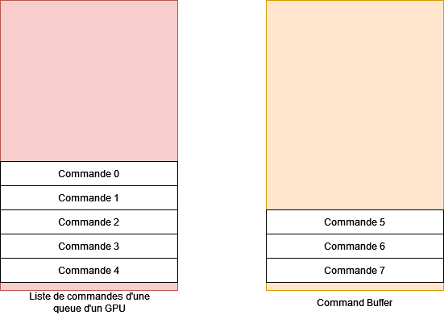
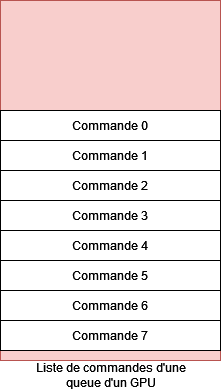
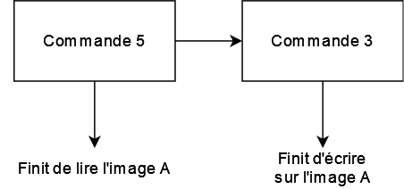
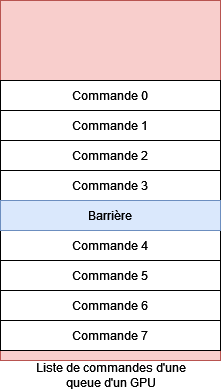
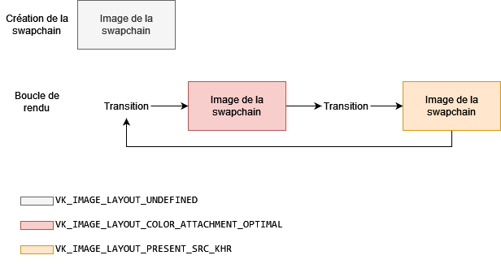
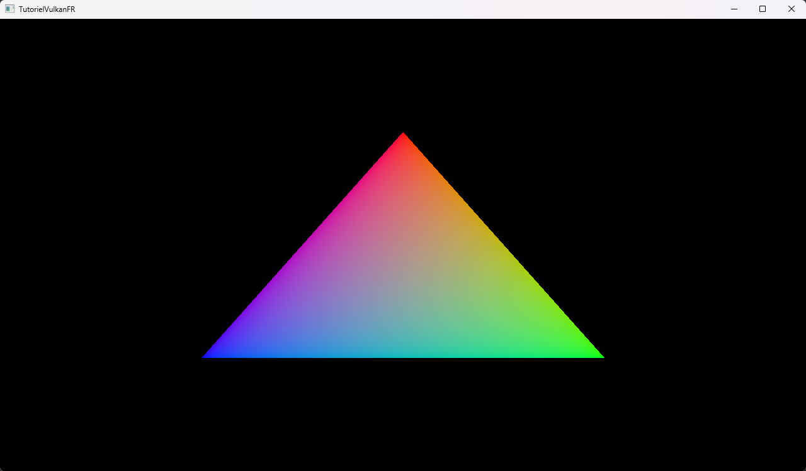

# [Tutoriel pour bien débuter à Vulkan](../index.md)
## 1.9 - La boucle de rendu

Nous pouvons maintenant nous attaquer à la boucle de rendu, c'est-à-dire la fonction qui sera appelée pour chaque image : la fonction ``update``.

Nous avons besoin d'une nouvelle extension, [**``VK_KHR_synchronization2``**](https://registry.khronos.org/vulkan/specs/1.3-extensions/man/html/VK_KHR_synchronization2.html), qui nous permettra d'utiliser les fonctionnalités de synchronisation avancées de Vulkan.

Nous devons donc l'activer lors de la création du *device* logique :

```cpp
// Lors de la creation du device logique
if (deviceExtensionAvailable("VK_KHR_dynamic_rendering")) {
	deviceExtensions.push_back("VK_KHR_dynamic_rendering");
}
if (deviceExtensionAvailable("VK_KHR_synchronization2")) {
	deviceExtensions.push_back("VK_KHR_synchronization2"); // On ajoute cette extension
}
deviceCreateInfo.enabledExtensionCount = static_cast<uint32_t>(deviceExtensions.size());
deviceCreateInfo.ppEnabledExtensionNames = deviceExtensions.data();
```

Nous devons aussi activer la fonctionnalité correspondante :

```cpp
VkPhysicalDeviceSynchronization2Features physicalDeviceSynchronization2Features = {};
physicalDeviceSynchronization2Features.sType = VK_STRUCTURE_TYPE_PHYSICAL_DEVICE_SYNCHRONIZATION_2_FEATURES;
physicalDeviceSynchronization2Features.pNext = &physicalDeviceDynamicRenderingFeatures; // On chaine avec la structure de fonctionnalités de VK_KHR_dynamic_rendering
physicalDeviceSynchronization2Features.synchronization2 = VK_TRUE;

VkDeviceCreateInfo deviceCreateInfo = {};
deviceCreateInfo.sType = VK_STRUCTURE_TYPE_DEVICE_CREATE_INFO;
deviceCreateInfo.pNext = &physicalDeviceSynchronization2Features; // Le pNext devient la structure de VK_KHR_synchronization2
```

Nous allons enregistrer les commandes pour le GPU, et parmi elles figurent [**``vkCmdBeginRenderingKHR``**](https://registry.khronos.org/vulkan/specs/1.3-extensions/man/html/vkCmdBeginRendering.html), [**``vkCmdEndRenderingKHR``**](https://registry.khronos.org/vulkan/specs/1.3-extensions/man/html/vkCmdEndRendering.html), fournies par ``VK_KHR_dynamic_rendering`` ainsi que [**``vkCmdPipelineBarrier2KHR``**](https://registry.khronos.org/vulkan/specs/1.3-extensions/man/html/vkCmdPipelineBarrier2.html) fournie par ``VK_KHR_synchronization2``. Ces fonctions doivent être chargées à la main, et nous allons garder les pointeurs dans la classe ``HelloTriangle`` pour ne pas avoir à les charger à chaque appel de la fonction ``update`` :

```cpp
PFN_vkCmdBeginRenderingKHR m_vkCmdBeginRenderingKHR;
PFN_vkCmdEndRenderingKHR m_vkCmdEndRenderingKHR;
PFN_vkCmdPipelineBarrier2KHR m_vkCmdPipelineBarrier2KHR;
```

Nous pouvons maintenant les charger à la suite de la fonction ``init`` :

```cpp
// Chargement de fonctions utilisees lors de l'enregistrement des commandes
m_vkCmdPipelineBarrier2KHR = (PFN_vkCmdPipelineBarrier2KHR)vkGetDeviceProcAddr(m_device, "vkCmdPipelineBarrier2KHR");
m_vkCmdBeginRenderingKHR = (PFN_vkCmdBeginRenderingKHR)vkGetDeviceProcAddr(m_device, "vkCmdBeginRenderingKHR");
m_vkCmdEndRenderingKHR = (PFN_vkCmdEndRenderingKHR)vkGetDeviceProcAddr(m_device, "vkCmdEndRenderingKHR");
```

Pour charger ces fonctions, nous n'utilisons pas [**``vkGetInstanceProcAddr``**](https://registry.khronos.org/vulkan/specs/1.3-extensions/man/html/vkGetInstanceProcAddr.html) mais [**``vkGetDeviceProcAddr``**](https://registry.khronos.org/vulkan/specs/1.3-extensions/man/html/vkGetDeviceProcAddr.html), qui est la fonction à utiliser lorsque les fonctions à charger prennent en premier paramètre un ``VkDevice`` ou un objet créé avec un ``VkDevice``. Ces fonctions sont d'ailleurs seulement utilisables avec le ``VkDevice`` qui a servi à les créer.

Dans la fonction ``update``, à la suite de ``glfwPollEvents`` :

```cpp
#include <limits> // A mettre avec les autres includes en haut du fichier

VK_CHECK(vkWaitForFences(m_device, 1, &m_fences[m_currentFrameInFlight], VK_TRUE, std::numeric_limits<uint64_t>::max()));
```

Nous allons attendre sur une *Fence* avec [**``vkWaitForFences``**](https://registry.khronos.org/vulkan/specs/1.3-extensions/man/html/vkWaitForFences.html), qui est une fonction bloquante. Si nous n'avions pas crée les ``VkFence``s avec ``flags = VK_FENCE_CREATE_SIGNALED_BIT``, le CPU se serait bloqué indéfiniment sur cette *Fence* dès le premier appel à la fonction ``update``.

``std::numeric_limits<uint64_t>::max()`` est la valeur maximale d'un entier 64 bits non-signé, soit ``0xFFFFFFFFFFFFFFFF`` en hexadécimal, ou 18446744073709551615 en décimal. C'est le temps (environ) en nanosecondes à attendre avant que le CPU puisse continuer si la ``VkFence`` n'est pas signalée, soit environ 6 siècles. Nous considérons donc que si le CPU est bloqué sur cette fonction, notre programme a probablement un bug.

Cette *Fence* est signalée dès que toutes les commandes d'un *Command Buffer* ont fini leur exécution, nous nous assurons donc qu'après avoir passé cette *Fence*, le *Command Buffer* est libre et prêt à être utilisé.

```cpp
// Recuperation d'un indice d'une image libre de la swapchain
uint32_t imageIndex;
VK_CHECK(vkAcquireNextImageKHR(m_device, m_swapchain, std::numeric_limits<uint64_t>::max(), m_acquireCompletedSemaphores[m_currentFrameInFlight], VK_NULL_HANDLE, &imageIndex));
```

``imageIndex`` va accueillir l'indice de l'image de la *swapchain* renvoyé par [**``vkAcquireNextImageKHR``**](https://registry.khronos.org/vulkan/specs/1.3-extensions/man/html/vkAcquireNextImageKHR.html). Comme expliqué sur le chapitre sur la *swapchain*, nous ne pouvons pas connaître en avance l'indice de l'image de la *swapchain* que nous allons recevoir.

Nous souhaitons signaler le sémaphore ``m_acquireCompletedSemaphores[m_currentFrameInFlight]`` dès que l'image de la *swapchain* dont l'indice a été reçu sera prête à être rendue, ce qui pourra arriver bien après l'appel à ``vkAcquireNextImageKHR``.

``vkAcquireNextImageKHR`` est aussi une fonction bloquante, et le CPU sortira soit après avoir reçu un indice d'une image de la *swapchain*, soit après 6 siècles, nous considérons donc, ici aussi, que si le CPU est bloqué sur cette fonction, notre programme a probablement un bug.

Nous avons désormais un indice vers une image de la *swapchain* qui est libre, nous allons maintenant passer à l'enregistrement des commandes GPU.

```cpp
// Reinitialisation du command buffer alloue avec le command pool
VK_CHECK(vkResetCommandPool(m_device, m_renderingCommandPools[m_currentFrameInFlight], 0));
```

La raison pour laquelle nous avons créé un ``VkCommandPool`` par *frame-in-flight* et alloué un ``VkCommandBuffer`` par ``VkCommandPool``, au lieu de créer un seul ``VkCommandPool`` et d'allouer *frames-in-flight* ``VkCommandBuffer``s est que nous allons réinitialiser le ``VkCommandPool`` entier avec [**``vkResetCommandPool``**](https://registry.khronos.org/vulkan/specs/1.3-extensions/man/html/vkResetCommandPool.html) dès que nous allons enregistrer des commandes GPU. Réinitialiser un *Command Pool* permet de réinitialiser tous les *Command Buffers* alloués avec à leur état initial. Si nous n'avions qu'un seul *Command Pool*, nous risquerions de réinitialiser des *Command Buffers* qui sont encore en cours d'utilisation.

```cpp
// Debut de l'enregistrement du command buffer
VkCommandBufferBeginInfo commandBufferBeginInfo = {};
commandBufferBeginInfo.sType = VK_STRUCTURE_TYPE_COMMAND_BUFFER_BEGIN_INFO;
commandBufferBeginInfo.pNext = nullptr;
commandBufferBeginInfo.flags = VK_COMMAND_BUFFER_USAGE_ONE_TIME_SUBMIT_BIT;
VK_CHECK(vkBeginCommandBuffer(m_renderingCommandBuffers[m_currentFrameInFlight], &commandBufferBeginInfo));
```

[**``VkCommandBufferBeginInfo``**](https://registry.khronos.org/vulkan/specs/1.3-extensions/man/html/VkCommandBufferBeginInfo.html) est la structure à remplir pour commencer l'enregistrement des commandes et pouvoir utiliser les fonctions ``vkCmdX`` que nous allons bientôt voir.

``flags = VK_COMMAND_BUFFER_USAGE_ONE_TIME_SUBMIT_BIT`` signifie que ce ``VkCommandBuffer`` ne sera soumis qu'une seule fois au GPU, ce qui peut éventuellement avoir un impact positif sur les performances. Ce qui nous est assuré par l'appel à ``vkResetCommandPool`` juste avant de commencer l'enregistrement.

Nous allons maintenant commencer à enregistrer des commandes. Il faut garder en tête que le rendu d'une image n'est pas un événement isolé et qu'il peut être influencé par l'enregistrement du rendu des images précédentes. En l'occurrence, ici, nous considérons que ce n'est pas la première fois qu'une image de la *swapchain* a été rendue et présentée lorsque nous enregistrons nos commandes, ce qui va être tout de suite important.

```cpp
// Transition de layout VK_IMAGE_LAYOUT_UNDEFINED -> VK_IMAGE_LAYOUT_COLOR_ATTACHMENT_OPTIMAL
VkImageMemoryBarrier2 undefinedToColorAttachmentOptimalImageMemoryBarrier = {};
undefinedToColorAttachmentOptimalImageMemoryBarrier.sType = VK_STRUCTURE_TYPE_IMAGE_MEMORY_BARRIER_2;
undefinedToColorAttachmentOptimalImageMemoryBarrier.pNext = nullptr;
undefinedToColorAttachmentOptimalImageMemoryBarrier.srcStageMask = VK_PIPELINE_STAGE_2_NONE;
undefinedToColorAttachmentOptimalImageMemoryBarrier.srcAccessMask = 0;
undefinedToColorAttachmentOptimalImageMemoryBarrier.dstStageMask = VK_PIPELINE_STAGE_2_COLOR_ATTACHMENT_OUTPUT_BIT;
undefinedToColorAttachmentOptimalImageMemoryBarrier.dstAccessMask = VK_ACCESS_2_COLOR_ATTACHMENT_WRITE_BIT;
undefinedToColorAttachmentOptimalImageMemoryBarrier.oldLayout = VK_IMAGE_LAYOUT_UNDEFINED;
undefinedToColorAttachmentOptimalImageMemoryBarrier.newLayout = VK_IMAGE_LAYOUT_COLOR_ATTACHMENT_OPTIMAL;
undefinedToColorAttachmentOptimalImageMemoryBarrier.srcQueueFamilyIndex = m_graphicsQueueFamilyIndex;
undefinedToColorAttachmentOptimalImageMemoryBarrier.dstQueueFamilyIndex = m_graphicsQueueFamilyIndex;
undefinedToColorAttachmentOptimalImageMemoryBarrier.image = m_swapchainImages[imageIndex];
undefinedToColorAttachmentOptimalImageMemoryBarrier.subresourceRange.aspectMask = VK_IMAGE_ASPECT_COLOR_BIT;
undefinedToColorAttachmentOptimalImageMemoryBarrier.subresourceRange.baseMipLevel = 0;
undefinedToColorAttachmentOptimalImageMemoryBarrier.subresourceRange.levelCount = 1;
undefinedToColorAttachmentOptimalImageMemoryBarrier.subresourceRange.baseArrayLayer = 0;
undefinedToColorAttachmentOptimalImageMemoryBarrier.subresourceRange.layerCount = 1;

VkDependencyInfo undefinedToColorAttachmentOptimalDependencyInfo = {};
undefinedToColorAttachmentOptimalDependencyInfo.sType = VK_STRUCTURE_TYPE_DEPENDENCY_INFO;
undefinedToColorAttachmentOptimalDependencyInfo.pNext = nullptr;
undefinedToColorAttachmentOptimalDependencyInfo.dependencyFlags = VK_DEPENDENCY_BY_REGION_BIT;
undefinedToColorAttachmentOptimalDependencyInfo.memoryBarrierCount = 0;
undefinedToColorAttachmentOptimalDependencyInfo.pMemoryBarriers = nullptr;
undefinedToColorAttachmentOptimalDependencyInfo.bufferMemoryBarrierCount = 0;
undefinedToColorAttachmentOptimalDependencyInfo.pBufferMemoryBarriers = nullptr;
undefinedToColorAttachmentOptimalDependencyInfo.imageMemoryBarrierCount = 1;
undefinedToColorAttachmentOptimalDependencyInfo.pImageMemoryBarriers = &undefinedToColorAttachmentOptimalImageMemoryBarrier;

m_vkCmdPipelineBarrier2KHR(m_renderingCommandBuffers[m_currentFrameInFlight], &undefinedToColorAttachmentOptimalDependencyInfo);
```

Nous entrons dans un aspect extrêmement important de Vulkan qui est la synchronisation des commandes. Pour comprendre en quoi consiste ce concept, il faut comprendre ce que sont les *Command Buffers* et les queues d'un GPU.



Une queue de GPU exécute les commandes qu'elle reçoit. Un *Command Buffer* n'est rien de plus qu'une liste de commandes. Dans Vulkan, ces commandes commencent toutes par ``vkCmd`` et prennent le *Command Buffer* qu'elles vont rejoindre en premier paramètre.



Lorsqu'un *Command Buffer* est soumis à une queue avec un appel à [**``vkQueueSubmit``**](https://registry.khronos.org/vulkan/specs/1.3-extensions/man/html/vkQueueSubmit.html), ses commandes sont ajoutées à la queue associée.

L'exécution des commandes débute dans l'ordre (donc ici, ``Commande 0`` va commencer, puis ``Commande 1`` va commencer, puis ``Commande 2`` va commencer, etc.) mais s'exécutent en parallèle ensuite, ce qui ne nous donne aucune garantie sur l'ordre de fin des commandes. Dans cet exemple, ``Commande 5`` peut se finir en premier, puis ``Commande 3`` peut se terminer, puis ``Commande 2``, etc.



Dans cet exemple, le développeur souhaitait que ``Commande 3`` écrive sur l'image ``A`` pour que ``Commande 5`` la lise, mais il n'a pas pensé à la synchronisation. Hors, les deux commandes s'exécutant en parallèle, ``Commande 5`` a lu l'image ``A`` en même temps que ``Commande 3`` était en train d'écrire dessus. Cette situation peut nous donner des problèmes de synchronisation, parfois facilement détectables, parfois invisibles sur votre ordinateur, mais visibles sur un autre.

Pour pallier ce problème, la commande [**``vkCmdPipelineBarrier``**](https://registry.khronos.org/vulkan/specs/1.3-extensions/man/html/vkCmdPipelineBarrier.html) (ainsi que la version [**``vkCmdPipelineBarrier2KHR``**](https://registry.khronos.org/vulkan/specs/1.3-extensions/man/html/vkCmdPipelineBarrier2.html) fournie par l'extension ``VK_KHR_synchronization2``) place des barrières de synchronisation entre les commandes et empêche les commandes suivantes de se lancer tant que certaines étapes n'auront pas été atteintes.



En plaçant efficacement des barrières, nous pouvons nous assurer que certaines commandes soient finies avant que d'autres, qui utilisent le résultat des commandes précédentes, ne commencent.

Un autre concept doit aussi être mentionné : le layout des images.

Lorsqu'elles sont créées, toutes les ``VkImage`` ont un [**``VKImageLayout``**](https://registry.khronos.org/vulkan/specs/1.3-extensions/man/html/VkImageLayout.html) indéfini, ``VK_IMAGE_LAYOUT_UNDEFINED``, qui n'est pas réellement un layout.

Dans ce "layout", on ne peut rien faire avec les images, nous devons donc faire des transitions de layout. Le rapport avec la synchronisation se trouve dans le fait que les transitions de layout se font aussi avec une barrière de synchronisation, ce qui fait du sens, puisqu'on aimerait écrire sur une image, puis mettre une barrière de synchronisation et changer le layout de l'image pour la rendre lisible dans un *shader* par exemple.



Dans notre cas, nous avons nos images de la *swapchain* qui vont suivre cette boucle de transition. Elles auront le layout ``VK_IMAGE_LAYOUT_COLOR_ATTACHMENT_OPTIMAL`` quand elles seront attachées en tant qu'image de couleur à une passe de rendu pour pouvoir écrire dessus, puis auront le layout ``VK_IMAGE_LAYOUT_PRESENT_SRC_KHR`` quand elles seront présentées à l'écran, puis retourneront au layout ``VK_IMAGE_LAYOUT_COLOR_ATTACHMENT_OPTIMAL``, etc.

Nous pouvons remarquer que nous transitionnons de ``VK_IMAGE_LAYOUT_UNDEFINED`` vers ``VK_IMAGE_LAYOUT_COLOR_ATTACHMENT_OPTIMAL`` alors que l'image se trouve dans le layout ``VK_IMAGE_LAYOUT_PRESENT_SRC_KHR`` dès la deuxième fois qu'elle apparaît dans la boucle de rendu.

Comme dit plus haut, ``VK_IMAGE_LAYOUT_UNDEFINED`` n'est pas vraiment un layout, nous pouvons transitionner depuis ``VK_IMAGE_LAYOUT_UNDEFINED`` peu importe le layout réel de l'image mais l'image perdra son contenu, ce qui n'est pas un problème pour nous puisque nous ne comptons pas réutiliser son contenu dans une image suivante.

Une transition de layout se fait avec la structure [**``VkImageMemoryBarrier``**](https://registry.khronos.org/vulkan/specs/1.3-extensions/man/html/VkImageMemoryBarrier.html) (ainsi que la version [**``VkImageMemoryBarrier2``**](https://registry.khronos.org/vulkan/specs/1.3-extensions/man/html/VkImageMemoryBarrier2.html) fournie par l'extension ``VK_KHR_synchronization2``).

``srcStageMask`` est un [**``VkPipelineStageFlags2``**](https://registry.khronos.org/vulkan/specs/1.3-extensions/man/html/VkPipelineStageFlagBits2.html) qui donne l'étape de pipeline où l'image a été utilisée en dernier. En dernier, nous avons présenté l'image à l'écran, ce qui n'est pas une étape de pipeline. Le *driver* a synchronisé implicitement cette opération et nous assure que l'image est disponible. Nous pouvons donc mettre ``VK_PIPELINE_STAGE_2_NONE``.

``srcAccessMask`` est un [**``VkAccessFlags2``**](https://registry.khronos.org/vulkan/specs/1.3-extensions/man/html/VkAccessFlagBits2.html) et spécifie ce qui a été fait avec l'image en dernier. Mais puisque nous n'avons pas spécifié de ``srcStageMask``, nous pouvons le laisser à 0.

``dstStageMask`` est un [**``VkPipelineStageFlags2``**](https://registry.khronos.org/vulkan/specs/1.3-extensions/man/html/VkPipelineStageFlagBits2.html) qui donne l'étape de pipeline où l'image va être utilisée ensuite. Nous allons écrire dessus en tant qu'image de couleur attachée à une passe de rendu, nous mettons donc ``VK_PIPELINE_STAGE_2_COLOR_ATTACHMENT_OUTPUT_BIT``.

``dstAccessMask`` est un [**``VkAccessFlags2``**](https://registry.khronos.org/vulkan/specs/1.3-extensions/man/html/VkAccessFlagBits2.html) et spécifie ce qui va être fait à l'image. Ici, elle sera écrite en tant qu'image de couleur attachée à un passe de rendu, nous mettons donc ``VK_ACCESS_2_COLOR_ATTACHMENT_WRITE_BIT``.

``oldLayout`` est le layout depuis lequel l'image va transitionner, donc le layout de l'image au moment de la barrière, comme expliqué plus haut, nous mettons ``VK_IMAGE_LAYOUT_UNDEFINED`` bien que ce ne soit pas un vrai layout car à ce moment, le contenu de l'image ne nous intéresse pas.

``newLayout`` est le layout vers lequel l'image doit transitionner. Elle sera utilisée comme image de couleur attachée à une passe de rendu, nous mettons donc ``VK_IMAGE_LAYOUT_COLOR_ATTACHMENT_OPTIMAL``.

Les barrières permettent aussi de transférer les ressources d'une famille de queues à une autre, mais nous n'allons pas le faire ici donc ``srcQueueFamilyIndex`` et ``dstQueueFamilyIndex`` sont identiques et sont l'indice de la famille dont vient notre queue graphique.

``image`` est l'image dont nous voulons transitionner le layout, donc l'image de la *swapchain* avec l'indice reçu de la fonction ``vkAcquireNextImageKHR``.

``subresourceRange`` est la partie de l'image que nous voulons transitionner, car chaque couche et chaque niveau de mipmap possède son propre layout. Notre image est une image de couleur donc ``subresourceRange.aspect`` est ``VK_IMAGE_ASPECT_COLOR_BIT`` et nous voulons transitionner le layout de l'image entière, qui n'a qu'un seul niveau de mipmap et qu'une seule couche.

Nous avons ensuite une structure ``VkDependencyInfo`` avec ``imageMemoryBarrierCount`` à 1 et ``pImageMemoryBarriers`` qui est notre ``VkImageMemoryBarrier2``. ``VkDependencyInfo`` peut être utilisé pour placer une barrière sur plusieurs ressources.

Enfin, nous appelons ``vkCmdPipelineBarrier2KHR`` avec ce ``VkDependencyInfo``.

```cpp
// Debut de la passe de rendu
VkRenderingAttachmentInfo renderingAttachmentInfo = {};
renderingAttachmentInfo.sType = VK_STRUCTURE_TYPE_RENDERING_ATTACHMENT_INFO;
renderingAttachmentInfo.pNext = nullptr;
renderingAttachmentInfo.imageView = m_swapchainImageViews[imageIndex];
renderingAttachmentInfo.imageLayout = VK_IMAGE_LAYOUT_COLOR_ATTACHMENT_OPTIMAL;
renderingAttachmentInfo.resolveMode = VK_RESOLVE_MODE_NONE;
renderingAttachmentInfo.resolveImageView = VK_NULL_HANDLE;
renderingAttachmentInfo.resolveImageLayout = VK_IMAGE_LAYOUT_UNDEFINED;
renderingAttachmentInfo.loadOp = VK_ATTACHMENT_LOAD_OP_CLEAR;
renderingAttachmentInfo.storeOp = VK_ATTACHMENT_STORE_OP_STORE;
renderingAttachmentInfo.clearValue.color = { 0.0f, 0.0f, 0.0f, 1.0f };

VkRenderingInfo renderingInfo = {};
renderingInfo.sType = VK_STRUCTURE_TYPE_RENDERING_INFO;
renderingInfo.pNext = nullptr;
renderingInfo.flags = 0;
renderingInfo.renderArea = m_scissor;
renderingInfo.layerCount = 1;
renderingInfo.viewMask = 0;
renderingInfo.colorAttachmentCount = 1;
renderingInfo.pColorAttachments = &renderingAttachmentInfo;
renderingInfo.pDepthAttachment = nullptr;
renderingInfo.pStencilAttachment = nullptr;
m_vkCmdBeginRenderingKHR(m_renderingCommandBuffers[m_currentFrameInFlight], &renderingInfo);
```

La prochaine commande enregistrée sert à débuter la passe de rendu, où nous allons dessiner notre triangle.

Nous devons spécifier un *scissor*, qui est celui que nous avons défini lors de la création du pipeline graphique et qui couvre l'entièreté de l'image, puis nous devons donner les images attachées à la passe de rendu.

Nous n'avons qu'une image de couleur à attacher, l'image de la *swapchain*, nous ne devons donc remplir qu'une seule structure [**``VkRenderingAttachmentInfo``**](https://registry.khronos.org/vulkan/specs/1.3-extensions/man/html/VkRenderingAttachmentInfo.html).

``imageView`` est la vue sur l'image que nous souhaitons attacher, nous utilisons donc la vue sur l'image de la *swapchain* avec l'indice reçu de la fonction ``vkAcquireNextImageKHR``.

``imageLayout`` est le layout de l'image pointé par la vue au moment où la passe de rendu commence. Une image de couleur attachée à une passe de rendu utilise le layout ``VK_IMAGE_LAYOUT_COLOR_ATTACHMENT_OPTIMAL`` et nous avons fait une transition vers ce layout.

``resolveMode`` concerne le *Multisampling*. Une image qui supporte le *Multisampling*, et qui a donc plusieurs échantillons par pixel, peut être résolue vers une image qui ne le supporte pas, pour avoir une image avec un seul échantillon par pixel qui est la moyenne des échantillons sur chaque pixel. C'est ce qui donne l'Anti-Aliasing.

Notre pipeline graphique ne fait pas de *Multisampling*, nous n'allons donc pas donner d'image sur laquelle résoudre ce multi-échantillonnage.

``loadOp`` est un [**``VkAttachmentLoadOp``**](https://registry.khronos.org/vulkan/specs/1.3-extensions/man/html/VkAttachmentLoadOp.html) et est l'opérateur qui sera appliqué sur l'image quand la passe commencera. Il en existe de plusieurs types :
- *Load* (``VK_ATTACHMENT_LOAD_OP_LOAD``) : l'image ne change pas.
- *Clear* (``VK_ATTACHMENT_LOAD_OP_CLEAR``) : tous les pixels de l'image seront réécrits avec une seule valeur spécifiée par ``clearValue``.
- *Don't Care* (``VK_ATTACHMENT_LOAD_OP_DONT_CARE``) : le contenu de l'image est détruit.

Nous voulons remplir notre image de pixels noirs, nous allons donc la *Clear* avec ``VK_ATTACHMENT_LOAD_OP_CLEAR``.

À noter que *Clear* une image a un coût et que si ce que vous allez rendre couvre l'entièreté de l'image, il est inutile de *Clear* et il vaut mieux mettre *Don't Care* avec ``VK_ATTACHMENT_LOAD_OP_DONT_CARE``. Notre triangle ne couvre pas toute la surface de l'image, nous allons donc la *Clear*.

``storeOp`` est un [**``VkAttachmentStoreOp``**](https://registry.khronos.org/vulkan/specs/1.3-extensions/man/html/VkAttachmentStoreOp.html) et est l'opérateur qui sera appliqué sur l'image à la fin de la passe. Il en existe de plusieurs types :
- *Store* (``VK_ATTACHMENT_STORE_OP_STORE``) : le contenu de l'image est gardé.
- *Don't Care* (``VK_ATTACHMENT_STORE_OP_DONT_CARE``) : le contenu de l'image est détruit.

Nous voulons garder le contenu de notre image, nous allons donc la *Store* avec ``VK_ATTACHMENT_STORE_OP_STORE``.

``clearValue`` est la valeur qui sera écrite sur tous les pixels de l'image si ``loadOp`` est ``VK_ATTACHMENT_LOAD_OP_CLEAR``. Notre image est une image de couleur donc seule la valeur de ``clearValue.color`` sera prise en compte. La couleur est au format RGBA (<span style="color:red">*Red*</span>, <span style="color:green">*Green*</span>, <span style="color:blue">*Blue*</span>, *Alpha*), nous voulons du noir donc (0, 0, 0) pour la couleur et 1 pour l'opacité.

Dans le cas d'une image de profondeur ou de profondeur-*stencil*, c'est ``clearValue.depthStencil`` qui sera prise en compte, au format (profondeur, *stencil*).

Nous pouvons ensuite appeler [**``vkCmdBeginRenderingKHR``**](https://registry.khronos.org/vulkan/specs/1.3-extensions/man/html/vkCmdBeginRenderingKHR.html) pour commencer notre passe de rendu.

Tout d'abord, nous allons lier notre pipeline graphique :

```cpp
// Lien du pipeline graphique
vkCmdBindPipeline(m_renderingCommandBuffers[m_currentFrameInFlight], VK_PIPELINE_BIND_POINT_GRAPHICS, m_graphicsPipeline);
vkCmdSetViewport(m_renderingCommandBuffers[m_currentFrameInFlight], 0, 1, &m_viewport);
vkCmdSetScissor(m_renderingCommandBuffers[m_currentFrameInFlight], 0, 1, &m_scissor);
```

Le lien du pipeline graphique se fait avec la fonction [**``vkCmdBindPipeline``**](https://registry.khronos.org/vulkan/specs/1.3-extensions/man/html/vkCmdBindPipeline.html). Nous devons préciser de quel type de pipeline nous parlons, puisque les pipelines de calcul ou encore de *ray tracing* (lancer de rayons) se lient avec la même fonction.

Nous devons ensuite spécifier les états de nos états dynamiques, que sont le *viewport* et le *scissor* avec respectivement [**``vkCmdSetViewport``**](https://registry.khronos.org/vulkan/specs/1.3-extensions/man/html/vkCmdSetViewport.html) et [**``vkCmdSetScissor``**](https://registry.khronos.org/vulkan/specs/1.3-extensions/man/html/vkCmdSetScissor.html).

Nous pouvons maintenant dessiner notre triangle :

```cpp
// Dessin
vkCmdDraw(m_renderingCommandBuffers[m_currentFrameInFlight], 3, 1, 0, 0);
```

Dessiner se fait avec la fonction [**``vkCmdDraw``**](https://registry.khronos.org/vulkan/specs/1.3-extensions/man/html/vkCmdDraw.html) et ses dérivées.

La fonction prend 5 paramètres :
- ``commandBuffer`` : le paramètre commun à toutes les fonctions qui enregistrent des commandes, c'est le *Command Buffer* dans lequel nous voulons enregistrer la commande.
- ``vertexCount`` : le nombre de *vertices* à dessiner. Nous faisons un triangle, donc 3 *vertices*.
- ``instanceCount`` : le nombre d'instances à dessiner. C'est-à-dire le nombre de fois que l'on souhaite dessiner notre objet. Nous ne voulons le dessiner qu'une seule fois, donc 1.
- ``firstVertex`` : l'indice du premier *vertex* à dessiner, donc 0.
- ``firstInstance`` : l'identifiant de la première instance à dessiner, donc 0.

Les commandes de dessin sont un peu particulières en terme de synchronisation car elles se terminent dans l'ordre où elles sont enregistrées sans même utiliser de barrière, ce qui permet de contrôler efficacement l'ordre dans lequel les objets se dessinent, quand c'est nécessaire (avec la transparence dépendante de l'ordre de rendu, par exemple).

Nous pouvons ensuite terminer la passe de rendu :

```cpp
// Fin de la passe de rendu
m_vkCmdEndRenderingKHR(m_renderingCommandBuffers[m_currentFrameInFlight]);
```

Nous devons maintenant transitionner notre image, qui est dans le layout ``VK_IMAGE_LAYOUT_COLOR_ATTACHMENT_OPTIMAL``, vers un layout qui permet de la présenter à l'écran, ``VK_IMAGE_LAYOUT_PRESENT_SRC_KHR``. Pour cela, nous avons besoin d'une deuxième barrière :

```cpp
// Transition de layout VK_IMAGE_LAYOUT_COLOR_ATTACHMENT_OPTIMAL -> VK_IMAGE_LAYOUT_PRESENT_SRC_KHR
VkImageMemoryBarrier2 colorAttachmentOptimalToPresentSrcImageMemoryBarrier = {};
colorAttachmentOptimalToPresentSrcImageMemoryBarrier.sType = VK_STRUCTURE_TYPE_IMAGE_MEMORY_BARRIER_2;
colorAttachmentOptimalToPresentSrcImageMemoryBarrier.pNext = nullptr;
colorAttachmentOptimalToPresentSrcImageMemoryBarrier.srcStageMask = VK_PIPELINE_STAGE_2_COLOR_ATTACHMENT_OUTPUT_BIT;
colorAttachmentOptimalToPresentSrcImageMemoryBarrier.srcAccessMask = VK_ACCESS_2_COLOR_ATTACHMENT_WRITE_BIT;
colorAttachmentOptimalToPresentSrcImageMemoryBarrier.dstStageMask = VK_PIPELINE_STAGE_2_NONE;
colorAttachmentOptimalToPresentSrcImageMemoryBarrier.dstAccessMask = 0;
colorAttachmentOptimalToPresentSrcImageMemoryBarrier.oldLayout = VK_IMAGE_LAYOUT_COLOR_ATTACHMENT_OPTIMAL;
colorAttachmentOptimalToPresentSrcImageMemoryBarrier.newLayout = VK_IMAGE_LAYOUT_PRESENT_SRC_KHR;
colorAttachmentOptimalToPresentSrcImageMemoryBarrier.srcQueueFamilyIndex = m_graphicsQueueFamilyIndex;
colorAttachmentOptimalToPresentSrcImageMemoryBarrier.dstQueueFamilyIndex = m_graphicsQueueFamilyIndex;
colorAttachmentOptimalToPresentSrcImageMemoryBarrier.image = m_swapchainImages[imageIndex];
colorAttachmentOptimalToPresentSrcImageMemoryBarrier.subresourceRange.aspectMask = VK_IMAGE_ASPECT_COLOR_BIT;
colorAttachmentOptimalToPresentSrcImageMemoryBarrier.subresourceRange.baseMipLevel = 0;
colorAttachmentOptimalToPresentSrcImageMemoryBarrier.subresourceRange.levelCount = 1;
colorAttachmentOptimalToPresentSrcImageMemoryBarrier.subresourceRange.baseArrayLayer = 0;
colorAttachmentOptimalToPresentSrcImageMemoryBarrier.subresourceRange.layerCount = 1;

VkDependencyInfo colorAttachmentOptimalToPresentSrcDependencyInfo = {};
colorAttachmentOptimalToPresentSrcDependencyInfo.sType = VK_STRUCTURE_TYPE_DEPENDENCY_INFO;
colorAttachmentOptimalToPresentSrcDependencyInfo.pNext = nullptr;
colorAttachmentOptimalToPresentSrcDependencyInfo.dependencyFlags = VK_DEPENDENCY_BY_REGION_BIT;
colorAttachmentOptimalToPresentSrcDependencyInfo.memoryBarrierCount = 0;
colorAttachmentOptimalToPresentSrcDependencyInfo.pMemoryBarriers = nullptr;
colorAttachmentOptimalToPresentSrcDependencyInfo.bufferMemoryBarrierCount = 0;
colorAttachmentOptimalToPresentSrcDependencyInfo.pBufferMemoryBarriers = nullptr;
colorAttachmentOptimalToPresentSrcDependencyInfo.imageMemoryBarrierCount = 1;
colorAttachmentOptimalToPresentSrcDependencyInfo.pImageMemoryBarriers = &colorAttachmentOptimalToPresentSrcImageMemoryBarrier;

m_vkCmdPipelineBarrier2KHR(m_renderingCommandBuffers[m_currentFrameInFlight], &colorAttachmentOptimalToPresentSrcDependencyInfo);
```

``srcStageMask`` donne l'étape de pipeline où l'image a été utilisée en dernier. En dernier, nous avons attaché l'image de couleur à une passe de rendu pour écrire dessus, nous mettons donc ``VK_PIPELINE_STAGE_2_COLOR_ATTACHMENT_OUTPUT_BIT``.

``srcAccessMask`` spécifie ce qui a été fait avec l'image en dernier. Nous avons écrit dessus en tant qu'image de couleur attachée à une passe de rendu, nous mettons donc ``VK_ACCESS_2_COLOR_ATTACHMENT_WRITE_BIT``.

``dstStageMask`` donne l'étape de pipeline où l'image va être utilisée ensuite. Nous allons la présenter à l'écran, ce qui n'est pas une étape de pipeline, nous mettons donc ``VK_PIPELINE_STAGE_2_NONE``.

``dstAccessMask`` spécifie ce qui va être fait à l'image. Ici, elle va être présentée à l'écran, et comme ``dstStageMask`` est égal à ``VK_PIPELINE_STAGE_2_NONE``, nous mettons 0.

``oldLayout`` est le layout depuis lequel l'image va transitionner, donc le layout de l'image au moment de la barrière, qui est ``VK_IMAGE_LAYOUT_COLOR_ATTACHMENT_OPTIMAL``.

``newLayout`` est le layout vers lequel l'image doit transitionner. Elle sera présentée à l'écran, nous mettons donc ``VK_IMAGE_LAYOUT_PRESENT_SRC_KHR``.

Nous pouvons désormais mettre fin à l'enregistrement des commandes dans le *Command Buffer* :

```cpp
// Fin de l'enregistrement du command buffer
VK_CHECK(vkEndCommandBuffer(m_renderingCommandBuffers[m_currentFrameInFlight]));
```

Nous allons ensuite dé-signaler notre *Fence* pour que le CPU se bloque sur l'appel à ``vkWaitForFences`` au début de la fonction ``update``, tant que celle-ci n'a pas été signalée par le GPU :

```cpp
// De-signalement de la fence
VK_CHECK(vkResetFences(m_device, 1, &m_fences[m_currentFrameInFlight]));
```

Nous devons maintenant soumettre nos commandes à la queue du GPU pour qu'elles soient exécutées :

```cpp
VkPipelineStageFlags waitDstStageMask = VK_PIPELINE_STAGE_COLOR_ATTACHMENT_OUTPUT_BIT;
VkSubmitInfo submitInfo = {};
submitInfo.sType = VK_STRUCTURE_TYPE_SUBMIT_INFO;
submitInfo.pNext = nullptr;
submitInfo.waitSemaphoreCount = 1;
submitInfo.pWaitSemaphores = &m_acquireCompletedSemaphores[m_currentFrameInFlight];
submitInfo.pWaitDstStageMask = &waitDstStageMask;
submitInfo.commandBufferCount = 1;
submitInfo.pCommandBuffers = &m_renderingCommandBuffers[m_currentFrameInFlight];
submitInfo.signalSemaphoreCount = 1;
submitInfo.pSignalSemaphores = &m_renderCompletedSemaphores[imageIndex];
VK_CHECK(vkQueueSubmit(m_graphicsQueue, 1, &submitInfo, m_fences[m_currentFrameInFlight]));
```

Soumettre des commandes à la queue du GPU se fait avec la structure [**``VkSubmitInfo``**](https://registry.khronos.org/vulkan/specs/1.3-extensions/man/html/VkSubmitInfo.html) et un appel à la fonction [**``vkQueueSubmit``**](https://registry.khronos.org/vulkan/specs/1.3-extensions/man/html/vkQueueSubmit.html).

``waitSemaphoreCount`` et ``pWaitSemaphores`` spécifient les sémaphores sur lesquels le GPU va attendre avant d'exécuter les commandes. ``m_acquireCompletedSemaphores[m_currentFrameInFlight]`` est le sémaphore que nous voulons signaler avec ``vkAcquireNextImageKHR``, et qui sera signalé lorsque le GPU pourra de nouveau utiliser cette image.

``commandBufferCount`` et ``pCommandBuffers`` spécifient les *Command Buffers* à soumettre à la queue du GPU, nous en avons un seul ici et c'est celui que nous venons d'enregistrer.

``signalSemaphoreCount`` et ``pSignalSemaphores`` sont les sémaphores qui seront signalés lorsque toutes les commandes auront complété leur exécution.

La ``VkFence`` en paramètre de ``vkQueueSubmit`` est elle aussi signalée une fois que toutes les commandes ont complété leur exécution. C'est sur cette *Fence* que le CPU attend au début de la fonction ``update``.

Nous devons maintenant présenter notre image de la *swapchain* à l'écran pour qu'elle s'y affiche :

```cpp
// Presentation de l'image de la swapchain a l'ecran
VkPresentInfoKHR presentInfo = {};
presentInfo.sType = VK_STRUCTURE_TYPE_PRESENT_INFO_KHR;
presentInfo.pNext = nullptr;
presentInfo.waitSemaphoreCount = 1;
presentInfo.pWaitSemaphores = &m_renderCompletedSemaphores[imageIndex];
presentInfo.swapchainCount = 1;
presentInfo.pSwapchains = &m_swapchain;
presentInfo.pImageIndices = &imageIndex;
presentInfo.pResults = nullptr;
VK_CHECK(vkQueuePresentKHR(m_graphicsQueue, &presentInfo));
```

La présentation se fait à l'aide de la structure [**``VkPresentInfoKHR``**](https://registry.khronos.org/vulkan/specs/1.3-extensions/man/html/VkPresentInfoKHR.html).

``waitSemaphoreCount`` et ``pWaitSemaphores`` sont les sémaphores sur lesquels le GPU va attendre. Ici, le GPU va attendre que le sémaphore ``m_renderCompletedSemaphores[imageIndex]`` soit signalé, ce qui arrivera quand toutes les commandes auront fini leur exécution, tel que décrit dans notre appel à ``vkQueueSubmit``. Nous ne voulons pas présenter une image qui n'a pas terminé son rendu.

Enfin, nous allons passer à la *frame-in-flight* suivante :

```cpp
// Frame-in-flight suivante
m_currentFrameInFlight = (m_currentFrameInFlight + 1) % m_framesInFlight;
```

Si nous avons 2 *frames-in-flight* pour faire du *Double Buffering*, ``m_currentFrameInFlight`` sera égal à 0, puis à 1, puis de nouveau à 0, puis de nouveau à 1, etc.

Si vous lancez le programme maintenant, vous devriez voir apparaître notre triangle.



Cependant, si vous fermez la fenêtre, de nombreuses erreurs de validation devraient apparaître dans la console :

```
Validation Error: [ VUID-vkDestroySemaphore-semaphore-01137 ] Object 0: handle = 0x1dd517e8470, type = VK_OBJECT_TYPE_DEVICE; | MessageID = 0xa1569838 | Cannot call vkDestroySemaphore on VkSemaphore 0x9fde6b0000000014[] that is currently in use by a command buffer. The Vulkan spec states: All submitted batches that refer to semaphore must have completed execution (https://vulkan.lunarg.com/doc/view/1.3.231.1/windows/1.3-extensions/vkspec.html#VUID-vkDestroySemaphore-semaphore-01137)
```

Il semblerait que nous essayons de détruire des objets qui sont encore utilisés...

En effet, maintenant que nous avons une boucle de rendu, nous ne pouvons plus fermer la fenêtre, supprimer les objets Vulkan et quitter le programme sans s'assurer que ces objets ne soient plus utilisés.

Pour pallier ce problème, nous allons attendre, au début de la fonction ``destroy``, que la queue du GPU ne soit plus utilisée avant de détruire les objets.

```cpp
// Attente que la queue du GPU ne soit plus utilisee
VK_CHECK(vkQueueWaitIdle(m_graphicsQueue));
```

Maintenant, fermer la fenêtre et détruire les objets Vulkan ne pose plus de problème.

À noter que [**``vkQueueWaitIdle``**](https://registry.khronos.org/vulkan/specs/1.3-extensions/man/html/vkQueueWaitIdle.html) et [**``vkDeviceWaitIdle``**](https://registry.khronos.org/vulkan/specs/1.3-extensions/man/html/vkDeviceWaitIdle.html) (qui effectue un ``vkQueueWaitIdle`` sur toutes les queues d'un *device* logique) ne doivent pas remplacer les *Fences* et les sémaphores car mal s'en servir ralentira le programme.

[**Chapitre précédent**](8.md) - [**Index**](../index.md) - [**Chapitre suivant**](10.md)

[**Code de la partie**](https://github.com/ZaOniRinku/TutorielVulkanFR/tree/partie1)