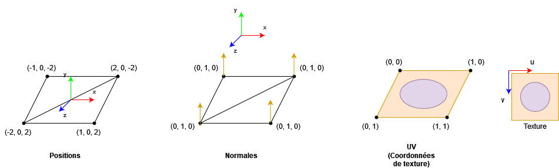

# [Tutoriel pour bien débuter à Vulkan](../index.md)
## 2.2 - Vertex et index buffers

Nous allons commencer par le maillage du modèle 3D. C'est-à-dire les triangles qui le composent.

Autant pour le triangle, nous n'avions besoin que de 3 positions et 3 couleurs, autant dans ce que nous allons voir maintenant, nous allons utiliser un nombre arbitraire de positions et de bien d'autres attributs. Nous allons commencer par définir une nouvelle structure ``Vertex`` dans ``renderingengine.h``, avant la définition de la classe ``RenderingEngine`` :

```CPP
#include "../external/nml/include/nml.h" // A ajouter au debut avec les autres includes

struct Vertex {
	nml::vec3 position;
	nml::vec3 normal;
	nml::vec3 uv;
};
```

Dans notre cas, un *vertex* sera composé d'une position 3D, d'une normale et de coordonnées de textures.



La position d'un *vertex* représente sa position dans le maillage, donc selon le repère du modèle, pas celui du monde. Une matrice modèle servira à transformer cette position dans le repère du modèle vers une position dans le repère du monde.

Les normales sont des vecteurs unitaires (de longueur égale à 1) orthogonaux à la surface. Elles sont utilisées lors de l'éclairage d'une surface car celui-ci dépend notamment de la direction de la lumière et de la normale de la surface. Chaque *vertex* possède une normale, la normale du fragment, qui sera utilisée lors des calculs de lumière, est calculée en interpolant les normales des *vertices*. Sur cet exemple, on peut remarquer que chaque *vertex* a la même normale, (0, 1, 0), elle sera donc constante sur toute la normale, ce qui donnera un éclairage uniforme.

Les uv, ou coordonnées de textures, sont des coordonnées normalisées (entre 0 et 1) qui correspondent à une position sur une image, où (0, 0) est le coin en haut à gauche de l'image et (1, 1) est le coin en bas à droite. Grâce à ces coordonnées normalisées, nous pouvons ignorer la taille réelle de l'image en pixels lorsque nous utilisons des textures.

Nous aurons aussi des indices qui permettront d'éviter de dupliquer les *vertices* :


Dans cette figure, sans *Index Buffer*, le *Vertex Buffer* contiendrait 6 *vertices*, dont 2 qui existaient déjà dans ce *Vertex Buffer*. Avec un *Index Buffer*, le *Vertex Buffer* ne contient plus que 4 *vertices*, et les triangles sont construits à partir des indices des *vertices* donnés dans l'*Index Buffer*.

Nous avons besoin d'avoir ces *vertices* et ces indices dans la mémoire du GPU, nous allons donc commencer par créer un *Vertex* et un *Index* Buffer.

Pour cela, nous allons avoir besoin d'inclure VulkanMemoryAllocator dans ``renderingengine.h`` :

```CPP
#if defined(TUTORIEL_VK_OS_WINDOWS)
#define VK_USE_PLATFORM_WIN32_KHR
#elif defined(TUTORIEL_VK_OS_LINUX)
#define VK_USE_PLATFORM_XLIB_KHR
#endif
#include "../external/VulkanMemoryAllocator/include/vk_mem_alloc.h" // Remplace "#include <vulkan/vulkan.h>"
```

``vk_mem_alloc.h`` inclut déjà ``<vulkan/vulkan.h>``, nous pouvons donc le remplacer.

VulkanMemoryAllocator est une bibliothèque qui implémente un allocateur de mémoire GPU pour Vulkan. La mémoire GPU va nous permettre d'accéder à des morceaux de données *buffers* ou même des images, comme des textures pour des modèles 3D, dans des *shaders*.

Pour comprendre pourquoi nous utilisons un allocateur de mémoire, il faut comprendre comment est allouée la mémoire GPU avec Vulkan.

Vulkan a une fonction [**``VkAllocateMemory``**](https://registry.khronos.org/vulkan/specs/1.3-extensions/man/html/vkAllocateMemory.html) qui permet d'allouer de la mémoire GPU. Chaque allocation effectuée avec cette fonction réduit un compteur d'allocations restantes pour l'application. Cette limite est définie par le *driver* du GPU.


Cette information est tirée de [**GPUinfo**](https://vulkan.gpuinfo.org/listdevices.php) et indique le nombre d'allocations mémoires qu'un GPU *NVIDIA GeForce GTX 1060 6GB* peut effectuer, qui est donc de 4096. Si nous allouons naïvement de la mémoire à chaque fois que nous souhaitons créer un *buffer* ou une image, nous allons atteindre cette limite très rapidement (il ne faut pas oublier qu'avec le *Double Buffering*, nous avons besoin de doubler les *buffers* que le CPU peut modifier).

Un allocateur de mémoire va appeler ``VkAllocateMemory`` mais va allouer de grands morceaux de mémoire, par exemple, des morceaux de 256Mio. Lorsqu'un *buffer* ou une image a besoin d'être créée, l'allocateur de mémoire ne va pas re-allouer de la mémoire, sauf si nécessaire, mais va utiliser les fonctions [**``vkBindBufferMemory``**](https://registry.khronos.org/vulkan/specs/1.3-extensions/man/html/vkBindBufferMemory.html) et [**``vkBindImageMemory``**](https://registry.khronos.org/vulkan/specs/1.3-extensions/man/html/vkBindImageMemory.html), qui va assigner une partie de ce morceau de mémoire à ce *buffer* ou cette image.


À gauche, nous avons un appel à ``VkAllocateMemory`` par *buffer* et image, ce qui n'est pas bon. À droite, nous avons un seul appel à ``VkAllocateMemory`` pour tous les *buffers* et images.

Un allocateur de mémoire va aussi choisir le bon tas de mémoire GPU (*memory heap*) pour le bon type de ressources et la manière dont elles vont être accédées (écrites par le CPU ou non, par exemple).

Il est possible d'écrire soi-même [**un allocateur de mémoire simple**](https://zaonirinku.github.io/vulkan_articles/memoryallocator.html) mais nous allons plutôt en utiliser un qui est déjà largement utilisé dans le développement d'applications avec Vulkan.

Nous devons initialiser VulkanMemoryAllocator, nous avons donc besoin d'un attribut ``VmaAllocator`` :

```CPP
VmaAllocator m_allocator;
```

Dans la fonction ``init``, nous allons créer notre allocateur de mémoire juste après avoir créé le *device* logique :

```CPP
// Initialisation de l'allocateur de memoire
VmaAllocatorCreateInfo vmaAllocatorCreateInfo = {};
vmaAllocatorCreateInfo.flags = 0;
vmaAllocatorCreateInfo.physicalDevice = m_physicalDevice;
vmaAllocatorCreateInfo.device = m_device;
vmaAllocatorCreateInfo.preferredLargeHeapBlockSize = 0;
vmaAllocatorCreateInfo.pAllocationCallbacks = nullptr;
vmaAllocatorCreateInfo.pDeviceMemoryCallbacks = nullptr;
vmaAllocatorCreateInfo.pHeapSizeLimit = nullptr;
vmaAllocatorCreateInfo.pVulkanFunctions = nullptr;
vmaAllocatorCreateInfo.instance = m_instance;
vmaAllocatorCreateInfo.vulkanApiVersion = VK_API_VERSION_1_1;
TUTORIEL_VK_CHECK(vmaCreateAllocator(&vmaAllocatorCreateInfo, &m_allocator));
```

VulkanMemoryAllocator utilise la même structure que Vulkan, avec une structure à remplir puis l'appel d'une fonction qui retourne un ``VkResult``.

Nous devons passer plusieurs objets Vulkan que nous avons créé.

``preferredLargeHeapBlockSize`` est la taille que nous aimerions donner à nos allocations. Mettre 0 ici signifie que VulkanMemoryAllocator utilisera sa valeur par défaut, qui est de 256Mio.

Dans la fonction ``destroy``, nous devons détruire notre allocateur de mémoire juste avant de détruire le *device* logique :

```CPP
// Destruction de l'allocateur de memoire
vmaDestroyAllocator(m_allocator);
```

Nous pouvons ensuite ajouter quatre nouveaux attributs, deux ``VkBuffer``s et deux ``VmaAllocation``s :

```CPP
VkBuffer m_vertexBuffer;
VmaAllocation m_vertexBufferAllocation;
VkBuffer m_indexBuffer;
VmaAllocation m_indexBufferAllocation;
```

``VkBuffer`` représente des données dans la mémoire du GPU. ``VmaAllocation`` est un objet ajouté par VulkanMemoryAllocator qui permet de garder des informations sur la ressource dans la mémoire GPU, nous allons avoir un ``VmaAllocation`` par ``VkBuffer`` et ``VkImage``.

Nous pouvons maintenant créer et allouer nos *buffers* à la suite de la fonction ``init`` :

```CPP
// Creation des vertex et index buffers
VkBufferCreateInfo vertexAndIndexBufferCreateInfo = {};
vertexAndIndexBufferCreateInfo.sType = VK_STRUCTURE_TYPE_BUFFER_CREATE_INFO;
vertexAndIndexBufferCreateInfo.pNext = nullptr;
vertexAndIndexBufferCreateInfo.flags = 0;
vertexAndIndexBufferCreateInfo.size = 67108864;
vertexAndIndexBufferCreateInfo.usage = VK_BUFFER_USAGE_VERTEX_BUFFER_BIT | VK_BUFFER_USAGE_TRANSFER_DST_BIT;
vertexAndIndexBufferCreateInfo.sharingMode = VK_SHARING_MODE_EXCLUSIVE;
vertexAndIndexBufferCreateInfo.queueFamilyIndexCount = 1;
vertexAndIndexBufferCreateInfo.pQueueFamilyIndices = &m_graphicsQueueFamilyIndex;

VmaAllocationCreateInfo vertexAndIndexBufferAllocationCreateInfo = {};
vertexAndIndexBufferAllocationCreateInfo.usage = VMA_MEMORY_USAGE_AUTO_PREFER_DEVICE;

vmaCreateBuffer(m_allocator, &vertexAndIndexBufferCreateInfo, &vertexAndIndexBufferAllocationCreateInfo, &m_vertexBuffer, &m_vertexBufferAllocation, nullptr);

vertexAndIndexBufferCreateInfo.usage = VK_BUFFER_USAGE_INDEX_BUFFER_BIT | VK_BUFFER_USAGE_TRANSFER_DST_BIT;
vmaCreateBuffer(m_allocator, &vertexAndIndexBufferCreateInfo, &vertexAndIndexBufferAllocationCreateInfo, &m_indexBuffer, &m_indexBufferAllocation, nullptr);
```

La structure [**``VkBufferCreateInfo``**](https://registry.khronos.org/vulkan/specs/1.3-extensions/man/html/VkBufferCreateInfo.html) est utilisée pour donner les informations lors de la création de *buffers*. Nous allons utiliser la même pour le *Vertex* et l'*Index* Buffer, nous allons cependant changer ``usage`` juste avant de créer l'*Index Buffer*.

``size`` est la taille du *buffer* en octet, ici, chaque *buffer* fera 64Mio, car nous voulons mettre tous nos maillages 3D dans les mêmes *Vertex* et *Index Buffer*. De manière générale, il est conseillé de regrouper les ressources dans un seul et même *buffer* (dans la mesure du possible) plutôt que de créer plein de *buffers* et mettre une ressource dans chaque *buffer*.

``usage`` est un [**``VkBufferUsageFlags``**](https://registry.khronos.org/vulkan/specs/1.3-extensions/man/html/VkBufferUsageFlagBits.html) qui spécifie la manière dont nous allons utiliser nos *buffers*. Nous avons donc ``VK_BUFFER_USAGE_VERTEX_BUFFER_BIT`` qui signifie qu'on aura un *Vertex Buffer*, puis cette valeur est remplacée par ``VK_BUFFER_USAGE_INDEX_BUFFER_BIT`` lors de la création de l'*Index Buffer*. Nous avons aussi ``VK_BUFFER_USAGE_TRANSFER_DST_BIT`` qui signifie que nos *buffers* seront la destination d'une opération de transfert (nous allons donc transférer des données d'un *buffer* vers ces *buffers*).

``sharingMode`` permet ici aussi de spécifier si le *buffer* sera utilisé par une seule ou plusieurs familles de queues. Nous n'en avons qu'une seule ici, donc ``queueFamilyIndexCount`` et ``pQueueFamilyIndices`` sont ignorés.

``VmaAllocationCreateInfo`` est une structure de VulkanMemoryAllocator et sert à donner des précisions sur la manière dont nous aimerions que notre *buffer* soit alloué en mémoire. Un ``usage`` de ``VMA_MEMORY_USAGE_AUTO_PREFER_DEVICE`` signifie que nous voulons que le *buffer* ne soit accessible que par le GPU et que le CPU n'y ait pas accès. Le fait que le CPU n'y ait pas accès permet de ne pas avoir à le doubler pour le *Double Buffering* et permet aussi un accès plus rapide pour le GPU.

``vmaCreateBuffer`` remplace [**``vkCreateBuffer``**](https://registry.khronos.org/vulkan/specs/1.3-extensions/man/html/vkCreateBuffer.html) pour créer un *buffer*. C'est une fonction de VulkanMemoryAllocator qui prend notre ``VkBufferCreateInfo`` ainsi que le ``VmaAllocationCreateInfo`` pour créer un *buffer* et l'allouer en mémoire.

Nous devons aussi les détruire et libérer leur mémoire :

```CPP
// Destruction des vertex et index buffers
vmaDestroyBuffer(m_allocator, m_indexBuffer, m_indexBufferAllocation);
vmaDestroyBuffer(m_allocator, m_vertexBuffer, m_vertexBufferAllocation);
```

``vmaDestroyBuffer`` remplace [**``vkDestroyBuffer``**](https://registry.khronos.org/vulkan/specs/1.3-extensions/man/html/vkDestroyBuffer.html) pour détruire un *buffer* et prend l'allocateur de mémoire, le *buffer* et son allocation.

Maintenant que nous avons nos *Vertex* et *Index Buffers*, nous allons les remplir.

Pour commencer, nous allons faire un cube qui affichera la texture sur chaque face.

Nous allons créer une méthode privée ``createCube`` dans la classe ``RenderingEngine`` :

```CPP
void createCube();
```

Et son implémentation dans ``renderingengine.cpp`` :

```CPP
void RenderingEngine::createCube() {
	std::array<Vertex, 24> vertices = { {
		{ {1.0f, 1.0f, -1.0f}, {0.0f, 1.0f, 0.0f}, {0.0f, 1.0f} }, // Vertex 0
		{ {-1.0f, 1.0f, -1.0f}, {0.0f, 1.0f, 0.0f}, {0.0f, 0.0f} }, // Vertex 1
		{ {-1.0f, 1.0f, 1.0f}, {0.0f, 1.0f, 0.0f}, {1.0f, 0.0f} }, // Vertex 2
		{ {1.0f, 1.0f, 1.0f}, {0.0f, 1.0f, 0.0f}, {1.0f, 1.0f} }, // Vertex 3
		{ {1.0f, -1.0f, 1.0f}, {0.0f, 0.0f, 1.0f}, {0.0f, 1.0f} }, // Vertex 4
		{ {1.0f, 1.0f, 1.0f}, {0.0f, 0.0f, 1.0f}, {0.0f, 0.0f} }, // Vertex 5
		{ {-1.0f, 1.0f, 1.0f}, {0.0f, 0.0f, 1.0f}, {1.0f, 0.0f} }, // Vertex 6
		{ {-1.0f, -1.0f, 1.0f}, {0.0f, 0.0f, 1.0f}, {1.0f, 1.0f} }, // Vertex 7
		{ {-1.0f, -1.0f, 1.0f}, {-1.0f, 0.0f, 0.0f}, {0.0f, 1.0f} }, // Vertex 8
		{ {-1.0f, 1.0f, 1.0f}, {-1.0f, 0.0f, 0.0f}, {0.0f, 0.0f} }, // Vertex 9
		{ {-1.0f, 1.0f, -1.0f}, {-1.0f, 0.0f, 0.0f}, {1.0f, 0.0f} }, // Vertex 10
		{ {-1.0f, -1.0f, -1.0f}, {-1.0f, 0.0f, 0.0f}, {1.0f, 1.0f} }, // Vertex 11
		{ {-1.0f, -1.0f, -1.0f}, {0.0f, -1.0f, 0.0f}, {0.0f, 1.0f} }, // Vertex 12
		{ {1.0f, -1.0f, -1.0f}, {0.0f, -1.0f, 0.0f}, {0.0f, 0.0f} }, // Vertex 13
		{ {1.0f, -1.0f, 1.0f}, {0.0f, -1.0f, 0.0f}, {1.0f, 0.0f} }, // Vertex 14
		{ {-1.0f, -1.0f, 1.0f}, {0.0f, -1.0f, 0.0f}, {1.0f, 1.0f} }, // Vertex 15
		{ {1.0f, -1.0f, -1.0f}, {1.0f, 0.0f, 0.0f}, {0.0f, 1.0f} }, // Vertex 16
		{ {1.0f, 1.0f, -1.0f}, {1.0f, 0.0f, 0.0f}, {0.0f, 0.0f} }, // Vertex 17
		{ {1.0f, 1.0f, 1.0f}, {1.0f, 0.0f, 0.0f}, {1.0f, 0.0f} }, // Vertex 18
		{ {1.0f, -1.0f, 1.0f}, {1.0f, 0.0f, 0.0f}, {1.0f, 1.0f} }, // Vertex 19
		{ {-1.0f, -1.0f, -1.0f}, {0.0f, 0.0f, -1.0f}, {0.0f, 1.0f} }, // Vertex 20
		{ {-1.0f, 1.0f, -1.0f}, {0.0f, 0.0f, -1.0f}, {0.0f, 0.0f} }, // Vertex 21
		{ {1.0f, 1.0f, -1.0f}, {0.0f, 0.0f, -1.0f}, {1.0f, 0.0f} }, // Vertex 22
		{ {1.0f, -1.0f, -1.0f}, {0.0f, 0.0f, -1.0f}, {1.0f, 1.0f} } // Vertex 23
	} };
}
```

Nous avons 24 *vertices* dans ce cube, alors que géométriquement, un cube n'a que 8 points.

La raison est que nous souhaitons des normales uniformes et une texture entière sur chaque face, nous avons donc besoin de définir plusieurs *vertices* à la même position, mais avec une normale et des coordonnées de texture différentes.

Nous avons donc un tableau de 24 ``Vertex``, l'ordre des attributs est donc *position*, *normal*, *uv*.

```CPP
std::array<uint32_t, 36> indices = {
	0,
	1,
	2,
	0,
	2,
	3,
	4,
	5,
	6,
	4,
	6,
	7,
	8,
	9,
	10,
	8,
	10,
	11,
	12,
	13,
	14,
	12,
	14,
	15,
	16,
	17,
	18,
	16,
	18,
	19,
	20,
	21,
	22,
	20,
	22,
	23
};
```

Puis nous avons le tableau contenant les indices. Les indices sont ici des entiers 32 bits non-signés, ce qui va avoir son importance.

Chaque face est un groupe de 6 entiers : ``x, x+1, x+2, x, x+2, x+3``. Les triangles sont montés dans le sens des aiguilles d'une montre, mais notre projection, que nous allons voir plus tard, va inverser leur ordre.

Nous avons maintenant les données à mettre dans nos *Vertex* et *Index Buffers*.

Le CPU ne peut pas accéder directement à ces *buffers*, nous allons donc devoir utiliser un *Staging Buffer* pour copier les données depuis le CPU dedans, puis copier les données de ce *Staging Buffer* vers nos *Vertex* et *Index Buffers*.


```CPP
// Creation du staging buffer
VkBuffer vertexAndIndexStagingBuffer;
VmaAllocation vertexAndIndexStagingBufferAllocation;

VkBufferCreateInfo vertexAndIndexStagingBufferCreateInfo = {};
vertexAndIndexStagingBufferCreateInfo.sType = VK_STRUCTURE_TYPE_BUFFER_CREATE_INFO;
vertexAndIndexStagingBufferCreateInfo.pNext = nullptr;
vertexAndIndexStagingBufferCreateInfo.flags = 0;
vertexAndIndexStagingBufferCreateInfo.size = 131072;
vertexAndIndexStagingBufferCreateInfo.usage = VK_BUFFER_USAGE_TRANSFER_SRC_BIT;
vertexAndIndexStagingBufferCreateInfo.sharingMode = VK_SHARING_MODE_EXCLUSIVE;
vertexAndIndexStagingBufferCreateInfo.queueFamilyIndexCount = 1;
vertexAndIndexStagingBufferCreateInfo.pQueueFamilyIndices = &m_graphicsQueueFamilyIndex;

VmaAllocationCreateInfo vertexAndIndexStagingBufferAllocationCreateInfo = {};
vertexAndIndexStagingBufferAllocationCreateInfo.usage = VMA_MEMORY_USAGE_AUTO_PREFER_HOST;
vertexAndIndexStagingBufferAllocationCreateInfo.flags = VMA_ALLOCATION_CREATE_HOST_ACCESS_SEQUENTIAL_WRITE_BIT;
TUTORIEL_VK_CHECK(vmaCreateBuffer(m_allocator, &vertexAndIndexStagingBufferCreateInfo, &vertexAndIndexStagingBufferAllocationCreateInfo, &vertexAndIndexStagingBuffer, &vertexAndIndexStagingBufferAllocation, nullptr));
```

La taille (``size``) de notre *Staging Buffer* est égale à la taille de notre *Vertex Buffer* + la taille de notre *Index Buffer* car nous n'allons utiliser qu'un seul *Staging Buffer* pour copier les données vers nos deux *buffers*.

L'``usage`` est ``VK_BUFFER_USAGE_TRANSFER_SRC_BIT``, là où celui de nos *Vertex* et *Index Buffers* était ``VK_BUFFER_USAGE_TRANSFER_DST_BIT``, c'est parce que notre *Staging Buffer* est la source (``SRC``) et les deux *buffers* sont les destinations (``DST``) de nos opérations de transfert, qui sont les copies.

Pour ``VmaAllocationCreateInfo``, l'usage est ``VMA_MEMORY_USAGE_AUTO_PREFER_HOST`` car nous voulons que le CPU puisse y accéder. ``flags`` est ``VMA_ALLOCATION_CREATE_HOST_ACCESS_SEQUENTIAL_WRITE_BIT`` pour indiquer que nous allons écrire dans cet espace mémoire depuis le CPU.

Nous pouvons maintenant copier nos *vertices* et nos *indices* vers le *Staging Buffer* :

```CPP
// Copie des données CPU vers le Staging Buffer
void* data;

TUTORIEL_VK_CHECK(vmaMapMemory(m_allocator, vertexAndIndexStagingBufferAllocation, &data));
memcpy(data, vertices.data(), vertices.size() * sizeof(Vertex));
memcpy(reinterpret_cast<char*>(data) + 67108864, indices.data(), indices.size() * sizeof(uint32_t));
vmaUnmapMemory(m_allocator, vertexAndIndexStagingBufferAllocation);
```

``vmaMapMemory`` remplace [**``vkMapMemory``**](https://registry.khronos.org/vulkan/specs/1.3-extensions/man/html/vkMapMemory.html) et sert à récupérer un pointeur vers l'adresse mémoire de notre *buffer*, qui est ici mise dans ``data``.

[**``memcpy``**](https://en.cppreference.com/w/c/string/byte/memcpy) sert à copier des données vers une adresse destination, (donc ``data``, qui pointe vers l'espace mémoire de notre *Staging Buffer*), depuis une adresse source (nos tableaux contenant les *vertices* et les indices), et une taille de données à copier.

Dans le second ``memcpy``, nous décalons l'adresse destination de 67108864, qui est la taille du *Vertex Buffer*. Le *Staging Buffer* a la taille du *Vertex Buffer* + la taille de l'*Index Buffer*, nous considérons donc que la première moitié est dédiée aux données à copier dans le *Vertex Buffer* tandis que la seconde moitié est dédiée aux données à copier dans l'*Index Buffer*.

Nous pouvons ensuite utiliser ``vmaUnmapMemory``, qui remplace [**``vkUnmapMemory``**](https://registry.khronos.org/vulkan/specs/1.3-extensions/man/html/vkUnmapMemory.html) et qui va libérer l'adresse mémoire.

Notre *Staging Buffer* contient maintenant les données des *vertices* au début, et les indices à la moitié.

Nous pouvons donc copier ces données vers le *Vertex* et l'*Index Buffer*.

Copier des données du GPU vers le GPU requiert l'utilisation de commandes, et donc d'un *Command Buffer*.

Nous allons créer un *Command Pool* et y allouer un *Command Buffer*

```CPP
// Copie le Staging Buffer vers le Vertex Buffer et l'Index Buffer
VkCommandPool buffersCopyCommandPool;

VkCommandPoolCreateInfo buffersCopyCommandPoolCreateInfo = {};
buffersCopyCommandPoolCreateInfo.sType = VK_STRUCTURE_TYPE_COMMAND_POOL_CREATE_INFO;
buffersCopyCommandPoolCreateInfo.pNext = nullptr;
buffersCopyCommandPoolCreateInfo.flags = 0;
buffersCopyCommandPoolCreateInfo.queueFamilyIndex = m_graphicsQueueFamilyIndex;
TUTORIEL_VK_CHECK(vkCreateCommandPool(m_device, &buffersCopyCommandPoolCreateInfo, nullptr, &buffersCopyCommandPool));

VkCommandBuffer buffersCopyCommandBuffer;

VkCommandBufferAllocateInfo buffersCopyCommandBufferAllocateInfo = {};
buffersCopyCommandBufferAllocateInfo.sType = VK_STRUCTURE_TYPE_COMMAND_BUFFER_ALLOCATE_INFO;
buffersCopyCommandBufferAllocateInfo.pNext = nullptr;
buffersCopyCommandBufferAllocateInfo.commandPool = buffersCopyCommandPool;
buffersCopyCommandBufferAllocateInfo.level = VK_COMMAND_BUFFER_LEVEL_PRIMARY;
buffersCopyCommandBufferAllocateInfo.commandBufferCount = 1;
TUTORIEL_VK_CHECK(vkAllocateCommandBuffers(m_device, &buffersCopyCommandBufferAllocateInfo, &buffersCopyCommandBuffer));
```

Puis nous allons enregistrer les commandes de copie de données GPU vers GPU :

```CPP
VkCommandBufferBeginInfo vertexAndIndexBuffersCopyBeginInfo = {};
vertexAndIndexBuffersCopyBeginInfo.sType = VK_STRUCTURE_TYPE_COMMAND_BUFFER_BEGIN_INFO;
vertexAndIndexBuffersCopyBeginInfo.pNext = nullptr;
vertexAndIndexBuffersCopyBeginInfo.flags = VK_COMMAND_BUFFER_USAGE_ONE_TIME_SUBMIT_BIT;
vertexAndIndexBuffersCopyBeginInfo.pInheritanceInfo = nullptr;
vkBeginCommandBuffer(buffersCopyCommandBuffer, &vertexAndIndexBuffersCopyBeginInfo);

VkBufferCopy vertexBufferCopy = {};
vertexBufferCopy.srcOffset = 0;
vertexBufferCopy.dstOffset = 0;
vertexBufferCopy.size = vertices.size() * sizeof(Vertex);
vkCmdCopyBuffer(buffersCopyCommandBuffer, vertexAndIndexStagingBuffer, m_vertexBuffer, 1, &vertexBufferCopy);

VkBufferCopy indexBufferCopy = {};
indexBufferCopy.srcOffset = 67108864;
indexBufferCopy.dstOffset = 0;
indexBufferCopy.size = indices.size() * sizeof(uint32_t);
vkCmdCopyBuffer(buffersCopyCommandBuffer, vertexAndIndexStagingBuffer, m_indexBuffer, 1, &indexBufferCopy);

vkEndCommandBuffer(buffersCopyCommandBuffer);
```

[**``vkCmdCopyBuffer``**](https://registry.khronos.org/vulkan/specs/1.3-extensions/man/html/vkCmdCopyBuffer.html) est la commande utilisée pour copier des données d'un *buffer* GPU vers un *buffer* GPU, et demande une structure [**``VkBufferCopy``**](https://registry.khronos.org/vulkan/specs/1.3-extensions/man/html/VkBufferCopy.html).

``srcOffset`` est le décalage en octet dans le *buffer* source (qui est ici le *Staging Buffer*). Il est 0 pour l'opération de copie vers le *Vertex Buffer* mais de la taille du *Vertex Buffer* pour l'opération de copie vers l'*Index Buffer*, puisque c'est ici que nous avons copié nos indices avec ``memcpy``.

``dstOffset`` est le décalage en octet dans le *buffer* destination. Nous n'avons pas de décalage donc il est 0 pour le *Vertex* et l'*Index Buffer*.

Nous devons maintenant soumettre ces commandes à la queue du GPU, et attendre qu'elle se finisse :

```CPP
VkFence buffersCopyFence;

VkFenceCreateInfo buffersCopyFenceCreateInfo = {};
buffersCopyFenceCreateInfo.sType = VK_STRUCTURE_TYPE_FENCE_CREATE_INFO;
buffersCopyFenceCreateInfo.pNext = nullptr;
buffersCopyFenceCreateInfo.flags = 0;
TUTORIEL_VK_CHECK(vkCreateFence(m_device, &buffersCopyFenceCreateInfo, nullptr, &buffersCopyFence));

VkSubmitInfo buffersCopySubmitInfo = {};
buffersCopySubmitInfo.sType = VK_STRUCTURE_TYPE_SUBMIT_INFO;
buffersCopySubmitInfo.pNext = nullptr;
buffersCopySubmitInfo.waitSemaphoreCount = 0;
buffersCopySubmitInfo.pWaitSemaphores = nullptr;
buffersCopySubmitInfo.pWaitDstStageMask = nullptr;
buffersCopySubmitInfo.commandBufferCount = 1;
buffersCopySubmitInfo.pCommandBuffers = &buffersCopyCommandBuffer;
buffersCopySubmitInfo.signalSemaphoreCount = 0;
buffersCopySubmitInfo.pSignalSemaphores = nullptr;
TUTORIEL_VK_CHECK(vkQueueSubmit(m_graphicsQueue, 1, &buffersCopySubmitInfo, buffersCopyFence));
TUTORIEL_VK_CHECK(vkWaitForFences(m_device, 1, &buffersCopyFence, VK_TRUE, std::numeric_limits<uint64_t>::max()));
```

Nous allons utiliser une *Fence* qui sera signalée par le GPU lorsque l'exécution des commandes sera terminée. Le CPU restera bloqué sur [**``vkWaitForFences``**](https://registry.khronos.org/vulkan/specs/1.3-extensions/man/html/vkWaitForFences.html) en attendant.

Une fois que le CPU dépasse ``vkWaitForFences``, nous sommes assurés que nous n'avons plus besoin du *Command Pool*, de la *Fence* et du *Staging Buffer*, et nous pouvons donc les détruire :

```CPP
// Destruction des ressources utilisees pour la copie des buffers
vkDestroyFence(m_device, buffersCopyFence, nullptr);
vkDestroyCommandPool(m_device, buffersCopyCommandPool, nullptr);
vmaDestroyBuffer(m_allocator, vertexAndIndexStagingBuffer, vertexAndIndexStagingBufferAllocation);
```

Nous pouvons appeler cette fonction à la suite de la fonction ``init`` :

```CPP
// Creation d'un cube
createCube();
```

Notre *Vertex Buffer* contient maintenant les attributs des *vertices* du cube, et l'*Index Buffer* contient les indices.

[**Chapitre précédent**](1.md) - [**Index**](../index.md) - [**Chapitre suivant**](3.md)

[**Code de la partie**](https://github.com/ZaOniRinku/TutorielVulkanFR/tree/partie2)