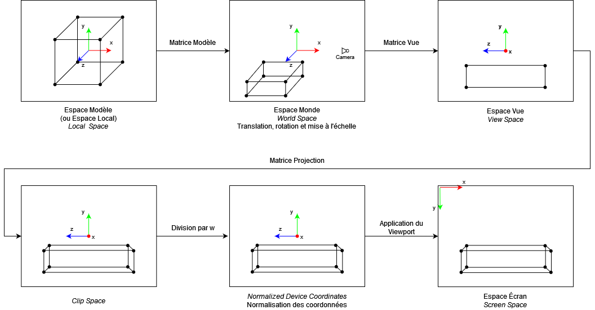
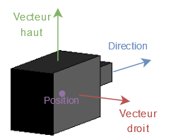
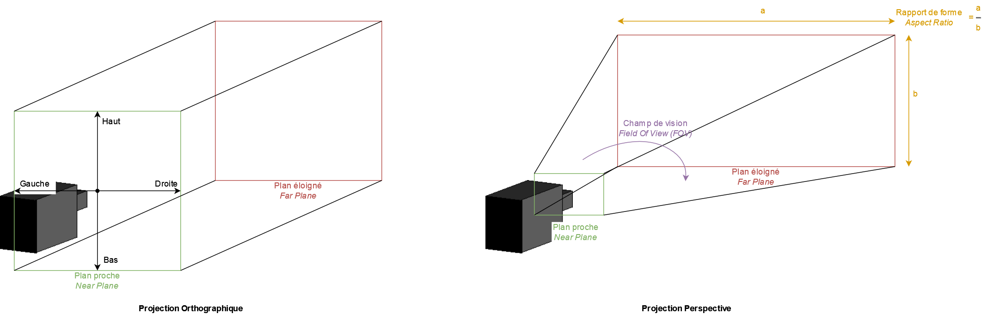
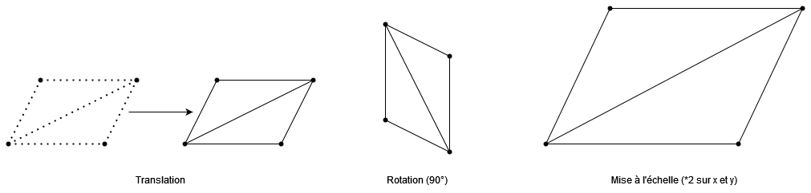

# [Tutoriel pour bien débuter à Vulkan](../index.md)
## 2.3 - La caméra et la matrice modèle

Nous avons nos *vertices* dans un *Vertex Buffer* mais ceux-ci sont dans l'espace modèle, ce qui signifie que leurs positions sont relatives au maillage. Si nous voulons les afficher à l'écran, nous avons besoin de passer de l'espace modèle à l'espace écran, ce qui s'effectue en plusieurs étapes :



Dans le cas de notre triangle dans la partie précédente, les positions données dans le *Vertex Shader* étaient directement dans le *Clip Space*.

Dans le cas de nos modèles 3D, nous pouvons voir que nous aurons besoin d'une matrice modèle, d'une matrice de vue et d'une matrice de projection. La division par w est effectuée automatiquement après le *Vertex Shader* et l'application du *Viewport* est effectuée encore après.

La matrice vue et la matrice projection sont les deux éléments qui définissent une caméra.



La matrice vue est une matrice de 4 nombres flottants par 4 nombres flottants et contient la position de la caméra, sa direction, son vecteur droit et son vecteur haut.



On utilise généralement deux types de matrices de projection : les matrices de projections orthographiques et les matrices de projections perspectives. Les matrices de projections sont des matrices de 4 nombres flottants par 4 nombres flottants.

Les matrices de projections orthographiques peuvent être utilisées quand nous voulons une vue sans perspective, par exemple lors de la réalisation des cartes d'ombre pour les lumières directionnelles. Elles sont représentées par un volume qui est le parallélépipède rectangle.

Les matrices de projections perspectives sont utilisées lorsque nous souhaitons avoir de la perspective, ce qui est le cas quand nous voulons rendre des objets normalement, c'est-à-dire pour mimer la vision humaine ou l'image capturée par une caméra réelle. Elles sont représentées par un volume qui est le cône coupé par un plan, dit *frustum*.

Tout ce qui se trouve en dehors de ces volumes n'apparaît pas à l'écran, c'est ce qu'on appelle le *clipping* et qui détermine aussi la distance de rendu.

Les caméras étant utilisées dans le *Vertex Shader*, nous avons besoin de *buffers* dans la classe ``RenderingEngine`` :

```CPP
std::vector<VkBuffer> m_cameraBuffers;
std::vector<VmaAllocation> m_cameraBufferAllocations;
```

Nous utilisons plusieurs *buffers* ici car ceux-ci seront modifiés par le CPU à chaque image, nous avons donc besoin de les doubler dans le cas du *Double Buffering*.

Nous pouvons maintenant les créer à la suite de la fonction ``init`` :

```CPP
// Creation des buffers de camera
m_cameraBuffers.resize(m_framesInFlight);
m_cameraBufferAllocations.resize(m_framesInFlight);

VkBufferCreateInfo cameraBufferCreateInfo = {};
cameraBufferCreateInfo.sType = VK_STRUCTURE_TYPE_BUFFER_CREATE_INFO;
cameraBufferCreateInfo.pNext = nullptr;
cameraBufferCreateInfo.flags = 0;
cameraBufferCreateInfo.size = sizeof(nml::mat4) * 2;
cameraBufferCreateInfo.usage = VK_BUFFER_USAGE_UNIFORM_BUFFER_BIT;
cameraBufferCreateInfo.sharingMode = VK_SHARING_MODE_EXCLUSIVE;
cameraBufferCreateInfo.queueFamilyIndexCount = 1;
cameraBufferCreateInfo.pQueueFamilyIndices = &m_graphicsQueueFamilyIndex;

VmaAllocationCreateInfo cameraBufferAllocationCreateInfo = {};
cameraBufferAllocationCreateInfo.usage = VMA_MEMORY_USAGE_AUTO_PREFER_HOST;
cameraBufferAllocationCreateInfo.flags = VMA_ALLOCATION_CREATE_HOST_ACCESS_SEQUENTIAL_WRITE_BIT;

for (uint32_t i = 0; i < m_framesInFlight; i++) {
	VK_CHECK(vmaCreateBuffer(m_allocator, &cameraBufferCreateInfo, &cameraBufferAllocationCreateInfo, &m_cameraBuffers[i], &m_cameraBufferAllocations[i], nullptr));
}
```

On commence par changer la taille de nos ``std::vector`` contenant les *buffers* de caméra et leurs *allocations* pour le nombre de *frames-in-flight* (qui sera donc de 1 sans *Buffering*, 2 dans le cas du *Double Buffering* ou 3 dans le cas du *Triple Buffering*).

Nous avons besoin d'une matrice de vue et d'une matrice de projection, donc la taille (``size``) est égale à 16 nombres flottants par matrice. Ce qui donne ``(16 * 4) * 2 = 128 octets``, soit la taille de deux [**``nml::mat4``**](https://team-nutshell.github.io/nml/nml/matrix/mat4.html).

L'utilisation (``usage``) est ``VK_BUFFER_USAGE_UNIFORM_BUFFER_BIT``, ce qui signifie que nous faisons un *Uniform Buffer*. Les *Uniform Buffers* sont des *buffers* limités en taille et qui ne peuvent pas être modifiés dans les *shaders* mais qui peuvent potentiellement être accédés plus rapidement selon le GPU.

Nous voulons que le CPU puisse écrire dedans avec ``memcpy``, notre allocation a donc comme ``usage`` ``VMA_MEMORY_USAGE_AUTO_PREFER_HOST`` et le ``flags`` ``VMA_ALLOCATION_CREATE_HOST_ACCESS_SEQUENTIAL_WRITE_BIT``.

Puis nous devons les détruire dans la fonction ``destroy`` :

```CPP
// Destruction des buffers de camera
for (uint32_t i = 0; i < m_framesInFlight; i++) {
	vmaDestroyBuffer(m_allocator, m_cameraBuffers[i], m_cameraBufferAllocations[i]);
}
```



Les matrices modèle permettent de passer de l'espace modèle à l'espace monde, ce qui revient à donner une position dans le monde, une rotation et une mise à l'échelle à nos objets. La matrice modèle est une matrice de 4 nombres flottants par 4 nombres flottants.

La matrice modèle est aussi utilisée dans un *buffer*, nous en avons donc encore besoin dans la classe ``RenderingEngine`` :

```CPP
std::vector<VkBuffer> m_objectsBuffers;
std::vector<VmaAllocation> m_objectsBufferAllocations;
```

Ces matrices seront aussi modifiées par le CPU à chaque image, nous en avons donc besoin d'une par *frame-in-flight*.

```CPP
// Creation des buffers d'objets
m_objectsBuffers.resize(m_framesInFlight);
m_objectsBufferAllocations.resize(m_framesInFlight);

VkBufferCreateInfo objectsBufferCreateInfo = {};
objectsBufferCreateInfo.sType = VK_STRUCTURE_TYPE_BUFFER_CREATE_INFO;
objectsBufferCreateInfo.pNext = nullptr;
objectsBufferCreateInfo.flags = 0;
objectsBufferCreateInfo.size = sizeof(nml::mat4) * 2048;
objectsBufferCreateInfo.usage = VK_BUFFER_USAGE_STORAGE_BUFFER_BIT;
objectsBufferCreateInfo.sharingMode = VK_SHARING_MODE_EXCLUSIVE;
objectsBufferCreateInfo.queueFamilyIndexCount = 1;
objectsBufferCreateInfo.pQueueFamilyIndices = &m_graphicsQueueFamilyIndex;

VmaAllocationCreateInfo objectsBufferAllocationCreateInfo = {};
objectsBufferAllocationCreateInfo.usage = VMA_MEMORY_USAGE_AUTO_PREFER_HOST;
objectsBufferAllocationCreateInfo.flags = VMA_ALLOCATION_CREATE_HOST_ACCESS_SEQUENTIAL_WRITE_BIT;

for (uint32_t i = 0; i < m_framesInFlight; i++) {
	VK_CHECK(vmaCreateBuffer(m_allocator, &objectsBufferCreateInfo, &objectsBufferAllocationCreateInfo, &m_objectsBuffers[i], &m_objectsBufferAllocations[i], nullptr));
}
```

La taille (``size``) est égale à la taille de la matrice modèle, qui est donc de 64 octets, soit la taille d'un ``nml::mat4`` fois le nombre d'objets que nous voulons supporter, puisque nous allons mettre toutes les matrices modèle pour tous nos objets dans le même *buffer*. Cette valeur est arbitrairement égale à 2048 ici, ce qui signifie que nous pourrons avoir jusqu'à 2048 objets en même temps, mais il est possible de monter cette limite ou de la descendre.

L'utilisation (``usage``) est ``VK_BUFFER_USAGE_STORAGE_BUFFER_BIT``, ce qui signifie que nous allons ici utiliser un *Storage Buffer* qui peut contenir plus de données qu'un *Uniform Buffer* et peut être modifié dans les *shaders*, ce que nous n'allons pas faire ici. Notre nombre d'objets, et donc la taille de notre *buffer* étant arbitraire, il est préférable d'utiliser un *Storage Buffer* plutôt qu'un *Uniform Buffer* ici.

[**Chapitre précédent**](2.md) - [**Index**](../index.md) - [**Chapitre suivant**](4.md)

[**Code de la partie**](https://github.com/ZaOniRinku/TutorielVulkanFR/tree/partie2)