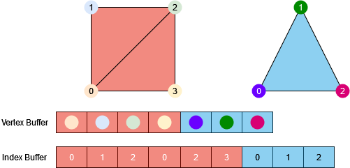

# [Tutoriel pour bien débuter à Vulkan](../index.md)
## 2.5 - Dessiner des maillages

Nous allons définir ce qu'est un maillage dans ``renderingengine.h``, juste après la définition de la structure ``Vertex`` :

```CPP
struct Mesh {
	uint32_t indexCount;
	uint32_t firstIndex;
	int32_t vertexOffset;
};
```

Pour le triangle, nous n'utilisions pas d'*Index Buffer*, nous appelions donc la fonction [**``vkCmdDraw``**](https://registry.khronos.org/vulkan/specs/1.3-extensions/man/html/vkCmdDraw.html). Ici, nous allons en utiliser un, nous allons donc utiliser la fonction [**``vkCmdDrawIndexed``**](https://registry.khronos.org/vulkan/specs/1.3-extensions/man/html/vkCmdDrawIndexed.html). La différence entre les deux se trouve dans le fait que la version ``Indexed`` ne compte plus en *vertices* mais en indices. Elle ajoute aussi ``vertexOffset`` qui est le décalage dans le *Vertex Buffer* qui déterminera quel *vertex* est à l'indice 0.

Puisque nous allons mettre tous les maillages dans le même *Vertex Buffer*, un maillage sera caractérisé par la position de son premier indice dans l'*Index Buffer*, le nombre d'indices et le décalage à appliquer dans le *Vertex Buffer* pour retrouver le premier *vertex*.



Sur cet exemple :
- Le carré :
```
indexCount = 6
firstIndex = 0
vertexOffset = 0
```
- Le triangle :
```
indexCount = 3
firstIndex = 6
vertexOffset = 4
```

Nous allons ajouter un attribut pour les maillages à la classe ``RenderingEngine`` :

```CPP
std::vector<Mesh> m_meshes;
```

Puis nous allons ajouter les informations de notre cube à notre liste de maillages dans la fonction ``createCube`` :

```CPP
// Ajout du cube à la liste des maillages
Mesh cube;
cube.indexCount = 36;
cube.firstIndex = 0;
cube.vertexOffset = 0;
m_meshes.push_back(cube);
```

Le cube a 36 indices et se trouve au tout début du *Vertex Buffer* et de l'*Index Buffer*, son ``firstIndex`` et son ``vertexOffset`` sont donc égaux à 0.

Nous allons ensuite définir ce qu'est un objet à rendre avec une structure ``Object`` dans ``renderingengine.h``, juste après la définition de la structure ``Vertex`` :

```CPP
struct Object {
	uint32_t index;

	nml::vec3 position;
	nml::vec3 rotation;
	nml::vec3 scale;

	size_t meshIndex;
};
```

``index`` est donc l'indice de notre objet que nous allons passer en tant que *Push Constant* et qui servira à récupérer la bonne matrice modèle depuis le *Storage Buffer* dans le *Vertex Shader*.

``position`` est la position de l'objet dans le monde, ``rotation`` est la rotation de l'objet sur les 3 axes et ``scale`` est la mise à l'échelle de l'objet.

``meshIndex`` est l'indice dans notre liste de maillages ``m_meshes`` qui va nous permettre de retrouver les informations du maillage à dessiner.

Nous allons ajouter un attribut pour les objets ainsi qu'un moyen de garder l'indice des objets actuel en mémoire, à la classe ``RenderingEngine`` :

```CPP
std::vector<Object> m_objects;
uint32_t m_objectIndex = 0;
```

Ainsi qu'une méthode privée ``createScene`` :

```CPP
void createScene();
```

Puis nous allons l'implémenter dans ``renderingengine.cpp`` :

```CPP
void RenderingEngine::createScene() {
	Object cubeObject;

	cubeObject.index = m_objectIndex++; // Indice 0

	cubeObject.position = nml::vec3(0.0f, 0.0f, 0.0f); // Milieu du monde
	cubeObject.rotation = nml::vec3(0.0f, 0.0f, 0.0f); // Pas de rotation
	cubeObject.scale = nml::vec3(1.0f, 1.0f, 1.0f); // Pas de mise à l'échelle

	cubeObject.meshIndex = 0; // Maillage 0 = Cube
}
```

Nous avons un objet qui a l'indice 0, est positionné au milieu du monde, n'a pas de rotation particulière et a sa taille normale. L'indice du maillage à utiliser est celui du cube.

Nous allons appeler cette fonction avant la création du *Descriptor Pool* :

```CPP
// Creation de la scene
createScene();
```

Dans la fonction ``update``, après avoir récupéré un indice d'image de la *swapchain*, nous allons mettre à jour le buffer de caméra actuel (selon la *frame-in-flight*) :

```CPP
// Mise à jour du buffer de caméra
const float toRad = 3.1415926535897932384626433832795f / 180.0f;
nml::mat4 cameraView = nml::lookAtRH(nml::vec3(0.0f, 2.0f, -3.0f), nml::vec3(0.0f, 0.0f, 0.0f), nml::vec3(0.0f, 1.0f, 0.0));
nml::mat4 cameraProjection = nml::perspectiveRH(90.0f * toRad, m_viewport.width / m_viewport.height, 0.05f, 100.0f);
cameraProjection[1][1] *= -1.0f;
std::array<nml::mat4, 2> cameraMatrices{ cameraView, cameraProjection };

void* data;
vmaMapMemory(m_allocator, m_cameraBufferAllocations[m_currentFrameInFlight], &data);
memcpy(data, cameraMatrices.data(), sizeof(nml::mat4) * 2);
vmaUnmapMemory(m_allocator, m_cameraBufferAllocations[m_currentFrameInFlight]);
```

Ici, nous devons choisir un système de coordonnées main gauche (*Left Hand*) ou main droite (*Right Hand*), ce qui change le sens de l'axe Z (en main gauche, l'axe Z pointe vers l'horizon, en main droite, l'axe Z pointe vers l'écran). Ce choix n'est pas très important tant qu'il est constant. Ce qu'il faut retenir est qu'avec le système de coordonnées main gauche, il faut inverser verticalement le viewport, en lui donnant une hauteur négative par exemple.

Notre matrice de vue est créée grâce à une matrice *look at* main droite, avec la fonction [**``nml::lookAt``**](https://team-nutshell.github.io/nml/nml/namespace/nml_lookatrh_vec3_vec3_vec3.html). Ses paramètres sont : la position de la caméra, vers quel point la caméra regarde, et quel axe est l'axe vertical positif. Ici, nous avons donc une caméra en position (0, 2, -3) qui regarde vers le centre du monde (0, 0, 0) et qui spécifie l'axe vertical positif comme étant Y+ (0, 1, 0).

La matrice de projection est une matrice de projection perspective main droite créée avec la fonction [**``nml::perspectiveRH``**](https://team-nutshell.github.io/nml/nml/namespace/nml_perspectiverh_float_float_float_float.html). Ses paramètres sont le champ de vision (ou *Field Of View*, *FOV*) en radians, on a donc ``90° * pi / 180`` pour la conversion en radians, le rapport de forme (ou *Aspect Ratio*), qui est ici la largeur de la fenêtre divisée par la hauteur de la fenêtre, qui par défaut, avec une largeur de 1280 pixels et une hauteur de 720 pixels donne un rapport de forme 16/9, puis la distance du plan proche (*Near Plane*) et du plan éloigné (*Far Plane*), où la distance du plan éloigné détermine la distance d'affichage.

``nml`` (et ``glm``) utilisant le système de coordonnées de l'espace écran d'OpenGL, où l'origine se situe en bas à gauche au lieu d'en haut à gauche comme sur Vulkan, nous devons prendre l'opposé d'un élément de la matrice de projection perspective.

Nous devons ensuite copier ces matrices dans l'*Uniform Buffer* de la *frame-in-flight* actuelle avec ``vmaMapMemory`` et ``memcpy``.

Nous pouvons maintenant mettre à jour le *Storage Buffer* des objets :

```CPP
// Mise à jour des buffers des objets
vmaMapMemory(m_allocator, m_objectsBufferAllocations[m_currentFrameInFlight], &data);
for (size_t i = 0; i < m_objects.size(); i++) {
	nml::mat4 objectModel = nml::translate(m_objects[i].position) * nml::rotate(m_objects[i].rotation.x, nml::vec3(1.0f, 0.0f, 0.0f)) * nml::rotate(m_objects[i].rotation.y, nml::vec3(0.0f, 1.0f, 0.0f)) * nml::rotate(m_objects[i].rotation.z, nml::vec3(0.0f, 0.0f, 1.0f)) * nml::scale(m_objects[i].scale);

	size_t offset = i * sizeof(nml::mat4);

	memcpy(reinterpret_cast<char*>(data) + offset, objectModel.data(), sizeof(nml::mat4));
}
vmaUnmapMemory(m_allocator, m_objectsBufferAllocations[m_currentFrameInFlight]);
```

Nous allons itérer sur notre liste d'objets puis construire notre matrice modèle TRS en construisant une matrice de translation avec [**``nml::translate``**](https://team-nutshell.github.io/nml/nml/namespace/nml_translate_vec3.html) qui prend en paramètre la position de l'objet, puis une matrice de rotation par axe avec [**``nml::rotate``**](https://team-nutshell.github.io/nml/nml/namespace/nml_rotate_float_vec3.html) qui prend en paramètre la rotation sur l'axe et l'axe, et une matrice de mise à l'échelle avec [**``nml::scale``**](https://team-nutshell.github.io/nml/nml/namespace/nml_scale_vec3.html) qui prend en paramètre la mise à l'échelle sur chaque axe.

Puisque nous avons tous nos objets dans le même *buffer*, nous devons nous déplacer dans la mémoire de la taille d'une matrice modèle pour passer à l'objet suivant, c'est le but de la variable ``offset``, qui sera égale à 0 pour le premier objet, 64 pour le deuxième, 128 pour le troisième, etc.

Nous pouvons maintenant écrire nos commandes pour dessiner nos objets, en commençant par lier le *Vertex Buffer* et l'*Index Buffer* avant de commencer la passe de rendu :

```CPP
// Lien du vertex et de l'index buffer
VkDeviceSize vertexBufferOffset = 0;
vkCmdBindVertexBuffers(m_renderingCommandBuffers[m_currentFrameInFlight], 0, 1, &m_vertexBuffer, &vertexBufferOffset);
vkCmdBindIndexBuffer(m_renderingCommandBuffers[m_currentFrameInFlight], m_indexBuffer, 0, VK_INDEX_TYPE_UINT32);
```

Lier des *Vertex Buffers* se fait avec la commande [**``vkCmdBindVertexBuffers``**](https://registry.khronos.org/vulkan/specs/1.3-extensions/man/html/vkCmdBindVertexBuffers.html) qui prend en paramètres :
- le *Command Buffer* actuel,
- l'indice du premier *Vertex Buffer*, qui est donc 0 ici,
- le nombre de *Vertex Buffers* à lier, donc 1 seul ici,
- les *Vertex Buffers* à lier,
- un éventuel décalage des *vertices* dans les *Vertex Buffers*, nous n'en avons pas donc 0 ici.

Lier un *Index Buffer* se fait avec la commande [**``vkCmdBindIndexBuffer``**](https://registry.khronos.org/vulkan/specs/1.3-extensions/man/html/vkCmdBindIndexBuffer.html) qui prend en paramètres :
- le *Command Buffer* actuel,
- l'*Index Buffer* à lier,
- un éventuel décalage des indices dans l'*Index Buffer* que nous n'avons pas donc 0 ici,
- le type des indices, qui sont des entiers 32 bits non-signés ici, donc ``VK_INDEX_TYPE_UINT32``. Utiliser un autre type comme ``VK_INDEX_TYPE_UINT16`` permet de réduire la taille des *Index Buffers* mais limite aussi le nombre d'indices dans un maillage au maximum d'un entier 16 bits non-signé, donc ``2^16 - 1 = 65535``, là où le maximum d'un entier 32 bits non-signé est de ``2^32 - 1 = 4294967295``.

Nous pouvons ensuite lier notre *Descriptor Set* :

```CPP
// Lien du descriptor set 0
vkCmdBindDescriptorSets(m_renderingCommandBuffers[m_currentFrameInFlight], VK_PIPELINE_BIND_POINT_GRAPHICS, m_graphicsPipelineLayout, 0, 1, &m_descriptorSets[m_currentFrameInFlight], 0, nullptr);
```

Lier des *Descriptor Sets* se fait avec la commande [**``vkCmdBindDescriptorSets``**](https://registry.khronos.org/vulkan/specs/1.3-extensions/man/html/vkCmdBindDescriptorSets.html) qui prend en paramètres :
- le *Command Buffer* actuel,
- le type de pipeline sur lequel le *Descriptor Set* sera lié, ici c'est un pipeline graphique donc ``VK_PIPELINE_BIND_POINT_GRAPHICS``,
- le layout du pipeline,
- l'indice du premier *Descriptor Set* qui est donc 0 car nous avons ``set = 0`` dans le *shader*,
- le nombre de *Descriptor Set* à lier, 1 ici,
- les *Descriptor Set* à lier, qui est donc notre *Descriptor Set* pour la *frame-in-flight* actuelle qui pointe vers les *buffers* de la *frame-in-flight* actuelle,
- les éventuelles valeurs de décalages dans le cas où des *Uniform Buffers* dynamiques ou des *Storage Buffers* dynamiques sont utilisés, ce qui n'est pas le cas ici.

Nous pouvons maintenant remplacer la commande de dessin que nous utilisions pour le triangle pour dessiner nos objets :

```CPP
for (size_t i = 0; i < m_objects.size(); i++) {
	// Passage de l'indice de l'objet avec une push constant
	vkCmdPushConstants(m_renderingCommandBuffers[m_currentFrameInFlight], m_graphicsPipelineLayout, VK_SHADER_STAGE_VERTEX_BIT, 0, sizeof(uint32_t), &m_objects[i].index);

	// Dessin
	vkCmdDrawIndexed(m_renderingCommandBuffers[m_currentFrameInFlight], m_meshes[m_objects[i].meshIndex].indexCount, 1, m_meshes[m_objects[i].meshIndex].firstIndex, m_meshes[m_objects[i].meshIndex].vertexOffset, 0);
}
```

[**``vkCmdPushConstants``**](https://registry.khronos.org/vulkan/specs/1.3-extensions/man/html/vkCmdPushConstants.html) sert à passer les *Push Constants*  aux *shaders* et prend en paramètres :
- le *Command Buffer* actuel,
- le layout du pipeline,
- les stages de *shaders* dans lesquels les *Push Constants* seront lues, ici ``VK_SHADER_STAGE_VERTEX_BIT``,
- un éventuel décalage dans les données des *Push Constants*, mais nous n'en avons pas ici, donc 0,
- la taille des données à passer, qui est ici la taille de l'indice de l'objet, donc la taille d'un entier 32 bits non-signé, 4 octets,
- l'adresse vers les données à passer, qui ici est l'indice de l'objet en train d'être dessiné.

En lançant le programme maintenant, voici ce qui devrait apparaître :


Notre cube avec les coordonnées de texture interpolées en tant que couleur.

En redimensionnant la fenêtre, le cube ne se déforme pas car nous mettons à jour le rapport de forme (*Aspect Ratio*) à chaque image.

[**Chapitre précédent**](4.md) - [**Index**](../index.md) - [**Chapitre suivant**](6.md)

[**Code de la partie**](https://github.com/ZaOniRinku/TutorielVulkanFR/tree/partie2)