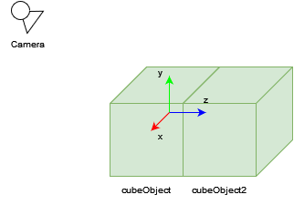

# [Tutoriel pour bien débuter à Vulkan](../index.md)
## 2.6 - Image de profondeur

Ajoutons maintenant un deuxième objet dans la fonction ``createScene`` :

```CPP
Object cubeObject2;

cubeObject2.index = m_objectIndex++; // Indice 1

cubeObject2.position = nml::vec3(0.0f, 0.0f, 2.0f);
cubeObject2.rotation = nml::vec3(0.0f, 0.0f, 0.0f);
cubeObject2.scale = nml::vec3(1.0f, 1.0f, 1.0f);

cubeObject2.meshIndex = 0; // Maillage 0 = Cube

m_objects.push_back(cubeObject2);
```



Celui-ci est en (0, 0, 2), ce qui signifie qu'il va se trouver derrière le premier objet.

Cependant, si nous lançons le programme maintenant...


Notre second cube, qui se situe derrière le premier apparaît pourtant devant.

La raison pour cela est que nous dessinons ce cube en deuxième, ses fragments sont donc écrits sur l'image sur laquelle est déjà dessiné le premier cube.

Pour pallier ce problème, nous avons besoin d'une image de profondeur qui va permettre de vérifier que le fragment actuel se trouve bien devant ceux déjà présents sur l'image, et ne pas les rendre si ce n'est pas le cas.

Nous allons donc ajouter deux attributs dans la classe ``RenderingEngine``, une image, sa vue et son allocation :

```CPP
VkImage m_depthImage;
VkImageView m_depthImageView;
VmaAllocation m_depthImageAllocation;
```

Nous allons ensuite ajouter une méthode privée dans laquelle nous allons créer cette image de profondeur :

```CPP
void createDepthImage();
```

Puis l'implémentation dans ``renderingengine.cpp`` :

```CPP
int width;
int height;
glfwGetWindowSize(m_window, &width, &height);

VkImageCreateInfo depthImageCreateInfo = {};
depthImageCreateInfo.sType = VK_STRUCTURE_TYPE_IMAGE_CREATE_INFO;
depthImageCreateInfo.pNext = nullptr;
depthImageCreateInfo.flags = 0;
depthImageCreateInfo.imageType = VK_IMAGE_TYPE_2D;
depthImageCreateInfo.format = VK_FORMAT_D32_SFLOAT;
depthImageCreateInfo.extent.width = static_cast<uint32_t>(width);
depthImageCreateInfo.extent.height = static_cast<uint32_t>(height);
depthImageCreateInfo.extent.depth = 1;
depthImageCreateInfo.mipLevels = 1;
depthImageCreateInfo.arrayLayers = 1;
depthImageCreateInfo.samples = VK_SAMPLE_COUNT_1_BIT;
depthImageCreateInfo.tiling = VK_IMAGE_TILING_OPTIMAL;
depthImageCreateInfo.usage = VK_IMAGE_USAGE_DEPTH_STENCIL_ATTACHMENT_BIT;
depthImageCreateInfo.sharingMode = VK_SHARING_MODE_EXCLUSIVE;
depthImageCreateInfo.queueFamilyIndexCount = 1;
depthImageCreateInfo.pQueueFamilyIndices = &m_graphicsQueueFamilyIndex;
depthImageCreateInfo.initialLayout = VK_IMAGE_LAYOUT_UNDEFINED;

VmaAllocationCreateInfo depthImageAllocationCreateInfo = {};
depthImageAllocationCreateInfo.usage = VMA_MEMORY_USAGE_AUTO_PREFER_DEVICE;

VK_CHECK(vmaCreateImage(m_allocator, &depthImageCreateInfo, &depthImageAllocationCreateInfo, &m_depthImage, &m_depthImageAllocation, nullptr));
```

La création d'une image utilise la structure [**``VkImageCreateInfo``**](https://registry.khronos.org/vulkan/specs/1.3-extensions/man/html/VkImageCreateInfo.html).

``imageType`` est le type de l'image, qui ici est une image 2D.

``format`` est un [**``VkFormat``**](https://registry.khronos.org/vulkan/specs/1.3-extensions/man/html/VkFormat.html) et est le format de l'image. Nous sommes en train de créer une image de profondeur, son format est donc ``VK_FORMAT_D32_SFLOAT``.

``extent`` contient la taille de l'image, qui est ici la taille de notre fenêtre.

``mipLevels`` est le nombre de niveaux de mipmaps, nous n'en avons qu'un seul.

``arrayLayers`` est le nombre de couches, nous n'en avons qu'un seul.

``samples`` est le nombre d'échantillons par pixel pour le *Multisampling*. Nous ne faisons pas de *Multisampling* donc la valeur est ``VK_SAMPLE_COUNT_1_BIT``.

``tiling`` correspond à l'organisation de l'image en mémoire. Nous voulons que l'image soit organisée optimalement en mémoire avec ``VK_IMAGE_TILING_OPTIMAL``, ce qui implique que ses pixels ne seront pas dans l'ordre en mémoire. Ce fait ne change absolument rien, si ce n'est que si nous voulons récupérer l'image depuis la mémoire GPU pour la mettre dans un fichier par exemple, elle ne sera pas dans l'ordre. Pour cela, il faut utiliser ``VK_IMAGE_TILING_LINEAR``, mais ce ``tiling`` vient avec de nombreuses limites.

``usage`` spécifie ce que nous allons faire avec l'image. Cette image sera attachée à la passe de rendu en tant qu'image de profondeur, donc l'``usage`` est ``VK_IMAGE_USAGE_DEPTH_STENCIL_ATTACHMENT_BIT``.

``sharingMode`` spécifie si l'image sera utilisée par une ou plusieurs familles de queues. Nous n'allons en utiliser qu'une seule donc donner ``VK_SHARING_MODE_EXCLUSIVE``. Si ``VK_SHARING_MODE_EXCLUSIVE`` est utilisé, alors ``queueFamilyIndexCount`` et ``pQueueFamilyIndices`` sont ignorés, ils sont spécifiés ici pour des questions de démonstration.

``initialLayout`` est le [**``VkImageLayout``**](https://registry.khronos.org/vulkan/specs/1.3-extensions/man/html/VkImageLayout.html) initial de l'image, il ne peut être que ``VK_IMAGE_LAYOUT_UNDEFINED``.

L'allocation se fait de la même manière qu'avec les *buffers*, l'``usage`` est ici ``VMA_MEMORY_USAGE_AUTO_PREFER_DEVICE`` car le CPU ne va pas lire ni écrire sur l'image.

``vmaCreateImage`` remplace [**``vkCreateImage``**](https://registry.khronos.org/vulkan/specs/1.3-extensions/man/html/vkCreateImage.html) pour créer une image avec VulkanMemoryAllocator.

Nous devons ensuite créer la vue sur l'image :

```CPP
VkImageViewCreateInfo depthImageViewCreateInfo = {};
depthImageViewCreateInfo.sType = VK_STRUCTURE_TYPE_IMAGE_VIEW_CREATE_INFO;
depthImageViewCreateInfo.pNext = nullptr;
depthImageViewCreateInfo.flags = 0;
depthImageViewCreateInfo.image = m_depthImage;
depthImageViewCreateInfo.viewType = VK_IMAGE_VIEW_TYPE_2D;
depthImageViewCreateInfo.format = VK_FORMAT_D32_SFLOAT;
depthImageViewCreateInfo.components.r = VK_COMPONENT_SWIZZLE_R;
depthImageViewCreateInfo.components.g = VK_COMPONENT_SWIZZLE_G;
depthImageViewCreateInfo.components.b = VK_COMPONENT_SWIZZLE_B;
depthImageViewCreateInfo.components.a = VK_COMPONENT_SWIZZLE_A;
depthImageViewCreateInfo.subresourceRange.aspectMask = VK_IMAGE_ASPECT_DEPTH_BIT;
depthImageViewCreateInfo.subresourceRange.baseMipLevel = 0;
depthImageViewCreateInfo.subresourceRange.levelCount = 1;
depthImageViewCreateInfo.subresourceRange.baseArrayLayer = 0;
depthImageViewCreateInfo.subresourceRange.layerCount = 1;
VK_CHECK(vkCreateImageView(m_device, &depthImageViewCreateInfo, nullptr, &m_depthImageView));
```

Ici, la seule différence avec la création des vues des images de la *swapchain* se trouve dans l'image pointée, qui est notre image de profondeur, le ``format`` qui est le format de profondeur ``VK_FORMAT_D32_SFLOAT`` et l'``aspect`` qui spécifie que c'est une vue vers une image de profondeur, ``VK_IMAGE_ASPECT_DEPTH_BIT``.

Nous devons ensuite effectuer une transition de layout de ``VK_LAYOUT_UNDEFINED`` vers ``VK_IMAGE_LAYOUT_DEPTH_STENCIL_ATTACHMENT_OPTIMAL`` pour qu'elle soit prête à être attachée à une passe de rendu en tant qu'image de profondeur.

Transitionner de layout nécessite l'utilisation d'un *Command Buffer*, on va donc créer un *Command Pool* :

```CPP
// Transition de layout VK_IMAGE_LAYOUT_UNDEFINED -> VK_IMAGE_LAYOUT_DEPTH_STENCIL_ATTACHMENT_OPTIMAL
VkCommandPool depthImageTransitionCommandPool;

VkCommandPoolCreateInfo depthImageTransitionCommandPoolCreateInfo = {};
depthImageTransitionCommandPoolCreateInfo.sType = VK_STRUCTURE_TYPE_COMMAND_POOL_CREATE_INFO;
depthImageTransitionCommandPoolCreateInfo.pNext = nullptr;
depthImageTransitionCommandPoolCreateInfo.flags = 0;
depthImageTransitionCommandPoolCreateInfo.queueFamilyIndex = m_graphicsQueueFamilyIndex;
VK_CHECK(vkCreateCommandPool(m_device, &depthImageTransitionCommandPoolCreateInfo, nullptr, &depthImageTransitionCommandPool));
```

Allouer un *Command Buffer* :

```CPP
VkCommandBuffer depthImageTransitionCommandBuffer;

VkCommandBufferAllocateInfo depthImageTransitionCommandBufferAllocateInfo = {};
depthImageTransitionCommandBufferAllocateInfo.sType = VK_STRUCTURE_TYPE_COMMAND_BUFFER_ALLOCATE_INFO;
depthImageTransitionCommandBufferAllocateInfo.pNext = nullptr;
depthImageTransitionCommandBufferAllocateInfo.commandPool = depthImageTransitionCommandPool;
depthImageTransitionCommandBufferAllocateInfo.level = VK_COMMAND_BUFFER_LEVEL_PRIMARY;
depthImageTransitionCommandBufferAllocateInfo.commandBufferCount = 1;
VK_CHECK(vkAllocateCommandBuffers(m_device, &depthImageTransitionCommandBufferAllocateInfo, &depthImageTransitionCommandBuffer));
```

Démarrer l'enregistrement des commandes dans le *Command Buffer* :

```CPP
VkCommandBufferBeginInfo depthImageTransitionBeginInfo = {};
depthImageTransitionBeginInfo.sType = VK_STRUCTURE_TYPE_COMMAND_BUFFER_BEGIN_INFO;
depthImageTransitionBeginInfo.pNext = nullptr;
depthImageTransitionBeginInfo.flags = VK_COMMAND_BUFFER_USAGE_ONE_TIME_SUBMIT_BIT;
depthImageTransitionBeginInfo.pInheritanceInfo = nullptr;
VK_CHECK(vkBeginCommandBuffer(depthImageTransitionCommandBuffer, &depthImageTransitionBeginInfo));
```

Enregistrer la barrière pour transitionner de layout :

```CPP
VkImageMemoryBarrier2 undefinedToDepthStencilAttachmentOptimalImageMemoryBarrier = {};
undefinedToDepthStencilAttachmentOptimalImageMemoryBarrier.sType = VK_STRUCTURE_TYPE_IMAGE_MEMORY_BARRIER_2;
undefinedToDepthStencilAttachmentOptimalImageMemoryBarrier.pNext = nullptr;
undefinedToDepthStencilAttachmentOptimalImageMemoryBarrier.srcStageMask = VK_PIPELINE_STAGE_2_NONE;
undefinedToDepthStencilAttachmentOptimalImageMemoryBarrier.srcAccessMask = 0;
undefinedToDepthStencilAttachmentOptimalImageMemoryBarrier.dstStageMask = VK_PIPELINE_STAGE_2_EARLY_FRAGMENT_TESTS_BIT | VK_PIPELINE_STAGE_2_LATE_FRAGMENT_TESTS_BIT;
undefinedToDepthStencilAttachmentOptimalImageMemoryBarrier.dstAccessMask = VK_ACCESS_2_DEPTH_STENCIL_ATTACHMENT_READ_BIT | VK_ACCESS_2_DEPTH_STENCIL_ATTACHMENT_WRITE_BIT;
undefinedToDepthStencilAttachmentOptimalImageMemoryBarrier.oldLayout = VK_IMAGE_LAYOUT_UNDEFINED;
undefinedToDepthStencilAttachmentOptimalImageMemoryBarrier.newLayout = VK_IMAGE_LAYOUT_DEPTH_STENCIL_ATTACHMENT_OPTIMAL;
undefinedToDepthStencilAttachmentOptimalImageMemoryBarrier.srcQueueFamilyIndex = m_graphicsQueueFamilyIndex;
undefinedToDepthStencilAttachmentOptimalImageMemoryBarrier.dstQueueFamilyIndex = m_graphicsQueueFamilyIndex;
undefinedToDepthStencilAttachmentOptimalImageMemoryBarrier.image = m_depthImage;
undefinedToDepthStencilAttachmentOptimalImageMemoryBarrier.subresourceRange.aspectMask = VK_IMAGE_ASPECT_DEPTH_BIT;
undefinedToDepthStencilAttachmentOptimalImageMemoryBarrier.subresourceRange.baseMipLevel = 0;
undefinedToDepthStencilAttachmentOptimalImageMemoryBarrier.subresourceRange.levelCount = 1;
undefinedToDepthStencilAttachmentOptimalImageMemoryBarrier.subresourceRange.baseArrayLayer = 0;
undefinedToDepthStencilAttachmentOptimalImageMemoryBarrier.subresourceRange.layerCount = 1;

VkDependencyInfo undefinedToDepthStencilAttachmentOptimalDependencyInfo = {};
undefinedToDepthStencilAttachmentOptimalDependencyInfo.sType = VK_STRUCTURE_TYPE_DEPENDENCY_INFO;
undefinedToDepthStencilAttachmentOptimalDependencyInfo.pNext = nullptr;
undefinedToDepthStencilAttachmentOptimalDependencyInfo.dependencyFlags = VK_DEPENDENCY_BY_REGION_BIT;
undefinedToDepthStencilAttachmentOptimalDependencyInfo.memoryBarrierCount = 0;
undefinedToDepthStencilAttachmentOptimalDependencyInfo.pMemoryBarriers = nullptr;
undefinedToDepthStencilAttachmentOptimalDependencyInfo.bufferMemoryBarrierCount = 0;
undefinedToDepthStencilAttachmentOptimalDependencyInfo.pBufferMemoryBarriers = nullptr;
undefinedToDepthStencilAttachmentOptimalDependencyInfo.imageMemoryBarrierCount = 1;
undefinedToDepthStencilAttachmentOptimalDependencyInfo.pImageMemoryBarriers = &undefinedToDepthStencilAttachmentOptimalImageMemoryBarrier;
m_vkCmdPipelineBarrier2KHR(depthImageTransitionCommandBuffer, &undefinedToDepthStencilAttachmentOptimalDependencyInfo);

VK_CHECK(vkEndCommandBuffer(depthImageTransitionCommandBuffer));
```

Les paramètres de la barrière d'image permettant cette transition sont :

``srcStageMask`` est le stage de pipeline à attendre avant d'effectuer la transition. Ici, il n'y a aucun stage de pipeline à attendre donc ``VK_PIPELINE_STAGE_2_NONE``.

``srcAccessMask`` est la manière dont l'image a été accédée avant. Il n'y a eu aucun accès donc 0.

``dstStageMask`` est le stage de pipeline sur lequel l'image va être utilisé. L'image sera utilisée pour tester la profondeur des fragments donc ``VK_PIPELINE_STAGE_2_EARLY_FRAGMENT_TESTS_BIT | VK_PIPELINE_STAGE_2_LATE_FRAGMENT_TESTS_BIT``. Le *Early Fragment Test* permet de tester la profondeur des fragments avant d'utiliser le *Fragment Shader* pour pouvoir les supprimer s'ils n'avaient aucune chance d'apparaitre sur l'image car leur profondeur est supérieure à celle de l'image de profondeur à la même position. Le *Late Fragment Test* permet de supprimer les fragments qui n'ont pas pu être testés avec le *Early Fragment Test* parce que le *Fragment Shader* modifie ``gl_FragDepth``, qui est la valeur de profondeur du fragment.

``dstAccessMask`` est la manière dont l'image sera accédée. Nous allons écrire dessus pour écrire les valeurs de profondeur des fragments et nous allons lire dessus pour comparer la profondeur des fragments qui arrivent et la profondeur écrite sur l'image à la même position, donc ``VK_ACCESS_2_DEPTH_STENCIL_ATTACHMENT_READ_BIT | VK_ACCESS_2_DEPTH_STENCIL_ATTACHMENT_WRITE_BIT``.

``oldLayout`` est le layout de l'image que nous voulons changer, donc ``VK_IMAGE_LAYOUT_UNDEFINED``.

``newLayout`` est le layout de l'image souhaité, donc ``VK_IMAGE_LAYOUT_DEPTH_STENCIL_ATTACHMENT_OPTIMAL``.

``image`` est l'image à transitionner, donc notre image de profondeur.

``subresourceRange.aspectMask`` est l'aspect de l'image, qui ici est une image de profondeur, donc ``VK_IMAGE_ASPECT_DEPTH_BIT``.

Et enfin, créer une *Fence*, soumettre le *Command Buffer* au GPU et attendre que les commandes se finissent :

```CPP
VkFence depthImageTransitionFence;

VkFenceCreateInfo depthImageTransitionFenceCreateInfo = {};
depthImageTransitionFenceCreateInfo.sType = VK_STRUCTURE_TYPE_FENCE_CREATE_INFO;
depthImageTransitionFenceCreateInfo.pNext = nullptr;
depthImageTransitionFenceCreateInfo.flags = 0;
VK_CHECK(vkCreateFence(m_device, &depthImageTransitionFenceCreateInfo, nullptr, &depthImageTransitionFence));

VkSubmitInfo depthImageTransitionSubmitInfo = {};
depthImageTransitionSubmitInfo.sType = VK_STRUCTURE_TYPE_SUBMIT_INFO;
depthImageTransitionSubmitInfo.pNext = nullptr;
depthImageTransitionSubmitInfo.waitSemaphoreCount = 0;
depthImageTransitionSubmitInfo.pWaitSemaphores = nullptr;
depthImageTransitionSubmitInfo.pWaitDstStageMask = nullptr;
depthImageTransitionSubmitInfo.commandBufferCount = 1;
depthImageTransitionSubmitInfo.pCommandBuffers = &depthImageTransitionCommandBuffer;
depthImageTransitionSubmitInfo.signalSemaphoreCount = 0;
depthImageTransitionSubmitInfo.pSignalSemaphores = nullptr;
VK_CHECK(vkQueueSubmit(m_graphicsQueue, 1, &depthImageTransitionSubmitInfo, depthImageTransitionFence));
VK_CHECK(vkWaitForFences(m_device, 1, &depthImageTransitionFence, VK_TRUE, std::numeric_limits<uint64_t>::max()));
```

Puis détruire la *Fence* et le *Command Pool* qui ne sont plus utiles :

```CPP
vkDestroyFence(m_device, depthImageTransitionFence, nullptr);
vkDestroyCommandPool(m_device, depthImageTransitionCommandPool, nullptr);
```

Nous pouvons appeler cette fonction juste avant de créer la scène :

```CPP
// Creation de l'image de profondeur
createDepthImage();
```

Nous devons détruire l'image de profondeur et sa vue à la fermeture du programme dans ``destroy`` :

```CPP
// Destruction de l'image de profondeur et sa vue
vkDestroyImageView(m_device, m_depthImageView, nullptr);
vmaDestroyImage(m_allocator, m_depthImage, m_depthImageAllocation);
```

``vmaDestroyImage`` remplace [**``vkDestroyImage``**](https://registry.khronos.org/vulkan/specs/1.3-extensions/man/html/vkDestroyImage.html) pour détruire une image avec VulkanMemoryAllocator.

Puisque la taille de l'image dépend de la taille de la fenêtre, nous allons aussi détruire l'image de profondeur et sa vue pour la recréer lorsque la fenêtre est redimensionnée, dans la fonction ``onResize`` :

```CPP
// Destruction de l'image de profondeur et de sa vue
vkDestroyImageView(m_device, m_depthImageView, nullptr);
vmaDestroyImage(m_allocator, m_depthImage, m_depthImageAllocation);

// Recreation de l'image de profondeur
createDepthImage();
```

Nous devons maintenant revenir dans la fonction ``createGraphicsPipeline`` pour indiquer que nous allons utiliser une image de profondeur et que nous allons effectuer des tests de profondeur avec :

```CPP
// Profondeur et stencil
VkPipelineDepthStencilStateCreateInfo depthStencilStateCreateInfo = {};
depthStencilStateCreateInfo.sType = VK_STRUCTURE_TYPE_PIPELINE_DEPTH_STENCIL_STATE_CREATE_INFO;
depthStencilStateCreateInfo.pNext = nullptr;
depthStencilStateCreateInfo.flags = 0;
depthStencilStateCreateInfo.depthTestEnable = VK_TRUE; // Etait VK_FALSE
depthStencilStateCreateInfo.depthWriteEnable = VK_TRUE; // Etait VK_FALSE
depthStencilStateCreateInfo.depthCompareOp = VK_COMPARE_OP_LESS; // Etat VK_COMPARE_OP_NEVER
depthStencilStateCreateInfo.depthBoundsTestEnable = VK_FALSE;
depthStencilStateCreateInfo.stencilTestEnable = VK_FALSE;
depthStencilStateCreateInfo.front = {};
depthStencilStateCreateInfo.back = {};
depthStencilStateCreateInfo.minDepthBounds = 0.0f;
depthStencilStateCreateInfo.maxDepthBounds = 1.0f;
```

``depthTestEnable`` est maintenant à ``VK_TRUE``, ce qui signifie que nous allons tester la profondeur des fragments arrivant avec les profondeurs sur l'image de profondeur à la même position.

``depthWriteEnable`` est maintenant à ``VK_TRUE``, ce qui signifie que nous allons écrire sur l'image de profondeur sur le test de profondeur passe.

``depthCompareOp`` est maintenant à ``VK_COMPARE_OP_LESS``, ce qui signifie que le test de profondeur passera et que nous écrirons la valeur de profondeur du fragment sur l'image si elle est strictement inférieure à la valeur déjà inscrite sur l'image à la même position.

```CPP
// Rendu dynamique
VkPipelineRenderingCreateInfo pipelineRenderingCreateInfo = {};
pipelineRenderingCreateInfo.sType = VK_STRUCTURE_TYPE_PIPELINE_RENDERING_CREATE_INFO;
pipelineRenderingCreateInfo.pNext = nullptr;
pipelineRenderingCreateInfo.viewMask = 0;
pipelineRenderingCreateInfo.colorAttachmentCount = 1;
pipelineRenderingCreateInfo.pColorAttachmentFormats = &m_swapchainFormat;
pipelineRenderingCreateInfo.depthAttachmentFormat = VK_FORMAT_D32_SFLOAT; // Etait VK_FORMAT_UNDEFINED
pipelineRenderingCreateInfo.stencilAttachmentFormat = VK_FORMAT_UNDEFINED;
```

``depthAttachmentFormat`` est le format de l'image de profondeur que nous allons utiliser pour les tests de profondeur. Ce format est ``VK_FORMAT_D32_SFLOAT``.

Nous n'avons maintenant plus qu'à modifier les structures qui débutent la passe de rendu dans la boucle de rendu pour y attacher la vue de notre image de profondeur :

```CPP
// Debut de la passe de rendu
VkRenderingAttachmentInfo renderingAttachmentInfo = {};
renderingAttachmentInfo.sType = VK_STRUCTURE_TYPE_RENDERING_ATTACHMENT_INFO;
renderingAttachmentInfo.pNext = nullptr;
renderingAttachmentInfo.imageView = m_swapchainImageViews[imageIndex];
renderingAttachmentInfo.imageLayout = VK_IMAGE_LAYOUT_COLOR_ATTACHMENT_OPTIMAL;
renderingAttachmentInfo.resolveMode = VK_RESOLVE_MODE_NONE;
renderingAttachmentInfo.resolveImageView = VK_NULL_HANDLE;
renderingAttachmentInfo.resolveImageLayout = VK_IMAGE_LAYOUT_UNDEFINED;
renderingAttachmentInfo.loadOp = VK_ATTACHMENT_LOAD_OP_CLEAR;
renderingAttachmentInfo.storeOp = VK_ATTACHMENT_STORE_OP_STORE;
renderingAttachmentInfo.clearValue.color = { 0.0f, 0.0f, 0.0f, 1.0f };
renderingAttachmentInfo.clearValue.depthStencil = { 0.0f, 0 };

VkRenderingAttachmentInfo depthRenderingAttachmentInfo = {}; // Nouveau
depthRenderingAttachmentInfo.sType = VK_STRUCTURE_TYPE_RENDERING_ATTACHMENT_INFO;
depthRenderingAttachmentInfo.pNext = nullptr;
depthRenderingAttachmentInfo.imageView = m_depthImageView;
depthRenderingAttachmentInfo.imageLayout = VK_IMAGE_LAYOUT_DEPTH_STENCIL_ATTACHMENT_OPTIMAL;
depthRenderingAttachmentInfo.resolveMode = VK_RESOLVE_MODE_NONE;
depthRenderingAttachmentInfo.resolveImageView = VK_NULL_HANDLE;
depthRenderingAttachmentInfo.resolveImageLayout = VK_IMAGE_LAYOUT_UNDEFINED;
depthRenderingAttachmentInfo.loadOp = VK_ATTACHMENT_LOAD_OP_CLEAR;
depthRenderingAttachmentInfo.storeOp = VK_ATTACHMENT_STORE_OP_STORE;
depthRenderingAttachmentInfo.clearValue.color = { 0.0f, 0.0f, 0.0f, 1.0f };
depthRenderingAttachmentInfo.clearValue.depthStencil = { 1.0f, 0 };

VkRenderingInfo renderingInfo = {};
renderingInfo.sType = VK_STRUCTURE_TYPE_RENDERING_INFO;
renderingInfo.pNext = nullptr;
renderingInfo.flags = 0;
renderingInfo.renderArea = m_scissor;
renderingInfo.layerCount = 1;
renderingInfo.viewMask = 0;
renderingInfo.colorAttachmentCount = 1;
renderingInfo.pColorAttachments = &renderingAttachmentInfo;
renderingInfo.pDepthAttachment = &depthRenderingAttachmentInfo; // Etait nullptr
renderingInfo.pStencilAttachment = nullptr;
m_vkCmdBeginRenderingKHR(m_renderingCommandBuffers[m_currentFrameInFlight], &renderingInfo);
```

On ajoute une structure [**``VkRenderingAttachmentInfo``**](https://registry.khronos.org/vulkan/specs/1.3-extensions/man/html/VkRenderingAttachmentInfo.html) pour attacher l'image de profondeur.

Le layout de l'image est ``VK_IMAGE_LAYOUT_DEPTH_STENCIL_ATTACHMENT_OPTIMAL`` grâce à la transition de layout effectuée lors de la création dde l'image.

Le ``loadOp`` est ``VK_ATTACHMENT_LOAD_OP_CLEAR``, signifiant que l'image sera réécrite avec la valeur de ``clearValue.depthStencil``. La première valeur est la valeur que nous souhaitons écrire pour la profondeur, nous mettons la valeur maximale, donc 1, car nous testons si les fragments arrivant ont une profondeur inférieure.

On ajoute ensuite cette structure dans ``pDepthAttachment``.

En lançant le programme maintenant, nous obtenons :


Le deuxième cube apparaît bien derrière le premier.

Voici à quoi ressemble l'image de profondeur de notre scène.


[**Chapitre précédent**](5.md) - [**Index**](../index.md) - [**Chapitre suivant**](7.md)

[**Code de la partie**](https://github.com/ZaOniRinku/TutorielVulkanFR/tree/partie2)