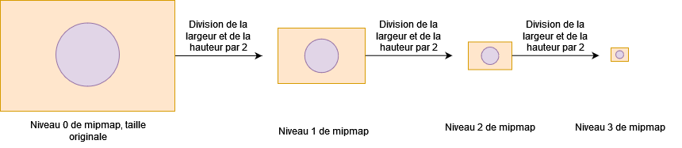
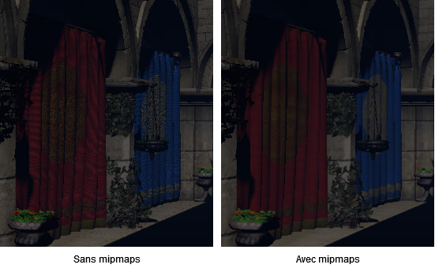
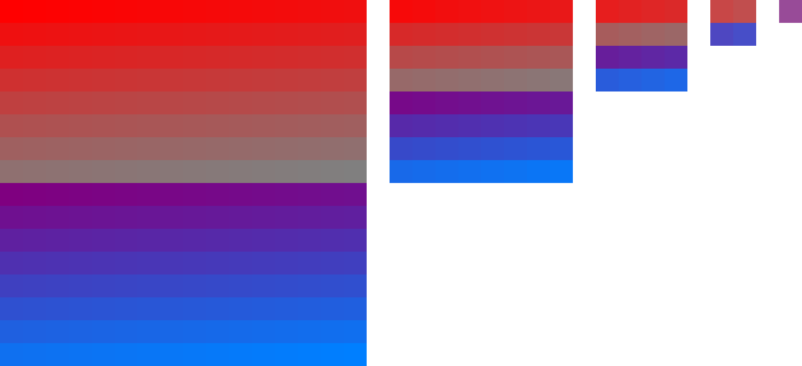
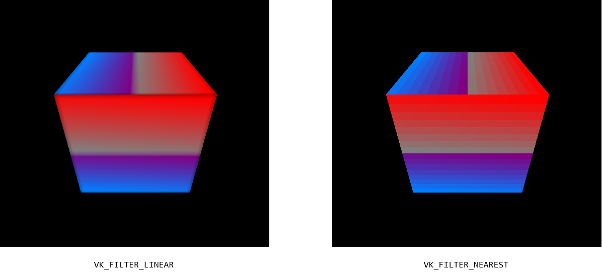
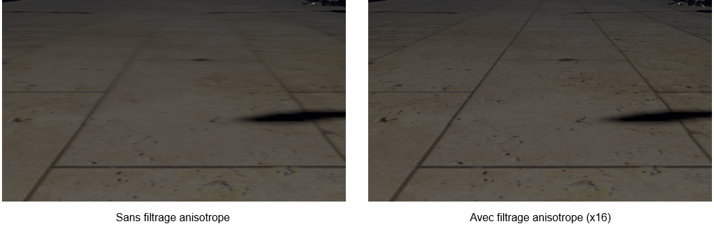
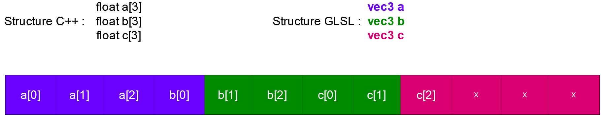
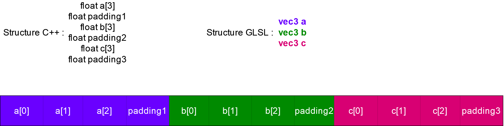
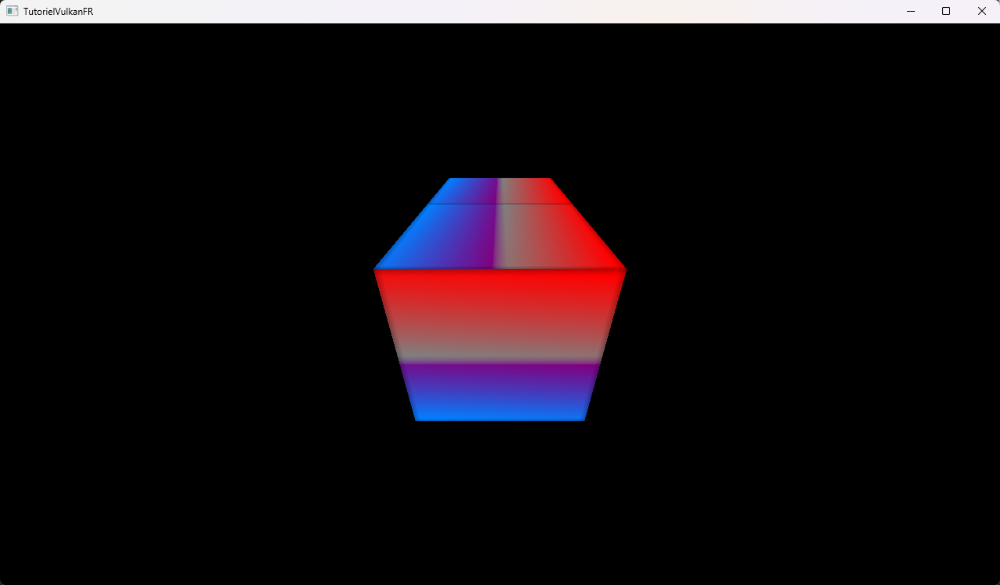

# [Tutoriel pour bien débuter à Vulkan](../index.md)
## 2.7 - Utilisation de textures

Actuellement, nous avons nos coordonnées de texture dans le *Fragment Shader* et nous nous en servons comme couleur, il est maintenant de temps de s'en servir pour utiliser des textures.

Nous allons avoir besoin de plusieurs attributs dans la classe ``RenderingEngine`` :

```cpp
std::vector<VkImage> m_textureImages;
std::vector<VkImageView> m_textureImageViews;
std::vector<VmaAllocation> m_textureImageAllocations;
VkSampler m_textureSampler;
```

Ainsi que d'une nouvelle méthode pour créer une texture :

```cpp
void createTexture();
```

Que nous allons implémenter dans ``renderingengine.cpp`` :

```cpp
void RenderingEngine::createTexture() {
	int width = 16;
	int height = 16;

	std::array<unsigned char, width * height * 4> textureData;
	for (size_t i = 0; i < width * height; i++) {
		textureData[i * 4] = static_cast<unsigned char>(255 - i); // Rouge
		textureData[i * 4 + 1] = static_cast<unsigned char>(i % 128); // Vert
		textureData[i * 4 + 2] = static_cast<unsigned char>(i); // Bleu
		textureData[i * 4 + 3] = static_cast<unsigned char>(255); // Alpha
	}
}
```

Nous allons définir une image de taille 16 pixels par 16 pixels à la main. Notre texture sera au format RGBA (<span style="color:red">*Red*</span>, <span style="color:green">*Green*</span>, <span style="color:blue">*Blue*</span>, *Alpha*), donc 4 composantes, et chaque composante sera de la taille d'un caractère non-signé, soit 8 bits, les valeurs allant donc de 0 à 255. ``textureData`` va donc contenir les pixels de notre texture.

Nous allons ensuite ajouter une autre méthode privée nous permettant de calculer le nombre de niveaux de mipmaps selon la largeur et la hauteur d'une l'image :

```cpp
uint32_t findMipLevels(uint32_t width, uint32_t height);
```

Implémentée dans ``renderingengine.cpp`` :

```cpp
uint32_t RenderingEngine::findMipLevels(uint32_t width, uint32_t height) {
	return static_cast<uint32_t>(std::floor(std::log2(std::min(width, height)) + 1));
}
```



Les mipmaps d'une image sont deux fois plus petits que le niveau précédent. On doit donc trouver quand est-ce qu'on ne peut plus diviser soit la largeur, soit la hauteur, par 2. En utilisant des textures avec des tailles qui sont des puissances de 2, on peut donc aller jusqu'à un niveau de mipmap final n'ayant qu'un seul pixel.

Lorsque le *Fragment Shader* lit dans une texture, il va déterminer le niveau de mipmap adapté à utiliser selon la distance du fragment avec la caméra.

Avoir des mipmaps prend un peu plus d'espace dans la mémoire qu'une image sans mipmap mais présentent deux avantages conséquents :
- Un meilleur accès en mémoire aux textures quand les fragments sont éloignés de la caméra.
- Permet d'éviter les motifs de moiré.



Les motifs de moiré sont reconnaissables à leurs étranges lignes et courbes. Ils apparaissent lorsque nous n'échantillonnons pas suffisamment des signaux hautes fréquences. Il se trouve que nos textures sont des signaux hautes fréquences et que lorsque les objets apparaissent petits, notamment quand ils sont loins, trop peu de pixels sont échantillonnés par rapport à l'image de base. Les mipmaps sont plus petits, l'échantillonnage est donc meilleur et permet d'éviter ce problème.

Nous allons ensuite créer l'image de notre texture :

```cpp
// Creation de l'image de la texture
VkImage textureImage;
VmaAllocation textureImageAllocation;

VkImageCreateInfo textureImageCreateInfo = {};
textureImageCreateInfo.sType = VK_STRUCTURE_TYPE_IMAGE_CREATE_INFO;
textureImageCreateInfo.pNext = nullptr;
textureImageCreateInfo.flags = 0;
textureImageCreateInfo.imageType = VK_IMAGE_TYPE_2D;
textureImageCreateInfo.format = VK_FORMAT_R8G8B8A8_SRGB;
textureImageCreateInfo.extent.width = static_cast<uint32_t>(width);
textureImageCreateInfo.extent.height = static_cast<uint32_t>(height);
textureImageCreateInfo.extent.depth = 1;
textureImageCreateInfo.mipLevels = findMipLevels(textureImageCreateInfo.extent.width, textureImageCreateInfo.extent.height);
textureImageCreateInfo.arrayLayers = 1;
textureImageCreateInfo.samples = VK_SAMPLE_COUNT_1_BIT;
textureImageCreateInfo.tiling = VK_IMAGE_TILING_OPTIMAL;
textureImageCreateInfo.usage = VK_IMAGE_USAGE_SAMPLED_BIT | VK_IMAGE_USAGE_TRANSFER_SRC_BIT | VK_IMAGE_USAGE_TRANSFER_DST_BIT;
textureImageCreateInfo.sharingMode = VK_SHARING_MODE_EXCLUSIVE;
textureImageCreateInfo.queueFamilyIndexCount = 1;
textureImageCreateInfo.pQueueFamilyIndices = &m_graphicsQueueFamilyIndex;
textureImageCreateInfo.initialLayout = VK_IMAGE_LAYOUT_UNDEFINED;

VmaAllocationCreateInfo textureImageAllocationCreateInfo = {};
textureImageAllocationCreateInfo.usage = VMA_MEMORY_USAGE_AUTO_PREFER_DEVICE;

VK_CHECK(vmaCreateImage(m_allocator, &textureImageCreateInfo, &textureImageAllocationCreateInfo, &textureImage, &textureImageAllocation, nullptr));
```

Comme pour la création de l'image de profondeur, nous utilisons la structure [**``VkImageCreateInfo``**](https://registry.khronos.org/vulkan/specs/1.3-extensions/man/html/VkImageCreateInfo.html) pour créer une image.

Comme expliqué lorsque nous avons écrit les pixels de notre image juste avant, le ``format`` est RGBA où chaque composante fait un octet, ou 8 bits, nous avons donc ``VK_FORMAT_R8G8B8A8_SRGB``. Nous utilisons la version ``SRGB`` de ce format car nous allons traiter des couleurs ici. Les formats ``UNORM`` sont plutôt à utiliser lorsque nous ne traitons pas des couleurs mais plutôt des valeurs, comme sur les images de normales (*Normal Map*), où le rouge sera l'axe x de la normale, le vert sera l'axe y de la normale et le bleu sera l'axe z de la normale.

Notre image est de taille 16 pixels par 16 pixels, ``extent.width`` et ``extent.height`` sont donc égaux à 16.

``mipLevels`` sera le nombre de niveaux de mipmaps, et utilise la fonction ``findMipLevels`` que nous avons implémenté juste avant.

Le nombre de niveaux pour cette image est calculé de cette manière :

```
floor(log2(min(16, 16)) + 1) = floor(log2(16)) + 1) = floor(4 + 1) = floor(5) = 5 
```

Nous aurons donc 5 niveaux de mipmaps, de taille 16x16 (taille originale), 8x8, 4x4, 2x2 et 1x1.

L'``usage`` contient ``VK_IMAGE_USAGE_SAMPLED_BIT``, ce qui signifie que notre image sera échantillonnée dans un *shader*, ce qui est le principe des textures, mais aussi ``VK_IMAGE_USAGE_TRANSFER_SRC_BIT`` et ``VK_IMAGE_USAGE_TRANSFER_DST_BIT``, ce qui signifie que nous allons transférer des données depuis et vers cette image dans le GPU.

L'``usage`` de l'allocation est ``VMA_MEMORY_USAGE_AUTO_PREFER_DEVICE``, le CPU n'y aura donc pas accès.

Nous pouvons ensuite créer sa vue :

```cpp
// Creation de la vue de l'image de la texture
VkImageView textureImageView;

VkImageViewCreateInfo textureImageViewCreateInfo = {};
textureImageViewCreateInfo.sType = VK_STRUCTURE_TYPE_IMAGE_VIEW_CREATE_INFO;
textureImageViewCreateInfo.pNext = nullptr;
textureImageViewCreateInfo.flags = 0;
textureImageViewCreateInfo.image = textureImage;
textureImageViewCreateInfo.viewType = VK_IMAGE_VIEW_TYPE_2D;
textureImageViewCreateInfo.format = VK_FORMAT_R8G8B8A8_SRGB;
textureImageViewCreateInfo.components.r = VK_COMPONENT_SWIZZLE_R;
textureImageViewCreateInfo.components.g = VK_COMPONENT_SWIZZLE_G;
textureImageViewCreateInfo.components.b = VK_COMPONENT_SWIZZLE_B;
textureImageViewCreateInfo.components.a = VK_COMPONENT_SWIZZLE_A;
textureImageViewCreateInfo.subresourceRange.aspectMask = VK_IMAGE_ASPECT_COLOR_BIT;
textureImageViewCreateInfo.subresourceRange.baseMipLevel = 0;
textureImageViewCreateInfo.subresourceRange.levelCount = textureImageCreateInfo.mipLevels;
textureImageViewCreateInfo.subresourceRange.baseArrayLayer = 0;
textureImageViewCreateInfo.subresourceRange.layerCount = 1;
VK_CHECK(vkCreateImageView(m_device, &textureImageViewCreateInfo, nullptr, &textureImageView));
```

Il est intéressant de noter que nous souhaitons avoir accès à tous les niveaux de mipmaps dans cette vue, donc ``levelCount`` est égal à ``textureImageCreateInfo.mipLevels``, qui est utilisé lors de la création de l'image, et qui est égal à 5 ici.

Nous avons maintenant besoin de créer un *Staging Buffer*, comme lors de la création des *Vertex* et *Index Buffers* pour pouvoir y copier les valeurs des pixels depuis le CPU puis les copier dans notre image de texture :

```cpp
// Creation du staging buffer
VkBuffer textureStagingBuffer;
VmaAllocation textureStagingBufferAllocation;

VkBufferCreateInfo textureStagingBufferCreateInfo = {};
textureStagingBufferCreateInfo.sType = VK_STRUCTURE_TYPE_BUFFER_CREATE_INFO;
textureStagingBufferCreateInfo.pNext = nullptr;
textureStagingBufferCreateInfo.flags = 0;
textureStagingBufferCreateInfo.size = static_cast<size_t>(width) * static_cast<size_t>(height) * 4;
textureStagingBufferCreateInfo.usage = VK_BUFFER_USAGE_TRANSFER_SRC_BIT;
textureStagingBufferCreateInfo.sharingMode = VK_SHARING_MODE_EXCLUSIVE;
textureStagingBufferCreateInfo.queueFamilyIndexCount = 1;
textureStagingBufferCreateInfo.pQueueFamilyIndices = &m_graphicsQueueFamilyIndex;

VmaAllocationCreateInfo textureStagingBufferAllocationCreateInfo = {};
textureStagingBufferAllocationCreateInfo.usage = VMA_MEMORY_USAGE_AUTO_PREFER_HOST;
textureStagingBufferAllocationCreateInfo.flags = VMA_ALLOCATION_CREATE_HOST_ACCESS_SEQUENTIAL_WRITE_BIT;
VK_CHECK(vmaCreateBuffer(m_allocator, &textureStagingBufferCreateInfo, &textureStagingBufferAllocationCreateInfo, &textureStagingBuffer, &textureStagingBufferAllocation, nullptr));

void* data;
VK_CHECK(vmaMapMemory(m_allocator, textureStagingBufferAllocation, &data));
memcpy(data, textureData.data(), static_cast<size_t>(width) * static_cast<size_t>(height) * 4);
vmaUnmapMemory(m_allocator, textureStagingBufferAllocation);
```

La taille de ce *Staging Buffer* est de ``16 * 16 * 4`` car l'image est de taille 16 pixels par 16 pixels où chaque pixel possède 4 composantes de 1 octet.

Nous devons ensuite créer un *Command Pool* pour y allouer un *Command Buffer* afin de transitionner tous les niveaux de mipmaps de l'image vers le layout ``VK_IMAGE_LAYOUT_TRANSFER_DST_OPTIMAL`` :

```cpp
// Copie du staging buffer et generation des mipmaps
VkCommandPool createTextureCommandPool;

VkCommandPoolCreateInfo createTextureCommandPoolCreateInfo = {};
createTextureCommandPoolCreateInfo.sType = VK_STRUCTURE_TYPE_COMMAND_POOL_CREATE_INFO;
createTextureCommandPoolCreateInfo.pNext = nullptr;
createTextureCommandPoolCreateInfo.flags = 0;
createTextureCommandPoolCreateInfo.queueFamilyIndex = m_graphicsQueueFamilyIndex;
VK_CHECK(vkCreateCommandPool(m_device, &createTextureCommandPoolCreateInfo, nullptr, &createTextureCommandPool));

VkCommandBuffer createTextureCommandBuffer;

VkCommandBufferAllocateInfo createTextureCommandBufferAllocateInfo = {};
createTextureCommandBufferAllocateInfo.sType = VK_STRUCTURE_TYPE_COMMAND_BUFFER_ALLOCATE_INFO;
createTextureCommandBufferAllocateInfo.pNext = nullptr;
createTextureCommandBufferAllocateInfo.commandPool = createTextureCommandPool;
createTextureCommandBufferAllocateInfo.level = VK_COMMAND_BUFFER_LEVEL_PRIMARY;
createTextureCommandBufferAllocateInfo.commandBufferCount = 1;
VK_CHECK(vkAllocateCommandBuffers(m_device, &createTextureCommandBufferAllocateInfo, &createTextureCommandBuffer));

VkCommandBufferBeginInfo createTextureCommandBufferBeginInfo = {};
createTextureCommandBufferBeginInfo.sType = VK_STRUCTURE_TYPE_COMMAND_BUFFER_BEGIN_INFO;
createTextureCommandBufferBeginInfo.pNext = nullptr;
createTextureCommandBufferBeginInfo.flags = VK_COMMAND_BUFFER_USAGE_ONE_TIME_SUBMIT_BIT;
createTextureCommandBufferBeginInfo.pInheritanceInfo = nullptr;
VK_CHECK(vkBeginCommandBuffer(createTextureCommandBuffer, &createTextureCommandBufferBeginInfo));

VkImageMemoryBarrier2 undefinedToTransferDstOptimalImageMemoryBarrier = {};
undefinedToTransferDstOptimalImageMemoryBarrier.sType = VK_STRUCTURE_TYPE_IMAGE_MEMORY_BARRIER_2;
undefinedToTransferDstOptimalImageMemoryBarrier.pNext = nullptr;
undefinedToTransferDstOptimalImageMemoryBarrier.srcStageMask = VK_PIPELINE_STAGE_2_NONE;
undefinedToTransferDstOptimalImageMemoryBarrier.srcAccessMask = 0;
undefinedToTransferDstOptimalImageMemoryBarrier.dstStageMask = VK_PIPELINE_STAGE_2_COPY_BIT;
undefinedToTransferDstOptimalImageMemoryBarrier.dstAccessMask = VK_ACCESS_2_TRANSFER_WRITE_BIT;
undefinedToTransferDstOptimalImageMemoryBarrier.oldLayout = VK_IMAGE_LAYOUT_UNDEFINED;
undefinedToTransferDstOptimalImageMemoryBarrier.newLayout = VK_IMAGE_LAYOUT_TRANSFER_DST_OPTIMAL;
undefinedToTransferDstOptimalImageMemoryBarrier.srcQueueFamilyIndex = m_graphicsQueueFamilyIndex;
undefinedToTransferDstOptimalImageMemoryBarrier.dstQueueFamilyIndex = m_graphicsQueueFamilyIndex;
undefinedToTransferDstOptimalImageMemoryBarrier.image = textureImage;
undefinedToTransferDstOptimalImageMemoryBarrier.subresourceRange.aspectMask = VK_IMAGE_ASPECT_COLOR_BIT;
undefinedToTransferDstOptimalImageMemoryBarrier.subresourceRange.baseMipLevel = 0;
undefinedToTransferDstOptimalImageMemoryBarrier.subresourceRange.levelCount = textureImageCreateInfo.mipLevels;
undefinedToTransferDstOptimalImageMemoryBarrier.subresourceRange.baseArrayLayer = 0;
undefinedToTransferDstOptimalImageMemoryBarrier.subresourceRange.layerCount = 1;

VkDependencyInfo undefinedToTransferDstOptimalDependencyInfo = {};
undefinedToTransferDstOptimalDependencyInfo.sType = VK_STRUCTURE_TYPE_DEPENDENCY_INFO;
undefinedToTransferDstOptimalDependencyInfo.pNext = nullptr;
undefinedToTransferDstOptimalDependencyInfo.dependencyFlags = VK_DEPENDENCY_BY_REGION_BIT;
undefinedToTransferDstOptimalDependencyInfo.memoryBarrierCount = 0;
undefinedToTransferDstOptimalDependencyInfo.pMemoryBarriers = nullptr;
undefinedToTransferDstOptimalDependencyInfo.bufferMemoryBarrierCount = 0;
undefinedToTransferDstOptimalDependencyInfo.pBufferMemoryBarriers = nullptr;
undefinedToTransferDstOptimalDependencyInfo.imageMemoryBarrierCount = 1;
undefinedToTransferDstOptimalDependencyInfo.pImageMemoryBarriers = &undefinedToTransferDstOptimalImageMemoryBarrier;
m_vkCmdPipelineBarrier2KHR(createTextureCommandBuffer, &undefinedToTransferDstOptimalDependencyInfo);
```

``dstStageMask`` est à ``VK_PIPELINE_STAGE_2_COPY_BIT`` car nous allons effectuer une opération de copie sur l'image et ``dstAccessMask`` est à ``VK_ACCESS_2_TRANSFER_WRITE_BIT`` car nous allons transférer et écrire des données dessus.

Puis nous pouvons copier les données du *Staging Buffer* qui contient les pixels de l'image vers l'image :

```cpp
VkBufferImageCopy textureBufferCopy = {};
textureBufferCopy.bufferOffset = 0;
textureBufferCopy.bufferRowLength = 0;
textureBufferCopy.bufferImageHeight = 0;
textureBufferCopy.imageSubresource.aspectMask = VK_IMAGE_ASPECT_COLOR_BIT;
textureBufferCopy.imageSubresource.mipLevel = 0;
textureBufferCopy.imageSubresource.baseArrayLayer = 0;
textureBufferCopy.imageSubresource.layerCount = 1;
textureBufferCopy.imageOffset.x = 0;
textureBufferCopy.imageOffset.y = 0;
textureBufferCopy.imageOffset.z = 0;
textureBufferCopy.imageExtent.width = static_cast<uint32_t>(width);
textureBufferCopy.imageExtent.height = static_cast<uint32_t>(height);
textureBufferCopy.imageExtent.depth = 1;
vkCmdCopyBufferToImage(createTextureCommandBuffer, textureStagingBuffer, textureImage, VK_IMAGE_LAYOUT_TRANSFER_DST_OPTIMAL, 1, &textureBufferCopy);
```

La copie de données d'un *buffer* vers une image se fait avec la commande [**``vkCmdCopyBufferToImage``**](https://registry.khronos.org/vulkan/specs/1.3-extensions/man/html/vkCmdCopyBufferToImage.html) et la structure [**``VkBufferImageCopy``**](https://registry.khronos.org/vulkan/specs/1.3-extensions/man/html/VkBufferImageCopy.html).

``bufferOffset`` est un décalage en octet dans le *buffer* source, mais nous utilisons tout le *buffer*, donc la valeur est 0.

``bufferRowLength`` et ``bufferImageHeight`` sont utilisés lorsque les données de l'image que nous voulons copier n'est pas consécutive dans la mémoire du *buffer*, ce qui n'est pas notre cas ici.

``mipLevel`` est à 0 car nous voulons copier nos données dans le niveau 0 de mipmap, qui est le niveau original de taille 16 pixels par 16 pixels. Il est possible de définir soi-même les pixels de chaque niveau de mipmap à la main mais nous allons les générer automatiquement.

``imageOffset`` spécifie un décalage en pixels dans l'image lors de la copie, notre image va être entièrement écrite avec cette opération de copie donc nous n'avons pas de décalage.

``imageExtent`` est la taille de l'image à copier, donc ici, 16 pixels de largeur ``width`` et 16 pixels de hauteur ``height``, ``depth`` est utilisé pour les images 3D, mais notre image est une image 2D.

``vkCmdCopyBufferToImage`` prend plusieurs paramètres :
- le *Command Buffer* dans lequel nous voulons ajouter cette commande,
- le *buffer* depuis lequel nous voulons copier les données, ici, notre *Staging Buffer*,
- l'image sur laquelle nous voulons les données du *buffer* source, ici, notre image de texture,
- le layout de l'image lors de l'opération de copie, ici, ``VK_IMAGE_LAYOUT_TRANSFER_DST_OPTIMAL``
- le nombre de copies à effectuer, une seule ici,
- les structures ``VkBufferImageCopy`` qui spécifient les copies à effectuer.

Nous allons ensuite générer automatiquement les niveaux de mipmaps grâce à une opération de copie d'images appelée *Blit*, qui permet de copier une image vers une autre image en spécifiant un filtre, donc, ici, du niveau *n* de mipmap au niveau *n+1* avec une interpolation linéaire.

La synchronisation est très importante aussi car nous ne voulons pas, par exemple, commencer la copie du niveau 2 au niveau 3 si la copie du niveau 1 au niveau 2 n'est toujours pas terminée.


Une fois qu'un niveau a effectué le *Blit* vers le niveau suivant, une barrière transitionne son layout de ``VK_IMAGE_LAYOUT_TRANSFER_SRC_OPTIMAL`` vers ``VK_IMAGE_LAYOUT_SHADER_READ_ONLY_OPTIMAL``, le rendant prêt à être lu dans un *shader*.

Une fois qu'un niveau a reçu ses données par un *Blit* depuis le niveau précédent, une barrière transitionne son layout de ``VK_IMAGE_LAYOUT_TRANSFER_DST_OPTIMAL`` vers ``VK_IMAGE_LAYOUT_TRANSFER_SRC_OPTIMAL`` pour qu'il puisse à son tour *Blit* vers le niveau suivant.

```cpp
VkImageMemoryBarrier2 mipMapGenerationImageMemoryBarrier = {};
mipMapGenerationImageMemoryBarrier.sType = VK_STRUCTURE_TYPE_IMAGE_MEMORY_BARRIER_2;
mipMapGenerationImageMemoryBarrier.pNext = nullptr;
mipMapGenerationImageMemoryBarrier.srcQueueFamilyIndex = m_graphicsQueueFamilyIndex;
mipMapGenerationImageMemoryBarrier.dstQueueFamilyIndex = m_graphicsQueueFamilyIndex;
mipMapGenerationImageMemoryBarrier.image = textureImage;
mipMapGenerationImageMemoryBarrier.subresourceRange.aspectMask = VK_IMAGE_ASPECT_COLOR_BIT;
mipMapGenerationImageMemoryBarrier.subresourceRange.levelCount = 1;
mipMapGenerationImageMemoryBarrier.subresourceRange.baseArrayLayer = 0;
mipMapGenerationImageMemoryBarrier.subresourceRange.layerCount = 1;

uint32_t mipWidth = textureImageCreateInfo.extent.width;
uint32_t mipHeight = textureImageCreateInfo.extent.height;
for (size_t i = 1; i < textureImageCreateInfo.mipLevels; i++) {
	mipMapGenerationImageMemoryBarrier.srcStageMask = VK_PIPELINE_STAGE_2_COPY_BIT;
	mipMapGenerationImageMemoryBarrier.srcAccessMask = VK_ACCESS_2_TRANSFER_WRITE_BIT;
	mipMapGenerationImageMemoryBarrier.dstStageMask = VK_PIPELINE_STAGE_2_COPY_BIT;
	mipMapGenerationImageMemoryBarrier.dstAccessMask = VK_ACCESS_2_TRANSFER_READ_BIT;
	mipMapGenerationImageMemoryBarrier.oldLayout = VK_IMAGE_LAYOUT_TRANSFER_DST_OPTIMAL;
	mipMapGenerationImageMemoryBarrier.newLayout = VK_IMAGE_LAYOUT_TRANSFER_SRC_OPTIMAL;
	mipMapGenerationImageMemoryBarrier.subresourceRange.baseMipLevel = static_cast<uint32_t>(i) - 1;

	VkDependencyInfo mipMapGenerationDependencyInfo = {};
	mipMapGenerationDependencyInfo.sType = VK_STRUCTURE_TYPE_DEPENDENCY_INFO;
	mipMapGenerationDependencyInfo.pNext = nullptr;
	mipMapGenerationDependencyInfo.dependencyFlags = VK_DEPENDENCY_BY_REGION_BIT;
	mipMapGenerationDependencyInfo.memoryBarrierCount = 0;
	mipMapGenerationDependencyInfo.pMemoryBarriers = nullptr;
	mipMapGenerationDependencyInfo.bufferMemoryBarrierCount = 0;
	mipMapGenerationDependencyInfo.pBufferMemoryBarriers = nullptr;
	mipMapGenerationDependencyInfo.imageMemoryBarrierCount = 1;
	mipMapGenerationDependencyInfo.pImageMemoryBarriers = &mipMapGenerationImageMemoryBarrier;
	m_vkCmdPipelineBarrier2KHR(createTextureCommandBuffer, &mipMapGenerationDependencyInfo);

	VkImageBlit imageBlit = {};
	imageBlit.srcSubresource.aspectMask = VK_IMAGE_ASPECT_COLOR_BIT;
	imageBlit.srcSubresource.mipLevel = static_cast<uint32_t>(i) - 1;
	imageBlit.srcSubresource.baseArrayLayer = 0;
	imageBlit.srcSubresource.layerCount = 1;
	imageBlit.srcOffsets[0].x = 0;
	imageBlit.srcOffsets[0].y = 0;
	imageBlit.srcOffsets[0].z = 0;
	imageBlit.srcOffsets[1].x = mipWidth;
	imageBlit.srcOffsets[1].y = mipHeight;
	imageBlit.srcOffsets[1].z = 1;
	imageBlit.dstSubresource.aspectMask = VK_IMAGE_ASPECT_COLOR_BIT;
	imageBlit.dstSubresource.mipLevel = static_cast<uint32_t>(i);
	imageBlit.dstSubresource.baseArrayLayer = 0;
	imageBlit.dstSubresource.layerCount = 1;
	imageBlit.dstOffsets[0].x = 0;
	imageBlit.dstOffsets[0].y = 0;
	imageBlit.dstOffsets[0].z = 0;
	imageBlit.dstOffsets[1].x = mipWidth > 1 ? mipWidth / 2 : 1;
	imageBlit.dstOffsets[1].y = mipHeight > 1 ? mipHeight / 2 : 1;
	imageBlit.dstOffsets[1].z = 1;
	vkCmdBlitImage(createTextureCommandBuffer, textureImage, VK_IMAGE_LAYOUT_TRANSFER_SRC_OPTIMAL, textureImage, VK_IMAGE_LAYOUT_TRANSFER_DST_OPTIMAL, 1, &imageBlit, VK_FILTER_LINEAR);

	mipMapGenerationImageMemoryBarrier.srcStageMask = VK_PIPELINE_STAGE_2_COPY_BIT;
	mipMapGenerationImageMemoryBarrier.srcAccessMask = VK_ACCESS_2_TRANSFER_READ_BIT;
	mipMapGenerationImageMemoryBarrier.dstStageMask = VK_PIPELINE_STAGE_2_FRAGMENT_SHADER_BIT;
	mipMapGenerationImageMemoryBarrier.dstAccessMask = VK_ACCESS_2_SHADER_SAMPLED_READ_BIT;
	mipMapGenerationImageMemoryBarrier.oldLayout = VK_IMAGE_LAYOUT_TRANSFER_SRC_OPTIMAL;
	mipMapGenerationImageMemoryBarrier.newLayout = VK_IMAGE_LAYOUT_SHADER_READ_ONLY_OPTIMAL;

	mipMapGenerationDependencyInfo.pImageMemoryBarriers = &mipMapGenerationImageMemoryBarrier;
	m_vkCmdPipelineBarrier2KHR(createTextureCommandBuffer, &mipMapGenerationDependencyInfo);

	mipWidth = mipWidth > 1 ? mipWidth / 2 : 1;
	mipHeight = mipHeight > 1 ? mipHeight / 2 : 1;
}
```

Nous avons donc ici une boucle qui commence du niveau 1 de mipmap (le niveau 0 a déjà ses pixels grâce au *Staging Buffer*) et qui va jusqu'au dernier niveau de mipmap.

À chaque tour de boucle, le layout du niveau de mipmap *i-1* transitionne de ``VK_IMAGE_LAYOUT_TRANSFER_DST_OPTIMAL`` vers ``VK_IMAGE_LAYOUT_TRANSFER_SRC_OPTIMAL``.

Dans cette transition de layout, ``srcStageMask`` est ``VK_PIPELINE_STAGE_2_COPY_BIT`` car nous voulons attendre que la copie vers ce niveau de mipmap se termine, ``srcAccessMask`` est ``VK_ACCESS_2_TRANSFER_WRITE_BIT`` et signifie que nous avons écrit dans cette image lors d'un transfert, ``dstStageMask`` est aussi ``VK_PIPELINE_STAGE_2_COPY_BIT`` et signifie que cette image sera utilisée lors d'une opération de copie et ``dstAccessMask`` est ``VK_ACCESS_2_TRANSFER_READ_BIT`` et signifie que nous allons lire les données de cette image lors d'un transfert.

Puis un *Blit* est effectué avec la commande [**``vkCmdBlitImage``**](https://registry.khronos.org/vulkan/specs/1.3-extensions/man/html/vkCmdBlitImage.html), qui utilise une structure [**``VkImageBlit``**](https://registry.khronos.org/vulkan/specs/1.3-extensions/man/html/VkImageBlit.html).

``srcSubresource.mipLevel`` est le niveau de mipmap de l'image depuis lequel nous voulons copier les données, donc ici, le niveau *i-1*.

``srcOffsets[0]`` est le coin supérieur gauche de l'image source, ``srcOffsets[1]`` est le coin inférieur droit de l'image source. Cette zone est celle que nous voulons copier.

``dstSubresource.mipLevel`` est le niveau de mipmap de l'image vers laquelle nous allons copier les données, donc ici, le niveau *i*.

``dstOffsets[0]`` est le coin supérieur gauche de l'image destination, ``dstOffsets[1]`` est le coin inférieur droit de l'image destination. Cette zone est celle dans laquelle les données seront copiées.

``vkCmdBlitImage`` prend en paramètres :
- le *Command Buffer* dans lequel nous voulons ajouter cette commande,
- l'image source depuis laquelle nous voulons copier les données, qui est ici l'image de texture,
- le layout de l'image source depuis laquelle nous voulons copier les données, qui est ici ``VK_IMAGE_LAYOUT_TRANSFER_SRC_OPTIMAL`` grâce à la transition de layout effectuée juste avant,
- l'image destination vers laquelle nous voulons copier les données, qui est aussi l'image de texture, puisque nous copions des données depuis différents niveaux de mipmaps d'une même image,
- le layout de l'image destination dans laquelle nous voulons copier les données, qui est ici ``VK_IMAGE_LAYOUT_TRANSFER_DST_OPTIMAL``,
- le nombre d'opérations de copies, ici, 1,
- les structures ``VkImageBlit`` qui spécifient les opérations de copies,
- le filtre à utiliser lors de la copie. Puisque les images sont de tailles différentes, nous pouvois choisir entre choisir le pixel le plus proche avec ``VK_FILTER_NEAREST`` ou effectuer une interpolation linéaire des pixels avec ``VK_FILTER_LINEAR``. Nous allons faire une interpolation linéaire.

Nous avons ensuite une autre barrière qui transitionne le layout du niveau *i-1* qui a fini de copier ses données au niveau *i* de ``VK_IMAGE_LAYOUT_TRANSFER_SRC_OPTIMAL`` vers ``VK_IMAGE_LAYOUT_SHADER_READ_ONLY_OPTIMAL``.

Dans cette transition de layout, ``srcStageMask`` est ``VK_PIPELINE_STAGE_2_COPY_BIT`` car nous voulons attendre que la copie se termine, ``srcAccessMask`` est ``VK_ACCESS_2_TRANSFER_READ_BIT`` et signifie que nous avons lu dans cette image lors d'un transfert, ``dstStageMask`` est ``VK_PIPELINE_STAGE_2_FRAGMENT_SHADER_BIT`` et signifie que cette image sera utilisée lors de l'étape de pipeline du *Fragment Shader* et ``dstAccessMask`` est ``VK_ACCESS_2_SHADER_SAMPLED_READ_BIT`` et signifie que nous allons échantillonner cette image dans un *shader*.

Enfin, nous calculons la largeur et la hauteur du niveau de mipmap suivant.

Nous pouvons ensuite terminer l'enregistrement des commandes, créer une *Fence*, soumettre les commandes au GPU et attendre sur la *Fence* que les commandes aient fini leur exécution :

```cpp
VK_CHECK(vkEndCommandBuffer(createTextureCommandBuffer));

VkFence buffersCopyFence;

VkFenceCreateInfo buffersCopyFenceCreateInfo = {};
buffersCopyFenceCreateInfo.sType = VK_STRUCTURE_TYPE_FENCE_CREATE_INFO;
buffersCopyFenceCreateInfo.pNext = nullptr;
buffersCopyFenceCreateInfo.flags = 0;
VK_CHECK(vkCreateFence(m_device, &buffersCopyFenceCreateInfo, nullptr, &buffersCopyFence));

VkSubmitInfo buffersCopySubmitInfo = {};
buffersCopySubmitInfo.sType = VK_STRUCTURE_TYPE_SUBMIT_INFO;
buffersCopySubmitInfo.pNext = nullptr;
buffersCopySubmitInfo.waitSemaphoreCount = 0;
buffersCopySubmitInfo.pWaitSemaphores = nullptr;
buffersCopySubmitInfo.pWaitDstStageMask = nullptr;
buffersCopySubmitInfo.commandBufferCount = 1;
buffersCopySubmitInfo.pCommandBuffers = &createTextureCommandBuffer;
buffersCopySubmitInfo.signalSemaphoreCount = 0;
buffersCopySubmitInfo.pSignalSemaphores = nullptr;
VK_CHECK(vkQueueSubmit(m_graphicsQueue, 1, &buffersCopySubmitInfo, buffersCopyFence));
VK_CHECK(vkWaitForFences(m_device, 1, &buffersCopyFence, VK_TRUE, std::numeric_limits<uint64_t>::max()));
```

Puis détruire le *Command Pool*, la *Fence* et le *Staging Buffer* qui ne sont plus utiles.

```cpp
vkDestroyFence(m_device, buffersCopyFence, nullptr);
vkDestroyCommandPool(m_device, createTextureCommandPool, nullptr);
vmaDestroyBuffer(m_allocator, textureStagingBuffer, textureStagingBufferAllocation);
```

Enfin, nous pouvons ajouter l'image, sa vue et son allocation à nos listes de textures :

```cpp
m_textureImages.push_back(textureImage);
m_textureImageAllocations.push_back(textureImageAllocation);
m_textureImageViews.push_back(textureImageView);
```

Puis nous pouvons appeler cette méthode dans la fonction ``init``, juste après avoir crée le cube :

```cpp
// Creation d'une texture
createTexture();
```

Sans oublier de détruire les images de textures et leurs vues à la fermeture dans la fonction ``destroy`` :

```cpp
// Destruction des images de textures et de leurs vues
for (size_t i = 0; i < m_textureImages.size(); i++) {
	vkDestroyImageView(m_device, m_textureImageViews[i], nullptr);
	vmaDestroyImage(m_allocator, m_textureImages[i], m_textureImageAllocations[i]);
}
```

Notre texture et ses niveaux de mipmaps ressemblent à ça :



Nous avons maintenant besoin de préciser la manière dont nous allons lire nos images dans les *shaders* avec un échantillonneur (*Sampler*), que nous allons créer juste avant l'appel à ``createTexture`` :

```cpp
// Creation de l'echantillonneur de textures
VkSamplerCreateInfo textureSamplerCreateInfo = {};
textureSamplerCreateInfo.sType = VK_STRUCTURE_TYPE_SAMPLER_CREATE_INFO;
textureSamplerCreateInfo.pNext = nullptr;
textureSamplerCreateInfo.flags = 0;
textureSamplerCreateInfo.magFilter = VK_FILTER_LINEAR;
textureSamplerCreateInfo.minFilter = VK_FILTER_LINEAR;
textureSamplerCreateInfo.mipmapMode = VK_SAMPLER_MIPMAP_MODE_LINEAR;
textureSamplerCreateInfo.addressModeU = VK_SAMPLER_ADDRESS_MODE_CLAMP_TO_BORDER;
textureSamplerCreateInfo.addressModeV = VK_SAMPLER_ADDRESS_MODE_CLAMP_TO_BORDER;
textureSamplerCreateInfo.addressModeW = VK_SAMPLER_ADDRESS_MODE_CLAMP_TO_BORDER;
textureSamplerCreateInfo.mipLodBias = 0.0f;
textureSamplerCreateInfo.anisotropyEnable = VK_TRUE;
textureSamplerCreateInfo.maxAnisotropy = 16.0f;
textureSamplerCreateInfo.compareEnable = VK_FALSE;
textureSamplerCreateInfo.compareOp = VK_COMPARE_OP_NEVER;
textureSamplerCreateInfo.minLod = 0.0f;
textureSamplerCreateInfo.maxLod = VK_LOD_CLAMP_NONE;
textureSamplerCreateInfo.borderColor = VK_BORDER_COLOR_INT_OPAQUE_BLACK;
textureSamplerCreateInfo.unnormalizedCoordinates = VK_FALSE;
VK_CHECK(vkCreateSampler(m_device, &textureSamplerCreateInfo, nullptr, &m_textureSampler));
```

Un *Sampler* se créé grâce à la structure [**``VkSamplerCreateInfo``**](https://registry.khronos.org/vulkan/specs/1.3-extensions/man/html/VkSamplerCreateInfo.html) :

``magFilter`` est le filtre de magnification, c'est-à-dire le filtre qui sera utilisé lorsque la texture à l'écran est plus grande que la texture réelle. ``minFilter`` est le filtre qui sera utilisé lorsque la texture à l'écran est plus petite que la texture réelle. Ici, nous allons utiliser une interpolation linéaire pour les deux avec ``VK_FILTER_LINEAR``.



Le filtre ``VK_FILTER_LINEAR`` est généralement utilisé, mais il existe aussi ``VK_FILTER_NEAREST`` qui ne fait pas d'interpolation mais qui va récupérer la valeur du pixel le plus proche. C'est le filtre à utiliser sur, par exemple, les textures en pixel-art, car nous ne voulons pas interpoler les pixels entre eux.

Le niveau de mipmap échantillonné est calculé automatiquement dans le *Fragment Shader* mais celui-ci ne tombe pas forcément sur un nombre entier. ``mipmapMode`` est le filtre à utiliser pour échantillonner quand le niveau de mipmap à échantillonner n'est pas entier mais qu'il se trouve entre deux niveaux de mipmaps. Par exemple, si le niveau de mipmap à échantillonner est 0.75, il faut utiliser le filtre spécifié dans ``mipmapMode`` pour choisir si on souhaite faire une interpolation linéaire (``VK_SAMPLER_MIPMAP_MODE_LINEAR``) entre la valeur récupérée sur le niveau de mipmap 0 et celle récupérée sur le niveau de mipmap 1 ou récupérer la valeur du niveau de mipmap la plus proche (``VK_SAMPLER_MIPMAP_MODE_NEAREST``), donc, ici, 1.

``addressModeU``, ``addressModeV`` et ``addressModeW`` spécifient ce que nous allons faire lorsque les coordonnées de textures sont en-dehors de l'intervalle 0 et 1. Nous pouvons répéter la texture avec ``VK_SAMPLER_ADDRESS_MODE_REPEAT``, récupérer la valeur du pixel au bord le plus proche avec ``VK_SAMPLER_ADDRESS_MODE_CLAMP_TO_EDGE`` ou récupérer la couleur de la bordure, spécifiée par ``borderColor`` avec ``VK_SAMPLER_ADDRESS_MODE_CLAMP_TO_BORDER``.

``mipLodBias`` permet d'ajouter un biais au niveau de mipmap qui sera sélectionné lors de l'échantillonnage de la texture. Nous n'allons pas en ajouter.

``anisotropyEnable`` permet d'activer le filtrage anisotrope. Le filtrage anisotrope permet de modifier la texture selon l'angle depuis lequel elle est regardée, en échantillonnant plusieurs valeurs, ce nombre étant spécifié par ``maxAnisotropy`` (qui ici signifie donc d'échantillonner au maximum 16 valeurs par pixel).



``compareEnable`` et ``compareOp`` sont utilisés lors d'échantillonnage d'images de profondeur. Celles-ci peuvent être échantillonnées comme des images normales, ce qui retournera la valeur de profondeur écrite dans l'image, ou en mode comparaison, où la valeur retournée sera 0 ou 1 selon l'opérateur de comparaison et la valeur de référence utilisée pour comparer. C'est une fonctionnalité très pratique lorsque nous souhaitons dessiner les ombres en échantillonnant depuis des cartes d'ombres. Nos textures sont des images de couleur donc nous n'en avons pas besoin.

``minLod`` et ``maxLod`` spécifient l'intervalle de niveaux de mipmaps pris en compte lors de l'échantillonnage. Nous allons prendre tous les niveaux de mipmaps en compte donc le ``minLod`` est à 0 et le ``maxLod`` est à la valeur spéciale ``VK_LOD_CLAMP_NONE`` qui signifie que nous n'allons pas limiter le niveau de mipmap maximum.

Si ``unnormalizedCoordinates`` est à ``VK_TRUE``, alors les coordonnées de texture iront de 0 à la taille réelle de l'image. Nous souhaitons normaliser ces coordonnées pour rester entre 0 et 1 et ne pas prendre en compte la taille réelle de l'image.

Nous pouvons utiliser le même *Sampler* pour toutes nos textures mais nous pouvons aussi en définir plusieurs et choisir un *Sampler* différent par texture, ce qui peut être utile quand nous souhaitons échantillonner différemment nos textures.

Nous devons le détruire à la fermeture du programme dans la fonction ``destroy`` :

```cpp
// Destruction de l'echantillonneur
vkDestroySampler(m_device, m_textureSampler, nullptr);
```

Nous devons maintenant modifier les *shaders* pour prendre en compte les textures.

Dans le *Vertex Shader*, ``model.vert`` :

```glsl
#version 460

layout(set = 0, binding = 0) uniform Camera {
	mat4 view;
	mat4 projection;
} camera;

struct ObjectInfo { // Nouveau
	mat4 model;
	uint textureID;
};

layout(std430, set = 0, binding = 1) restrict readonly buffer Objects {
	ObjectInfo info[]; // Modifie
} objects;

layout(push_constant) uniform ObjectID {
	uint objectID;
} oID;

layout(location = 0) in vec3 position;
layout(location = 1) in vec3 normal;
layout(location = 2) in vec2 uv;

layout(location = 0) out vec3 outNormal;
layout(location = 1) out vec2 outUV;
layout(location = 2) out flat uint outTextureID; // Nouveau

void main() {
	outNormal = normal;
	outUV = uv;
	outTextureID = objects.info[oID.objectID].textureID; // Nouveau
	gl_Position = camera.projection * camera.view * objects.info[oID.objectID].model * vec4(position, 1.0); // Modifie
}
```

Notre *Vertex Shader* va nous permettre de passer un identifiant de texture au *Fragment Shader* car nous voulons que chaque objet puisse utiliser une texture différente.

Notre *Storage Object* a maintenant une structure ``ObjectInfo`` qui contient la matrice modèle de l'objet ainsi que l'indice de texture que nous allons utiliser pour cet objet, que nous allons devoir ajouter. La raison pour laquelle nous utilisons une structure est que seul le dernier attribut du *buffer* peut avoir une taille arbitraire ``[]``, ce qui signifie que :

```glsl
layout(std430, set = 0, binding = 1) restrict readonly buffer Objects {
	mat4 model[];
	uint textureID[];
} objects;
```

Ne fonctionne pas, nous devons donc passer par une structure.

``std430`` spécifie des règles d'alignement pour les *buffers*.

Dans les *shaders*, les données sont alignées, il y a donc des octets qui sont inutilisés, contrairement aux structures C++ donc les éléments se suivent en mémoire.



Ici, nous avons une structure C++ :

```cpp
struct X {
	float a[3];
	float b[3];
	float c[3];
};
```

Qui fait donc ``3 * 4 * 3 = 36 octets``.

La structure GLSL :

```glsl
struct X {
	vec3 a;
	vec3 b;
	vec3 c;
};
```

Elle, fait ``3 * 4 * 4 = 48 octets``, car les ``vec3`` sont alignés sur 4 nombres flottants et non 3.

Nous pouvons donc remarquer que sur l'image, ``b[0]`` se trouve sur les 4 octets qui servent à aligner le ``vec3``, et décale donc le reste de la structure.

Pour avoir un alignement correct, nous devons ajouter 4 octets, donc un autre ``float`` par exemple, dont la valeur sera ignorée, mais qui aura comme seul but d'aligner correctement ``a``, ``b`` et ``c``.

```cpp
struct X {
	float a[3];
	float padding1;
	float b[3];
	float padding2;
	float c[3];
	float padding3;
};
```



Nous pouvons maintenant voir que les valeurs de ``a``, ``b`` et ``c`` seront les bonnes.

Dans notre cas, ``mat4`` doit être aligné, donc notre ``uint`` prendra la place de 4 ``uint`` pour que la ``mat4`` suivante soit correctement alignée.

Nous avons aussi ``layout(location = 2) out flat uint outTextureID`` qui signifie que nous allons passer notre indice de texture au *Fragment Shader*. ``flat`` signifie que la valeur sera passée telle quelle et ne sera pas interpolée. De toute façon, un entier en sortie ou en entrée d'un *shader* doit toujours avoir le mot-clé ``flat`` en GLSL car il ne peut pas être interpolé.

Pour le *Fragment Shader*, ``model.frag`` :

```cpp
#version 460
#extension GL_EXT_nonuniform_qualifier : enable // Nouveau

layout(set = 0, binding = 2) uniform sampler2D textures[]; // Nouveau

layout(location = 0) in vec3 inNormal;
layout(location = 1) in vec2 inUV;
layout(location = 2) in flat uint inTextureID; // Nouveau

layout(location = 0) out vec4 outColor;

void main() {
	vec4 textureColor = texture(textures[inTextureID], inUV); // Nouveau
	outColor = vec4(textureColor.rgb, 1.0); // Modifie
}
```

Nous allons utiliser une extension GLSL [**``GL_EXT_nonuniform_qualifier``**](https://github.com/KhronosGroup/GLSL/blob/master/extensions/ext/GL_EXT_nonuniform_qualifier.txt) qui permet de donner un indice non-constant à un tableau.

Et ce tableau sera celui des textures. Nous pouvons voir que c'est un tableau dynamique avec ``[]``, nous n'avons donc pas à lui donner de taille. Il sera renseigné dans le *Descriptor Set* avec l'*Uniform Buffer* des matrices de caméra et le *Storage Buffer* des informations sur les objets contenant les matrices modèle et les indices de texture. Les images lues dans les *shaders* sont ici de type ``sampler2D``, ce qui signifie que nous allons lire des images 2D avec un *Sampler*.

Nous allons récupérer l'indice de texture passé depuis le *Vertex Shader* à ``location = 2``.

Dans la fonction ``main``, nous allons utiliser la fonction [**``texture``**](https://registry.khronos.org/OpenGL-Refpages/gl4/html/texture.xhtml) qui prend en paramètre une image et son *Sampler* ainsi que des coordonnées de texture et renvoie une valeur échantillonnée sur la texture. La fonction ``texture`` prend en compte les paramètres du *Sampler*, que nous avons défini plus haut.

Pour utiliser l'extension GLSL ``GL_EXT_nonuniform_qualifier``, nous avons besoin d'utiliser l'extension de *device* [**``VK_EXT_descriptor_indexing``**](https://registry.khronos.org/vulkan/specs/1.3-extensions/man/html/VK_EXT_descriptor_indexing.html), qui elle-même a besoin de l'extension de *device* [**``VK_KHR_maintenance3``**](https://registry.khronos.org/vulkan/specs/1.3-extensions/man/html/VK_KHR_maintenance3.html). Nous allons donc les activer lors de la création du *device* logique.

Nous avons aussi besoin d'activer la fonctionnalité d'anisotropie dans les *Samplers* ainsi que des fonctionnalités de l'extension ``VK_EXT_descriptor_indexing`` :

```cpp
VkDeviceQueueCreateInfo deviceQueueCreateInfo = {};
deviceQueueCreateInfo.sType = VK_STRUCTURE_TYPE_DEVICE_QUEUE_CREATE_INFO;
deviceQueueCreateInfo.pNext = nullptr;
deviceQueueCreateInfo.flags = 0;
deviceQueueCreateInfo.queueFamilyIndex = m_graphicsQueueFamilyIndex;
deviceQueueCreateInfo.queueCount = 1;
deviceQueueCreateInfo.pQueuePriorities = &queuePriority;

VkPhysicalDeviceDescriptorIndexingFeatures physicalDeviceDescriptorIndexingFeatures = {}; // Nouveau
physicalDeviceDescriptorIndexingFeatures.sType = VK_STRUCTURE_TYPE_PHYSICAL_DEVICE_DESCRIPTOR_INDEXING_FEATURES;
physicalDeviceDescriptorIndexingFeatures.pNext = nullptr;
physicalDeviceDescriptorIndexingFeatures.shaderSampledImageArrayNonUniformIndexing = VK_TRUE;
physicalDeviceDescriptorIndexingFeatures.shaderStorageBufferArrayNonUniformIndexing = VK_TRUE;
physicalDeviceDescriptorIndexingFeatures.descriptorBindingPartiallyBound = VK_TRUE;
physicalDeviceDescriptorIndexingFeatures.runtimeDescriptorArray = VK_TRUE;

VkPhysicalDeviceDynamicRenderingFeatures physicalDeviceDynamicRenderingFeatures = {};
physicalDeviceDynamicRenderingFeatures.sType = VK_STRUCTURE_TYPE_PHYSICAL_DEVICE_DYNAMIC_RENDERING_FEATURES;
physicalDeviceDynamicRenderingFeatures.pNext = &physicalDeviceDescriptorIndexingFeatures; // Modifie
physicalDeviceDynamicRenderingFeatures.dynamicRendering = VK_TRUE;

VkPhysicalDeviceSynchronization2Features physicalDeviceSynchronization2Features = {};
physicalDeviceSynchronization2Features.sType = VK_STRUCTURE_TYPE_PHYSICAL_DEVICE_SYNCHRONIZATION_2_FEATURES;
physicalDeviceSynchronization2Features.pNext = &physicalDeviceDynamicRenderingFeatures;
physicalDeviceSynchronization2Features.synchronization2 = VK_TRUE;

VkPhysicalDeviceFeatures physicalDeviceFeatures = {}; // Nouveau
physicalDeviceFeatures.samplerAnisotropy = VK_TRUE;

VkDeviceCreateInfo deviceCreateInfo = {};
deviceCreateInfo.sType = VK_STRUCTURE_TYPE_DEVICE_CREATE_INFO;
deviceCreateInfo.pNext = &physicalDeviceSynchronization2Features;
deviceCreateInfo.queueCreateInfoCount = 1;
deviceCreateInfo.pQueueCreateInfos = &deviceQueueCreateInfo;
deviceCreateInfo.enabledLayerCount = 0;
deviceCreateInfo.ppEnabledLayerNames = nullptr;

std::vector<const char*> deviceExtensions;
if (deviceExtensionAvailable("VK_KHR_swapchain")) {
	deviceExtensions.push_back("VK_KHR_swapchain");
}
if (deviceExtensionAvailable("VK_KHR_create_renderpass2")) {
	deviceExtensions.push_back("VK_KHR_create_renderpass2");
}
if (deviceExtensionAvailable("VK_KHR_depth_stencil_resolve")) {
	deviceExtensions.push_back("VK_KHR_depth_stencil_resolve");
}
if (deviceExtensionAvailable("VK_KHR_dynamic_rendering")) {
	deviceExtensions.push_back("VK_KHR_dynamic_rendering");
}
if (deviceExtensionAvailable("VK_KHR_synchronization2")) {
	deviceExtensions.push_back("VK_KHR_synchronization2");
}
if (deviceExtensionAvailable("VK_KHR_maintenance3")) { // Nouveau
	deviceExtensions.push_back("VK_KHR_maintenance3");
}
if (deviceExtensionAvailable("VK_EXT_descriptor_indexing")) { // Nouveau
	deviceExtensions.push_back("VK_EXT_descriptor_indexing");
}
deviceCreateInfo.enabledExtensionCount = static_cast<uint32_t>(deviceExtensions.size());
deviceCreateInfo.ppEnabledExtensionNames = deviceExtensions.data();

deviceCreateInfo.pEnabledFeatures = &physicalDeviceFeatures; // Modifie
VK_CHECK(vkCreateDevice(m_physicalDevice, &deviceCreateInfo, nullptr, &m_device));
```

L'activation de fonctionnalités de base, donc qui ne viennent pas de versions de Vulkan ou d'extensions, se fait avec la structure [**``VkPhysicalDeviceFeatures``**](https://registry.khronos.org/vulkan/specs/1.3-extensions/man/html/VkPhysicalDeviceFeatures.html), à mettre dans ``pEnabledFeatures``.

À ne pas confondre avec les fonctionnalités provenant de versions de Vulkan ou d'extensions, à ajouter par une chaîne de ``pNext``. L'activation de fonctionnalités provenant de l'extension ``VK_EXT_descriptor_indexing`` se fait avec la structure [**``VkPhysicalDeviceDescriptorIndexingFeatures``**](https://registry.khronos.org/vulkan/specs/1.3-extensions/man/html/VkPhysicalDeviceDescriptorIndexingFeatures.html).

Nous pouvons maintenant retourner à la création du layout de *Descriptor Set* pour y ajouter nos textures :

```cpp
VkDescriptorSetLayoutBinding texturesDescriptorSetLayoutBinding = {}; // Nouveau
texturesDescriptorSetLayoutBinding.binding = 2;
texturesDescriptorSetLayoutBinding.descriptorType = VK_DESCRIPTOR_TYPE_COMBINED_IMAGE_SAMPLER;
texturesDescriptorSetLayoutBinding.descriptorCount = 524288;
texturesDescriptorSetLayoutBinding.stageFlags = VK_SHADER_STAGE_FRAGMENT_BIT;
texturesDescriptorSetLayoutBinding.pImmutableSamplers = nullptr;

std::array<VkDescriptorBindingFlags, 3> descriptorBindingFlags = { 0, 0, VK_DESCRIPTOR_BINDING_PARTIALLY_BOUND_BIT }; // Nouveau
VkDescriptorSetLayoutBindingFlagsCreateInfo descriptorSetLayoutBindingFlagsCreateInfo = {}; // Nouveau
descriptorSetLayoutBindingFlagsCreateInfo.sType = VK_STRUCTURE_TYPE_DESCRIPTOR_SET_LAYOUT_BINDING_FLAGS_CREATE_INFO;
descriptorSetLayoutBindingFlagsCreateInfo.pNext = nullptr;
descriptorSetLayoutBindingFlagsCreateInfo.bindingCount = static_cast<uint32_t>(descriptorBindingFlags.size());
descriptorSetLayoutBindingFlagsCreateInfo.pBindingFlags = descriptorBindingFlags.data();

std::array<VkDescriptorSetLayoutBinding, 3> descriptorSetLayoutBindings = { cameraDescriptorSetLayoutBinding, objectsDescriptorSetLayoutBinding, texturesDescriptorSetLayoutBinding }; // Modifie
VkDescriptorSetLayoutCreateInfo descriptorSetLayoutCreateInfo = {};
descriptorSetLayoutCreateInfo.sType = VK_STRUCTURE_TYPE_DESCRIPTOR_SET_LAYOUT_CREATE_INFO;
descriptorSetLayoutCreateInfo.pNext = &descriptorSetLayoutBindingFlagsCreateInfo; // Modifie
descriptorSetLayoutCreateInfo.flags = 0;
descriptorSetLayoutCreateInfo.bindingCount = static_cast<uint32_t>(descriptorSetLayoutBindings.size());
descriptorSetLayoutCreateInfo.pBindings = descriptorSetLayoutBindings.data();
VK_CHECK(vkCreateDescriptorSetLayout(m_device, &descriptorSetLayoutCreateInfo, nullptr, &m_descriptorSetLayout));
```

Nous avons donc besoin d'un nouveau [**``VkDescriptorSetLayoutBinding``**](https://registry.khronos.org/vulkan/specs/1.3-extensions/man/html/VkDescriptorSetLayoutBinding.html) pour nos textures. Dedans, nous spécifions que ce sera le ``binding`` 2 (puisque dans le *Fragment Shader*, nous avons ``binding = 2``), que son type est ``VK_DESCRIPTOR_TYPE_COMBINED_IMAGE_SAMPLER``, ce qui signifie que nous allons fournir une image et le *Sampler* qui spécifie comment cette image sera échantillonnée dans le *shader*. ``descriptorCount`` est à 524288 et signifie que nous allons pouvoir mettre 524288 textures différentes sur ce ``binding``. Cette valeur provient du fait que de nombreux GPU ont une limite maximum de nombre d'images à échantillonner dans un seul *Descriptor Set* supérieure à 524288. ``stageFlags`` indique que nous allons utiliser ce ``binding`` dans le *Fragment Shader*.

524288 est un grand nombre de textures à ajouter à un *Descriptor Set*, et nous n'en avons clairement pas autant. Bien heureusement, l'extension ``VK_EXT_descriptor_indexing`` nous permet d'ajouter une structure [**``VkDescriptorSetLayoutBindingFlagsCreateInfo``**](https://registry.khronos.org/vulkan/specs/1.3-extensions/man/html/VkDescriptorSetLayoutBindingFlagsCreateInfo.html) pour ajouter des [**``VkDescriptorBindingFlags``**](https://registry.khronos.org/vulkan/specs/1.3-extensions/man/html/VkDescriptorBindingFlagBits.html) à nos *bindings*. Les deux premiers *flags* sont à 0, ils correspondent à l'*Uniform Buffer* des matrices de caméra et au *Storage Buffer* des informations sur les objets. Le troisième *flag* est celui pour nos texture et est ``VK_DESCRIPTOR_BINDING_PARTIALLY_BOUND_BIT``, qui signifie que les images de notre tableau dynamique de textures dans le *Fragment Shader* (``textures[]``) qui ne sont pas utilisées n'ont pas à être spécifiées dans le *Descriptor Set*. Donc tant que l'indice de texture de chaque objet est strictement inférieur à la taille de notre liste de textures, nous n'aurons pas de problème.

Cette structure est à ajouter au ``pNext`` de notre [**``VkDescriptorSetLayoutCreateInfo``**](https://registry.khronos.org/vulkan/specs/1.3-extensions/man/html/VkDescriptorSetLayoutCreateInfo.html).

Nous pouvons ensuite retourner à la création du *Descriptor Pool* pour y ajouter les images avec *Sampler* :

```cpp
// Creation du descriptor pool
VkDescriptorPoolSize cameraDescriptorPoolSize = {};
cameraDescriptorPoolSize.type = VK_DESCRIPTOR_TYPE_UNIFORM_BUFFER;
cameraDescriptorPoolSize.descriptorCount = 1;

VkDescriptorPoolSize objectsDescriptorPoolSize = {};
objectsDescriptorPoolSize.type = VK_DESCRIPTOR_TYPE_STORAGE_BUFFER;
objectsDescriptorPoolSize.descriptorCount = 1;

VkDescriptorPoolSize texturesDescriptorPoolSize = {}; // Nouveau
texturesDescriptorPoolSize.type = VK_DESCRIPTOR_TYPE_COMBINED_IMAGE_SAMPLER;
texturesDescriptorPoolSize.descriptorCount = 524288;

std::array<VkDescriptorPoolSize, 3> descriptorPoolSizes = { cameraDescriptorPoolSize, objectsDescriptorPoolSize, texturesDescriptorPoolSize }; // Modifie
VkDescriptorPoolCreateInfo descriptorPoolCreateInfo = {};
descriptorPoolCreateInfo.sType = VK_STRUCTURE_TYPE_DESCRIPTOR_POOL_CREATE_INFO;
descriptorPoolCreateInfo.pNext = nullptr;
descriptorPoolCreateInfo.flags = 0;
descriptorPoolCreateInfo.maxSets = m_framesInFlight;
descriptorPoolCreateInfo.poolSizeCount = static_cast<uint32_t>(descriptorPoolSizes.size());
descriptorPoolCreateInfo.pPoolSizes = descriptorPoolSizes.data();
VK_CHECK(vkCreateDescriptorPool(m_device, &descriptorPoolCreateInfo, nullptr, &m_descriptorPool));
```

Nous avons besoin d'une autre structure [**``VkDescriptorPoolSize``**](https://registry.khronos.org/vulkan/specs/1.3-extensions/man/html/VkDescriptorPoolSize.html) pour y ajouter les images avec *Sampler*. Le ``type`` est donc ``VK_DESCRIPTOR_TYPE_COMBINED_IMAGE_SAMPLER`` et le nombre d'objets de ce type est ``524288``, soit le même que dans le layout de *Descriptor Set*.

Puis aller à la mise à jour des *Descriptor Sets* pour y ajouter nos textures :

```cpp
// Mise a jour des descriptor sets
for (uint32_t i = 0; i < m_framesInFlight; i++) {
	std::vector<VkWriteDescriptorSet> writeDescriptorSets;
	VkDescriptorBufferInfo cameraDescriptorBufferInfo;
	VkDescriptorBufferInfo objectsDescriptorBufferInfo;
	std::vector<VkDescriptorImageInfo> texturesDescriptorImageInfos; // Nouveau

	cameraDescriptorBufferInfo.buffer = m_cameraBuffers[i];
	cameraDescriptorBufferInfo.offset = 0;
	cameraDescriptorBufferInfo.range = sizeof(nml::mat4) * 2;

	VkWriteDescriptorSet cameraDescriptorWriteDescriptorSet = {};
	cameraDescriptorWriteDescriptorSet.sType = VK_STRUCTURE_TYPE_WRITE_DESCRIPTOR_SET;
	cameraDescriptorWriteDescriptorSet.pNext = nullptr;
	cameraDescriptorWriteDescriptorSet.dstSet = m_descriptorSets[i];
	cameraDescriptorWriteDescriptorSet.dstBinding = 0;
	cameraDescriptorWriteDescriptorSet.dstArrayElement = 0;
	cameraDescriptorWriteDescriptorSet.descriptorCount = 1;
	cameraDescriptorWriteDescriptorSet.descriptorType = VK_DESCRIPTOR_TYPE_UNIFORM_BUFFER;
	cameraDescriptorWriteDescriptorSet.pImageInfo = nullptr;
	cameraDescriptorWriteDescriptorSet.pBufferInfo = &cameraDescriptorBufferInfo;
	cameraDescriptorWriteDescriptorSet.pTexelBufferView = nullptr;
	writeDescriptorSets.push_back(cameraDescriptorWriteDescriptorSet);

	objectsDescriptorBufferInfo.buffer = m_objectsBuffers[i];
	objectsDescriptorBufferInfo.offset = 0;
	objectsDescriptorBufferInfo.range = (sizeof(nml::mat4) + sizeof(nml::vec4)) * 2048; // Modifie, etait "sizeof(nml::mat4) * 2048"

	VkWriteDescriptorSet objectsDescriptorWriteDescriptorSet = {};
	objectsDescriptorWriteDescriptorSet.sType = VK_STRUCTURE_TYPE_WRITE_DESCRIPTOR_SET;
	objectsDescriptorWriteDescriptorSet.pNext = nullptr;
	objectsDescriptorWriteDescriptorSet.dstSet = m_descriptorSets[i];
	objectsDescriptorWriteDescriptorSet.dstBinding = 1;
	objectsDescriptorWriteDescriptorSet.dstArrayElement = 0;
	objectsDescriptorWriteDescriptorSet.descriptorCount = 1;
	objectsDescriptorWriteDescriptorSet.descriptorType = VK_DESCRIPTOR_TYPE_STORAGE_BUFFER;
	objectsDescriptorWriteDescriptorSet.pImageInfo = nullptr;
	objectsDescriptorWriteDescriptorSet.pBufferInfo = &objectsDescriptorBufferInfo;
	objectsDescriptorWriteDescriptorSet.pTexelBufferView = nullptr;
	writeDescriptorSets.push_back(objectsDescriptorWriteDescriptorSet);

	texturesDescriptorImageInfos.resize(m_textureImages.size()); // Nouveau
	for (size_t j = 0; j < m_textureImages.size(); j++) {
		texturesDescriptorImageInfos[j].sampler = m_textureSampler;
		texturesDescriptorImageInfos[j].imageView = m_textureImageViews[j];
		texturesDescriptorImageInfos[j].imageLayout = VK_IMAGE_LAYOUT_SHADER_READ_ONLY_OPTIMAL;
	}

	VkWriteDescriptorSet texturesDescriptorWriteDescriptorSet = {}; // Nouveau
	texturesDescriptorWriteDescriptorSet.sType = VK_STRUCTURE_TYPE_WRITE_DESCRIPTOR_SET;
	texturesDescriptorWriteDescriptorSet.pNext = nullptr;
	texturesDescriptorWriteDescriptorSet.dstSet = m_descriptorSets[i];
	texturesDescriptorWriteDescriptorSet.dstBinding = 2;
	texturesDescriptorWriteDescriptorSet.dstArrayElement = 0;
	texturesDescriptorWriteDescriptorSet.descriptorCount = static_cast<uint32_t>(m_textureImages.size());
	texturesDescriptorWriteDescriptorSet.descriptorType = VK_DESCRIPTOR_TYPE_COMBINED_IMAGE_SAMPLER;
	texturesDescriptorWriteDescriptorSet.pImageInfo = texturesDescriptorImageInfos.data();
	texturesDescriptorWriteDescriptorSet.pBufferInfo = nullptr;
	texturesDescriptorWriteDescriptorSet.pTexelBufferView = nullptr;
	writeDescriptorSets.push_back(texturesDescriptorWriteDescriptorSet);

	vkUpdateDescriptorSets(m_device, static_cast<uint32_t>(writeDescriptorSets.size()), writeDescriptorSets.data(), 0, nullptr);
}
```

Nous avons besoin d'une autre structure [**``VkWriteDescriptorSet``**](https://registry.khronos.org/vulkan/specs/1.3-extensions/man/html/VkWriteDescriptorSet.html) pour nos textures. Son ``dstBinding`` est 2 car nous avons ``binding = 2`` dans le *Fragment Shader*, son ``descriptorCount`` est ici égal au nombre de textures que nous avons, puisque nous n'avons pas besoin de spécifier 524288 images et leur *Sampler* grâce au *flag* ``VK_DESCRIPTOR_BINDING_PARTIALLY_BOUND_BIT`` spécifié lors de la création du layout de *Descriptor Set*.

Nous devons donc donner autant de structures [**``VkDescriptorImageInfo``**](https://registry.khronos.org/vulkan/specs/1.3-extensions/man/html/VkDescriptorImageInfo.html) qu'il y a de textures dans notre liste de textures. Cette structure demande la vue vers l'image et le *Sampler* qui sera utilisé. Ici, nous utilisons toujours le même *Sampler*, celui que nous avons créé précédemment, mais il est possible de varier selon la texture. Cette structure demande aussi le layout de l'image, qui est ``VK_IMAGE_LAYOUT_SHADER_READ_ONLY_OPTIMAL`` grâce aux transitions de layouts effectuées pendant la génération automatiquement des mipmaps.

Nous modifions aussi la ``range`` du *Storage Buffer* des informations sur les objets car nous allons ajouter l'indice de texture. Bien que celui-ci sera un ``uint32_t``, donc , nous ajoutons la taille d'un ``nml::mat4`` pour aligner correctement les données en mémoire.

Nous devons aussi modifier la taille de ce *Storage Buffer* pour prendre en compte l'ajout des indices de texture des objets :

```cpp
VkBufferCreateInfo objectsBufferCreateInfo = {};
objectsBufferCreateInfo.sType = VK_STRUCTURE_TYPE_BUFFER_CREATE_INFO;
objectsBufferCreateInfo.pNext = nullptr;
objectsBufferCreateInfo.flags = 0;
objectsBufferCreateInfo.size = (sizeof(nml::mat4) + sizeof(nml::vec4)) * 2048; // Modifie, etait "sizeof(nml::mat4) * 2048"
objectsBufferCreateInfo.usage = VK_BUFFER_USAGE_STORAGE_BUFFER_BIT;
objectsBufferCreateInfo.sharingMode = VK_SHARING_MODE_EXCLUSIVE;
objectsBufferCreateInfo.queueFamilyIndexCount = 1;
objectsBufferCreateInfo.pQueueFamilyIndices = &m_graphicsQueueFamilyIndex;
```

Nous pouvons désormais ajouter l'indice de texture à la structure des objets :

```cpp
struct Object {
	uint32_t index;

	nml::vec3 position;
	nml::vec3 rotation;
	nml::vec3 scale;

	size_t meshIndex;
	unt32_t textureIndex; // Nouveau
};
```

Puis nous devons envoyer ces indices de texture vers le *Storage Buffer* dans la boucle de rendu :

```cpp
// Mise à jour des buffers des objets
VK_CHECK(vmaMapMemory(m_allocator, m_objectsBufferAllocations[m_currentFrameInFlight], &data));
for (size_t i = 0; i < m_objects.size(); i++) {
	nml::mat4 objectModel = nml::translate(m_objects[i].position) * nml::rotate(m_objects[i].rotation.x, nml::vec3(1.0f, 0.0f, 0.0f)) * nml::rotate(m_objects[i].rotation.y, nml::vec3(0.0f, 1.0f, 0.0f)) * nml::rotate(m_objects[i].rotation.z, nml::vec3(0.0f, 0.0f, 1.0f)) * nml::scale(m_objects[i].scale);

	size_t offset = (i * (sizeof(nml::mat4) + sizeof(nml::vec4))); // Modifie, etait "i * (sizeof(nml::mat4)"

	memcpy(reinterpret_cast<char*>(data) + offset, objectModel.data(), sizeof(nml::mat4));
	memcpy(reinterpret_cast<char*>(data) + offset + sizeof(nml::mat4), &m_objects[i].textureIndex, sizeof(uint32_t)); // Nouveau
}
vmaUnmapMemory(m_allocator, m_objectsBufferAllocations[m_currentFrameInFlight]);
```

Le décalage entre les informations de chaque objet est maintenant un peu plus grand puisqu'il inclut l'indice des textures, aligné sur 4 nombres flottants, donc ``sizeof(nml::vec4)``.

Nous envoyons l'indice de texture avec un ``memcpy`` en ajoutant à l'adresse du *Storage Buffer* ``data`` le décalage entre chaque objet ``offset`` et la taille de la matrice modèle ``sizeof(nml::mat4)``.

Dans la fonction ``createScene``, nous pouvons ajouter l'indice de la texture à nos objets, qui est 0 :

```cpp
void RenderingEngine::createScene() {
	Object cubeObject;

	cubeObject.index = m_objectIndex++; // Indice 0

	cubeObject.position = nml::vec3(0.0f, 0.0f, 0.0f); // Milieu du monde
	cubeObject.rotation = nml::vec3(0.0f, 0.0f, 0.0f); // Pas de rotation
	cubeObject.scale = nml::vec3(1.0f, 1.0f, 1.0f); // Pas de mise à l'échelle

	cubeObject.meshIndex = 0; // Maillage 0 = Cube
	cubeObject.textureIndex = 0; // Texture 0 // Nouveau

	m_objects.push_back(cubeObject);

	Object cubeObject2;

	cubeObject2.index = m_objectIndex++; // Indice 1

	cubeObject2.position = nml::vec3(0.0f, 0.0f, 2.0f);
	cubeObject2.rotation = nml::vec3(0.0f, 0.0f, 0.0f);
	cubeObject2.scale = nml::vec3(1.0f, 1.0f, 1.0f);

	cubeObject2.meshIndex = 0; // Maillage 0 = Cube
	cubeObject2.textureIndex = 0; // Texture 0 // Nouveau

	m_objects.push_back(cubeObject2);
}
```

En lançant le programme maintenant, nous avons bien nos textures sur nos cubes :



[**Chapitre précédent**](6.md) - [**Index**](../index.md) - [**Chapitre suivant**](8.md)

[**Code de la partie**](https://github.com/ZaOniRinku/TutorielVulkanFR/tree/partie2)