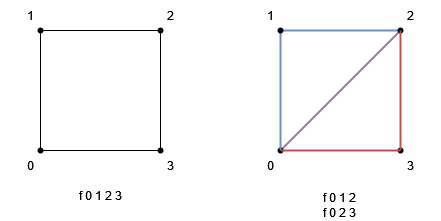

# [Tutoriel pour bien débuter à Vulkan](../index.md)
## 2.8 - Chargement de maillages et textures depuis des fichiers

Nous sommes désormais capables d'utiliser des maillages avec des *Vertex* et *Index Buffers* et utiliser des textures, nous pouvons maintenant les charger depuis des fichiers.

Ici, nous allons utiliser deux modèles au format OBJ.

Nous allons ajouter un nouveau dossier ``models`` dans lequel nous allons mettre nos maillages et nos textures.

Le format OBJ a l'avantage d'être facile à charger et l'intérieur du fichier est compréhensible par un humain.

Nous n'allons pas implémenter toute la spécification du format OBJ, qui est bien trop vaste et qui comprend beaucoup d'éléments que nous n'aurions pas utilisé.

Nous allons renommer la méthode ``createCube`` pour y charger des modèles :

```CPP
uint32_t loadModel(const std::string& modelFilePath); // Etait "void createCube();"
```

Nous devons aussi faire de même dans ``renderingengine.cpp`` :

```CPP
uint32_t RenderingEngine::loadModel(const std::string& modelFilePath) {
```

Et supprimer l'appel à ``createCube`` dans la fonction ``init``.

Dans la fonction ``loadModel``, nous allons supprimer les *vertices* et les indices du cube au début de la fonction, ainsi que l'ajout des informations du maillage du cube à la liste des maillages à la fin de la fonction.

Puis nous allons charger le fichier OBJ situé à ``modelFilePath`` :

```CPP
std::vector<Vertex> vertices;
std::vector<uint32_t> indices;

std::ifstream file(modelFilePath);

// Ouverture du fichier
if (!file.is_open()) {
	std::cout << "Impossible d'ouvrir le fichier de modele \"" + modelFilePath + "." << std::endl;
}
```

Nous allons tout d'abord déclarer nos listes de *vertices* et d'indices et ouvrir le fichier. Si celui-ci ne peut pas être ouvert, soit parce qu'il n'existe pas, soit parce que l'utilisateur n'a pas les accès en lecture, nous affichons un message d'erreur et quittons le programme.

```CPP
std::vector<nml::vec3> positions;
std::vector<nml::vec3> normals;
std::vector<nml::vec2> uvs;
```

Nous allons ensuite avoir besoin de listes pour y mettre les positions, les normales et les coordonnées de textures. La manière dont OBJ fonctionne est que nous allons d'abord charger les positions, les normales et les coordonnées de textures, puis, ensuite, créer des *vertices* en faisant des combinaisons de ces attributs.

```CPP
#include <unordered_map> // A ajouter en haut du fichier avec les autres includes

std::unordered_map<std::string, uint32_t> uniqueVertices;
```

Nous avons ensuite besoin d'une structure qui nous permettra de garder nos *vertices* uniques, pour éviter de les répéter, car nous utilisons des indices.

```CPP
std::string line;
while (std::getline(file, line)) {
	// Les commentaires doivent etre ignores
	if (line[0] == '#') {
		continue;
	}
```

Nous devons ensuite lire chaque ligne du fichier OBJ. Ceux-ci peuvent contenir des commentaires qui commencent par ``#``, ils doivent être ignorés.

```CPP
// Tokens de la ligne
std::vector<std::string> tokens;
size_t spacePosition = 0;
while ((spacePosition = line.find(' ')) != std::string::npos) {
	tokens.push_back(line.substr(0, spacePosition));
	line.erase(0, spacePosition + 1);
}
tokens.push_back(line);
```

Dans la ligne, nous allons séparer toutes les chaînes de caractères séparées par un espace.

```CPP
#include <cstdlib>  // A ajouter en haut du fichier avec les autres includes

// Lecture des jetons
// Position
if (tokens[0] == "v") {
	positions.push_back({
		static_cast<float>(std::atof(tokens[1].c_str())),
		static_cast<float>(std::atof(tokens[2].c_str())),
		static_cast<float>(std::atof(tokens[3].c_str()))
		});
}
```

Si une ligne commence par ``v``, alors elle décrit une position au format :

```
v x y z
```

Nous utilisons [**``atof``**](https://en.cppreference.com/w/cpp/string/byte/atof) qui convertir les chaînes de caractères en nombres flottants pour récupérer la position.

```CPP
// Normale
else if (tokens[0] == "vn") {
	normals.push_back({
		static_cast<float>(std::atof(tokens[1].c_str())),
		static_cast<float>(std::atof(tokens[2].c_str())),
		static_cast<float>(std::atof(tokens[3].c_str()))
		});
}
```

Si une ligne commence par ``vn``, alors elle décrit une normale au format :

```
vn x y z
```

```CPP
// Coordonnées de textures
else if (tokens[0] == "vt") {
	uvs.push_back({
		static_cast<float>(std::atof(tokens[1].c_str())),
		static_cast<float>(std::atof(tokens[2].c_str()))
		});
}
```

Si une ligne commence par "vt", alors elle décrit des coordonnées de texture au format :

```
vt u v
```

```CPP
	// Face
	else if (tokens[0] == "f") {
		std::vector<uint32_t> tmpIndices;
		for (size_t i = 1; i < tokens.size(); i++) {
			Vertex vertex = {};

			std::string tmp = tokens[i];
			std::vector<std::string> valueIndices;
			size_t slashPosition = 0;
			while ((slashPosition = tmp.find('/')) != std::string::npos) {
				valueIndices.push_back(tmp.substr(0, slashPosition));
				tmp.erase(0, slashPosition + 1);
			}
			valueIndices.push_back(tmp);

			for (size_t j = 0; j < valueIndices.size(); j++) {
				if (valueIndices[j] != "") {
					// v/vt/vn
					// Indice de position
					if (j == 0) {
						vertex.position[0] = positions[static_cast<size_t>(std::atoi(valueIndices[j].c_str())) - 1][0];
						vertex.position[1] = positions[static_cast<size_t>(std::atoi(valueIndices[j].c_str())) - 1][1];
						vertex.position[2] = positions[static_cast<size_t>(std::atoi(valueIndices[j].c_str())) - 1][2];
					}
					// Indice de coordonnées de texture
					else if (j == 1) {
						vertex.uv[0] = uvs[static_cast<size_t>(std::atoi(valueIndices[j].c_str())) - 1][0];
						vertex.uv[1] = uvs[static_cast<size_t>(std::atoi(valueIndices[j].c_str())) - 1][1];
					}
					// Indice de normale
					else if (j == 2) {
						vertex.normal[0] = normals[static_cast<size_t>(std::atoi(valueIndices[j].c_str())) - 1][0];
						vertex.normal[1] = normals[static_cast<size_t>(std::atoi(valueIndices[j].c_str())) - 1][1];
						vertex.normal[2] = normals[static_cast<size_t>(std::atoi(valueIndices[j].c_str())) - 1][2];
					}
				}
			}

			if (uniqueVertices.count(tokens[i]) == 0) {
				uniqueVertices[tokens[i]] = static_cast<uint32_t>(vertices.size());
				vertices.push_back(vertex);
			}
			tmpIndices.push_back(uniqueVertices[tokens[i]]);
		}

		// Une face peut être un triangle ou un rectangle
		// Triangle
		if (tmpIndices.size() == 3) {
			indices.insert(indices.end(), std::make_move_iterator(tmpIndices.begin()), std::make_move_iterator(tmpIndices.end()));
		}
		// Rectangle
		else if (tmpIndices.size() == 4) {
			// Triangle 1
			indices.push_back(tmpIndices[0]);
			indices.push_back(tmpIndices[1]);
			indices.push_back(tmpIndices[2]);

			// Triangle 2
			indices.push_back(tmpIndices[0]);
			indices.push_back(tmpIndices[2]);
			indices.push_back(tmpIndices[3]);
		}
	}
}
```

Et enfin, une ligne qui commence par ``f`` décrit une face, donc une primitive, au format :

```
f v/vt/vn v/vt/vn v/vt/vn
```

Dans le cas d'un triangle, ou

```
f v/vt/vn v/vt/vn v/vt/vn v/vt/vn
```

Dans le cas d'un rectangle.

``v/vt/vn`` sont les indices des positions, des textures et des normales dans l'ordre où ils sont apparus dans le fichier, donc dans l'ordre où nous les avons mis dans les listes ``positions``, ``normals`` et ``uvs``.

Le format OBJ ne prend pas en compte les indices des maillages et utilise donc des *vertices* identiques (ce qui signifie que les ``v/vt/vn`` ont les mêmes indices pour les positions, les normales et les coordonnées de texture, par exemple ``f 0/24/8 1/12/3 7/25/8`` et ``f 4/9/15 6/9/7 1/12/3``, nous avons ici la description de deux triangles, où le *vertex* avec les indices ``1/12/3`` est mentionné deux fois), nous devons prendre ça en compte, attribuer nous-mêmes des indices aux *vertices* et détecter lorsque nous avons déjà vu un *vertex* pour ajouter son indice à liste les indices de notre maillage.



Si nous sommes dans le cas ``f 0 1 2 3``, alors la face décrit un rectangle. Hors, nous ne pouvons traiter que des triangles, nous devons donc séparer ce rectangle en deux triangles, ce qui équivaut à ``f 0 1 2`` et ``f 0 2 3``.

Enfin, nous pouvons fermer le fichier :

```CPP
// Fermeture du fichier
file.close();
```

Nous avons maintenant besoin de connaître le décalage à appliquer dans le *Vertex Buffer* et l'*Index Buffer* pour éviter de récupérer des *vertices* et des indices des maillages qui y sont déjà présents.

Pour cela, nous allons ajouter deux nouveaux attributs privés dans la classe ``RenderingEngine`` :

```CPP
int32_t m_currentVertexOffset = 0;
uint32_t m_currentIndexOffset = 0;
```

Et ajouter les informations sur notre nouveau maillage à la liste des maillages :

```CPP
// Ajout du maillage à la liste
Mesh mesh;
mesh.indexCount = static_cast<uint32_t>(indices.size());
mesh.firstIndex = m_currentIndexOffset;
mesh.vertexOffset = m_currentVertexOffset;
m_meshes.push_back(mesh);
```

Nous devons prendre en compte le fait que le *Vertex* et l'*Index Buffer* ne sont peut-être plus vides au moment lors de la copie du *Staging Buffer* :

```CPP
VkBufferCopy vertexBufferCopy = {};
vertexBufferCopy.srcOffset = 0;
vertexBufferCopy.dstOffset = m_currentVertexOffset * sizeof(Vertex); // Modifie, etait 0
vertexBufferCopy.size = vertices.size() * sizeof(Vertex);
vkCmdCopyBuffer(buffersCopyCommandBuffer, vertexAndIndexStagingBuffer, m_vertexBuffer, 1, &vertexBufferCopy);

VkBufferCopy indexBufferCopy = {};
indexBufferCopy.srcOffset = (vertices.size() * sizeof(Vertex));
indexBufferCopy.dstOffset = m_currentIndexOffset * sizeof(uint32_t); // Modifie, etait 0
indexBufferCopy.size = indices.size() * sizeof(uint32_t);
vkCmdCopyBuffer(buffersCopyCommandBuffer, vertexAndIndexStagingBuffer, m_indexBuffer, 1, &indexBufferCopy);
```

À la fin de la fonction, nous allons ajouter le nombre de *vertices* et d'indices à nos valeurs de décalage pour le prochain maillage et retourner l'indice de ce maillage, qui correspond à la taille de notre liste de maillages - 1 :

```CPP
// Decalage du nombre de vertices et d'indices pour le prochain maillage
m_currentVertexOffset += static_cast<int32_t>(vertices.size());
m_currentIndexOffset += static_cast<uint32_t>(indices.size());

return m_meshes.size() - 1;
```

[**Chapitre précédent**](7.md) - [**Index**](../index.md)